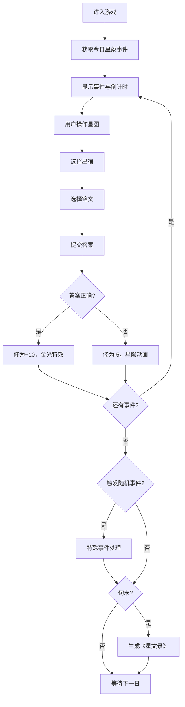

## 1. 产品概述

"星文织梦"是一款以古代星官为主题的互动式占卜游戏Web应用。用户扮演星官，根据每日星象变化选择正确的星宿与铭文组合，平息天象异变，积累修为并生成《星文录》评分。

- 核心玩法：限时事件处理 + 星图交互 + 铭文匹配
- 目标用户：喜欢古风文化、轻度策略游戏的Web用户
- 产品价值：结合传统文化与互动游戏，提供沉浸式星官体验

## 2. 核心功能

### 2.1 用户角色

| 角色 | 注册方式 | 核心权限 |
|------|---------|---------|
| 星官（玩家） | 无需注册，本地存储 | 进行游戏、查看历史《星文录》 |

### 2.2 功能模块

1. **星图交互区**：可拖拽旋转缩放的星图，星宿可点击选中
2. **事件处理面板**：显示当前天象事件、倒计时、铭文选择
3. **修为面板**：显示修为值、处理记录、历史《星文录》
4. **随机事件系统**：流星坠落、星官斗法、星图被毁等特殊事件
5. **评分系统**：每旬生成《星文录》评分报告

### 2.3 页面详情

| 页面名称 | 模块名称 | 功能描述 |
|---------|---------|---------|
| 主游戏页面 | 星图交互区 | Canvas绘制星图，支持拖拽旋转缩放，星宿点击高亮 |
| 主游戏页面 | 事件面板 | 显示事件描述、60秒环形倒计时、8种铭文选择 |
| 主游戏页面 | 修为面板 | 修为数值显示、事件历史记录、《星文录》列表 |
| 主游戏页面 | 随机事件弹窗 | 流星点击、猜拳斗法等特殊交互 |

## 3. 核心流程

用户进入游戏 → 后端生成今日星象事件 → 用户查看事件描述 → 旋转缩放星图寻找星宿 → 点击选中星宿 → 匹配对应铭文 → 提交选择 → 获得结果反馈（成功/失败）→ 修为变化 → 处理下一个事件 → 每日随机触发特殊事件 → 每旬结束生成《星文录》

## 4. 用户界面设计

### 4.1 设计风格

- **主色调**：夜空深蓝 `#0b0f2a`、星宿亮金 `#f5d742`、铭文青白 `#d0e0f0`、危机红 `#c0392b`
- **设计主题**：青瓷星夜风格，古风神秘氛围
- **字体**：标题使用书法风格字体，正文使用典雅宋体
- **布局**：三栏式布局，中央星图区最大，左右面板窄
- **动画效果**：星宿粒子柔光、金光扩散、星陨坠落、数字弹跳闪烁

### 4.2 页面设计概述

| 页面名称 | 模块名称 | UI元素 |
|---------|---------|--------|
| 主游戏页面 | 星图交互区 | Canvas星空背景、星宿连线、高亮光环、拖拽手势 |
| 主游戏页面 | 事件面板 | 卡片式布局、环形进度条倒计时、铭文按钮网格 |
| 主游戏页面 | 修为面板 | 金色修为数值、滚动历史列表、《星文录》条目 |
| 主游戏页面 | 随机事件弹窗 | 半透明遮罩、流星点击目标、猜拳按钮 |

### 4.3 响应式设计

- **桌面端**：三栏布局，星图区占60%宽度，左右面板各占20%
- **平板端**：两栏布局，星图在上，事件与修为面板并排在下
- **移动端**：单栏滚动布局，星图支持单手触控操作，面板堆叠显示
- **触控优化**：星宿点击区域增大，支持双指缩放和单指拖拽

### 4.4 性能要求

- 首屏加载 < 3秒
- 星图渲染帧率 > 30fps
- 事件处理响应 < 100ms
- 倒计时精确到秒级
