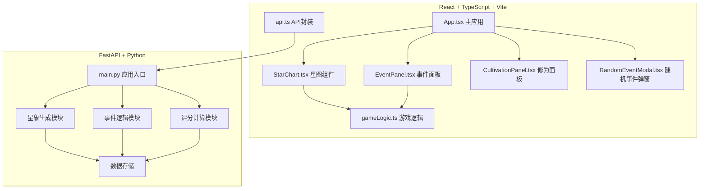
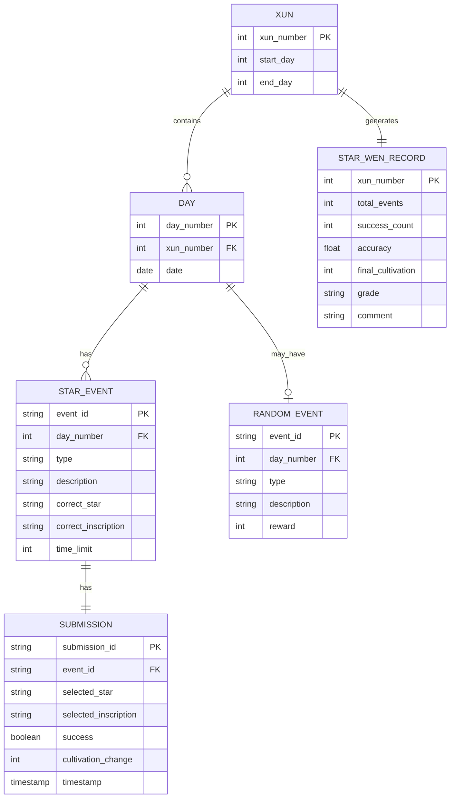
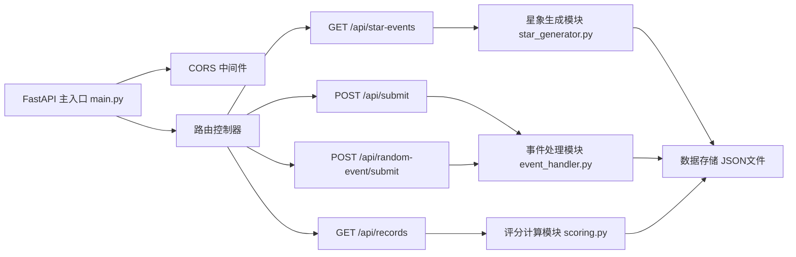

## 1. 架构设计



## 2. 技术描述

- **前端**：React 18 + TypeScript 5 + Vite 5 + Tailwind CSS 3 + Zustand（状态管理）
- **后端**：FastAPI 0.109 + Uvicorn 0.27
- **数据存储**：本地 JSON 文件（轻量级，无需数据库）
- **构建工具**：Vite 初始化 React + TypeScript 模板

## 3. 前端目录结构

```
src/
├── main.tsx              # 应用入口
├── App.tsx               # 主应用组件
├── index.css             # 全局样式与Tailwind
├── components/
│   ├── StarChart.tsx     # 星图交互组件（Canvas）
│   ├── EventPanel.tsx    # 事件处理面板
│   ├── CultivationPanel.tsx  # 修为与记录面板
│   ├── RandomEventModal.tsx  # 随机事件弹窗
│   └── RingProgress.tsx  # 环形倒计时组件
├── hooks/
│   ├── useGameState.ts   # 游戏状态管理
│   └── useStarChart.ts   # 星图交互Hook
├── store/
│   └── gameStore.ts      # Zustand状态管理
├── utils/
│   ├── gameLogic.ts      # 游戏逻辑工具
│   ├── api.ts            # API请求封装
│   └── animation.ts      # 动画工具函数
└── types/
    └── index.ts          # TypeScript类型定义
```

## 4. 后端目录结构

```
/
├── main.py               # FastAPI应用入口
├── requirements.txt      # Python依赖
├── data/
│   └── records.json      # 历史记录存储
└── app/
    ├── __init__.py
    ├── models.py         # Pydantic数据模型
    ├── star_generator.py # 星象生成逻辑
    ├── event_handler.py  # 事件处理逻辑
    └── scoring.py        # 评分计算逻辑
```

## 5. API 定义

### 5.1 GET /api/star-events
获取今日星象事件和随机事件

**响应：**
```typescript
interface StarEventsResponse {
  day: number;
  xun: number;
  events: StarEvent[];
  randomEvent: RandomEvent | null;
  cultivation: number;
}

interface StarEvent {
  id: string;
  type: 'meteor' | 'comet' | 'eclipse' | 'nova' | 'conjunction';
  description: string;
  hint: string;
  correctStar: string;
  correctInscription: string;
  timeLimit: number;
  availableStars: string[];
  availableInscriptions: string[];
}

interface RandomEvent {
  id: string;
  type: 'meteor_fall' | 'duel' | 'chart_destroyed';
  description: string;
  timeLimit: number;
  reward: number;
}
```

### 5.2 POST /api/submit
提交用户选择，返回处理结果

**请求：**
```typescript
interface SubmitRequest {
  eventId: string;
  selectedStar: string;
  selectedInscription: string;
  timeRemaining: number;
}
```

**响应：**
```typescript
interface SubmitResponse {
  success: boolean;
  cultivationChange: number;
  newCultivation: number;
  message: string;
  nextEvent: StarEvent | null;
  isXunEnd: boolean;
  starRecord: StarRecord | null;
}

interface StarRecord {
  eventId: string;
  success: boolean;
  timestamp: number;
  star: string;
  inscription: string;
}
```

### 5.3 POST /api/random-event/submit
提交随机事件处理结果

**请求：**
```typescript
interface RandomEventSubmitRequest {
  eventId: string;
  action: string;
  success: boolean;
}
```

**响应：**
```typescript
interface RandomEventSubmitResponse {
  success: boolean;
  cultivationChange: number;
  newCultivation: number;
  message: string;
}
```

### 5.4 GET /api/records
获取历史《星文录》记录

**响应：**
```typescript
interface RecordsResponse {
  records: StarWenRecord[];
}

interface StarWenRecord {
  xun: number;
  startDay: number;
  endDay: number;
  totalEvents: number;
  successCount: number;
  accuracy: number;
  finalCultivation: number;
  grade: 'S' | 'A' | 'B' | 'C' | 'D';
  comment: string;
}
```

## 6. 数据模型

### 6.1 实体关系



### 6.2 常量定义

**8种星宿：**
- 青龙（角宿）、白虎（奎宿）、朱雀（井宿）、玄武（斗宿）
- 紫微、太微、天市、文昌

**8种铭文：**
- 乾、坤、震、巽、坎、离、艮、兑

**星象类型：**
- 流星（meteor）、彗星（comet）、月食（eclipse）、新星（nova）、合星（conjunction）

**随机事件类型：**
- 流星坠落（meteor_fall）：快速点击抵御
- 星官斗法（duel）：猜拳机制
- 星图被毁（chart_destroyed）：快速恢复操作

## 7. 服务器架构



## 8. 性能优化

### 8.1 前端优化
- **星图渲染**：使用 Canvas 2D，requestAnimationFrame 确保60fps
- **状态管理**：Zustand 轻量级状态，避免不必要重渲染
- **动画**：CSS 动画为主，复杂粒子效果使用 Canvas
- **懒加载**：组件按需渲染，非关键资源延迟加载

### 8.2 后端优化
- **内存缓存**：游戏状态在内存中维护，减少IO
- **快速响应**：所有API响应时间 < 100ms
- **CORS配置**：开发环境代理配置，避免跨域问题
