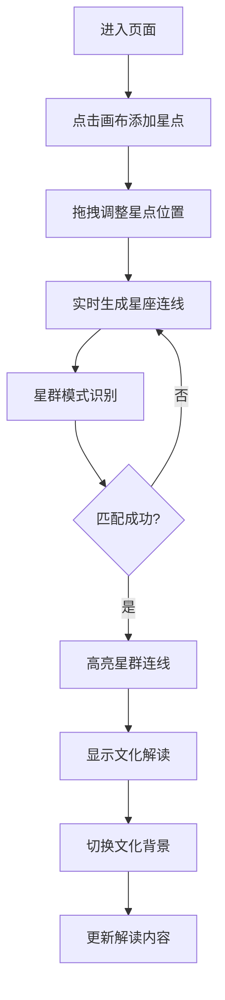

## 1. 产品概述
墨韵星图是一个沉浸式交互式数据可视化应用，让用户以古代天文学家的身份，在虚拟宣纸上通过拖拽和点击标记星点，实时生成星座连线图并获得文化解读。
- 核心价值：融合艺术、科学与文化，提供寓教于乐的星空探索体验
- 目标用户：天文爱好者、文化学习者、创意工作者

## 2. 核心功能

### 2.1 功能模块
1. **星图画布**：SVG宣纸背景，支持星点拖拽、点击选择、连线生成
2. **星点工具栏**：添加星点、删除星点、清空画布功能
3. **星群识别系统**：自动识别北斗、猎户等常见星群模式
4. **文化解读面板**：显示星群神话故事，支持中国星官/希腊神话切换
5. **动画效果系统**：墨迹晕开、星点闪烁、连线过渡等视觉效果

### 2.2 页面详情
| 页面名称 | 模块名称 | 功能描述 |
|-----------|-------------|---------------------|
| 主页面 | 星图画布 | D3.js渲染的宣纸背景SVG，支持拖拽交互，60fps流畅动画 |
| 主页面 | 左侧工具栏 | 添加、删除、清空星点按钮，响应式折叠设计 |
| 主页面 | 右侧解读面板 | 显示选中星群名称、文化背景、神话故事，文化切换下拉菜单 |

## 3. 核心流程
用户进入页面后，点击画布空白处添加星点，拖拽星点调整位置。系统实时根据星点坐标生成连线并识别预定义星群模式。识别成功后，星群连线加粗高亮，解读面板显示对应神话故事。用户可通过下拉菜单切换中国星官或希腊神话背景，解读内容随之变化。

## 4. 用户界面设计

### 4.1 设计风格
- **主色调**：宣纸白#f5f0e6、墨黑#2c2c2c、朱砂红#c0392b、石青#4a7c59、橙色高亮#e67e22
- **字体**：毛笔书法字体用于标题和按钮，衬线字体用于正文
- **视觉效果**：墨迹纹理背景、晕开动画、笔触效果
- **布局**：三栏布局（左工具栏、中画布、右面板），桌面端展开，移动端折叠

### 4.2 页面设计概述
| 页面名称 | 模块名称 | UI元素 |
|-----------|-------------|-------------|
| 主页面 | 星图画布 | 宣纸纹理背景、SVG星点（圆形带光晕）、墨迹连线、D3过渡动画 |
| 主页面 | 左侧工具栏 | 垂直排列按钮组、图标+文字、悬停笔触效果、移动端汉堡菜单折叠 |
| 主页面 | 右侧解读面板 | 卡片式设计、标题朱砂红、正文墨黑、文化切换下拉菜单、卷轴装饰边框 |

### 4.3 响应式
- 桌面端（≥1024px）：三栏展开布局，画布居中
- 平板端（768-1024px）：工具栏和面板可折叠，画布自适应
- 移动端（<768px）：工具栏和面板改为底部抽屉式，画布占满屏幕
- 所有触控元素≥44px，支持触摸拖拽
