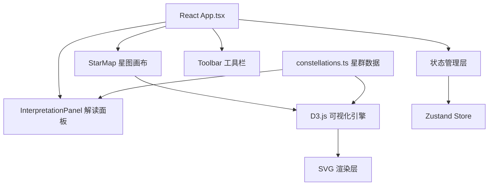

## 1. 架构设计


## 2. 技术描述
- 前端：React 18 + TypeScript + D3.js v7 + Vite
- 状态管理：Zustand
- 样式：原生CSS + CSS变量（水墨主题）
- 字体：Google Fonts（Ma Shan Zheng 毛笔字体 + Noto Serif SC 衬线字体）
- 图标：Lucide React

## 3. 目录结构
```
src/
├── components/
│   ├── StarMap.tsx          # D3星图画布组件
│   ├── Toolbar.tsx          # 左侧工具栏组件
│   └── InterpretationPanel.tsx  # 右侧解读面板
├── utils/
│   └── constellations.ts    # 星群模式与解读数据
├── store/
│   └── useStarStore.ts      # Zustand状态管理
├── styles/
│   └── global.css           # 全局样式与主题变量
├── App.tsx                  # 主应用组件
└── main.tsx                 # React入口
```

## 4. 数据模型

### 4.1 星点数据结构
```typescript
interface Star {
  id: string;
  x: number;
  y: number;
  selected: boolean;
}
```

### 4.2 星群模式结构
```typescript
interface ConstellationPattern {
  id: string;
  name: {
    chinese: string;
    greek: string;
  };
  points: { x: number; y: number }[];
  connections: [number, number][];
  threshold: number;
  interpretation: {
    chinese: {
      official: string;
      story: string;
    };
    greek: {
      official: string;
      story: string;
    };
  };
}
```

### 4.3 识别结果结构
```typescript
interface RecognitionResult {
  pattern: ConstellationPattern;
  matchedStars: string[];
  similarity: number;
}
```

## 5. 核心算法
1. **星群匹配算法**：使用缩放不变的模式匹配，计算用户星点与预定义模式的最小平均距离
2. **连线生成**：D3力导向图或最近邻算法自动生成星点间连线
3. **性能优化**：requestAnimationFrame节流拖拽更新，D3过渡动画使用GPU加速

## 6. 性能指标
- 星点数量≤50时，拖拽帧率≥60fps
- 星群识别响应时间<100ms
- 动画流畅度：过渡动画≥30fps
- 内存占用：页面加载<50MB，运行时<100MB
