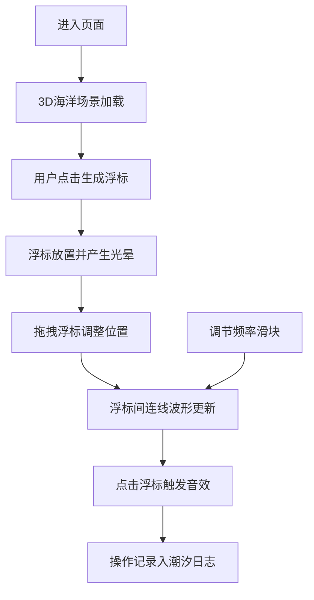

## 1. 产品概述

"潮汐回响"是一款沉浸式3D交互可视化音乐创作工具，让用户化身为海之诗人，在三维海洋空间中通过放置和拖拽声波浮标来编织动态的潮汐音乐网络。

- 核心价值：将视觉艺术与音乐创作融合，提供沉浸式的创作体验
- 目标用户：音乐爱好者、视觉艺术家、创意工作者
- 市场定位：创新型交互艺术体验项目

## 2. 核心功能

### 2.1 功能模块

1. **3D海洋场景**：粒子海面、深海环境、动态光照
2. **声波浮标系统**：浮标放置、拖拽移动、光晕扩散动画
3. **音乐网络**：浮标间波形连线、频率调制、旋律生成
4. **交互控制面板**：浮标生成、频率调节、场景重置
5. **潮汐日志**：操作记录、音高变化追踪

### 2.2 页面详情

| 页面名称 | 模块名称 | 功能描述 |
|-----------|-------------|---------------------|
| 主页面 | 3D海洋场景 | 全屏Three.js渲染，粒子海面动画，浮标渲染与交互 |
| 主页面 | 控制面板 | 浮标生成按钮、频率滑块、重置按钮 |
| 主页面 | 潮汐日志 | 最近5次操作记录，音高变化展示 |

## 3. 核心流程

用户进入页面 → 看到动态3D海洋场景 → 点击"生成浮标"按钮放置浮标 → 拖拽浮标调整位置 → 调节频率滑块改变波形 → 点击浮标触发音效 → 操作记录显示在潮汐日志中

## 4. 用户界面设计

### 4.1 设计风格

- **主色调**：深海蓝 #0a1a3a（背景）、浪花白 #e0f0ff（文字/高亮）、珊瑚粉 #ff6b6b（强调）
- **按钮风格**：半透明玻璃拟态，圆角8px，悬停有光晕效果
- **字体**：采用优雅的无衬线字体，标题使用艺术感字体
- **布局风格**：沉浸式全屏3D场景，悬浮式控制面板
- **视觉元素**：流动粒子、波纹动画、渐变透明度

### 4.2 页面设计概述

| 页面名称 | 模块名称 | UI Elements |
|-----------|-------------|-------------|
| 主页面 | 3D海洋场景 | 深海蓝背景，流动粒子海面，透明浮标带脉动光晕，波形连线动画 |
| 主页面 | 控制面板 | 左下角悬浮，玻璃拟态，包含按钮和滑块 |
| 主页面 | 潮汐日志 | 右下角悬浮，半透明背景，滚动显示操作记录 |

### 4.3 响应性

- 桌面端优先设计，全屏3D场景
- 控制面板和日志面板固定位置，自适应屏幕尺寸
- 支持鼠标拖拽、点击等桌面交互

### 4.4 3D场景指导

- **环境**：深海氛围，带雾效和体积光
- **光照**：环境光 + 方向光模拟水面折射，浮标自发光
- **相机**：透视相机，可轨道控制缩放和旋转
- **交互**：浮标可拖拽，点击触发音效
- **动画**：粒子海面流动，浮标光晕脉动，连线波形动画
- **后处理**：泛光效果，色彩分级增强深海氛围
- **性能**：优化粒子数量，使用InstancedMesh，目标60fps
