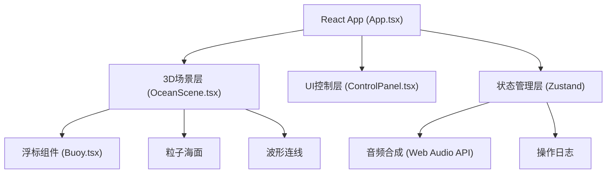

## 1. 架构设计



## 2. 技术描述

- **前端框架**：React@18 + TypeScript
- **构建工具**：Vite@5
- **3D渲染**：Three.js + @react-three/fiber + @react-three/drei
- **状态管理**：Zustand
- **样式方案**：TailwindCSS@3
- **音频处理**：Web Audio API（内置合成器）
- **图标**：lucide-react

## 3. 目录结构

```
src/
├── main.tsx              # 入口文件
├── App.tsx               # 主应用组件
├── index.css             # 全局样式
├── scene/
│   ├── OceanScene.tsx    # 3D海洋场景
│   ├── Buoy.tsx          # 浮标组件
│   ├── OceanSurface.tsx  # 粒子海面
│   └── WaveLines.tsx     # 波形连线
├── ui/
│   ├── ControlPanel.tsx  # 控制面板
│   └── TideLog.tsx       # 潮汐日志
├── store/
│   └── useStore.ts       # Zustand状态管理
├── hooks/
│   └── useAudio.ts       # 音频Hook
├── types/
│   └── index.ts          # 类型定义
└── utils/
    └── audio.ts          # 音频工具
```

## 4. 数据模型

### 4.1 浮标数据结构

```typescript
interface Buoy {
  id: string;
  position: [number, number, number];
  color: string;
  pitch: number;      // 音高 0-11
  frequency: number;  // 脉动频率
}
```

### 4.2 操作日志结构

```typescript
interface LogEntry {
  id: string;
  timestamp: number;
  type: 'create' | 'move' | 'click' | 'frequency';
  message: string;
  pitchChange?: number;
}
```

### 4.3 应用状态

```typescript
interface AppState {
  buoys: Buoy[];
  frequency: number;      // 全局频率 0.1-2
  logs: LogEntry[];
  selectedBuoyId: string | null;
  addBuoy: (position: [number, number, number]) => void;
  removeBuoy: (id: string) => void;
  updateBuoyPosition: (id: string, position: [number, number, number]) => void;
  setFrequency: (freq: number) => void;
  triggerBuoySound: (id: string) => void;
  reset: () => void;
  addLog: (entry: Omit<LogEntry, 'id' | 'timestamp'>) => void;
}
```

## 5. 性能优化策略

1. **浮标渲染**：使用InstancedMesh批量渲染浮标
2. **粒子系统**：使用Points和BufferGeometry优化海面粒子
3. **动画循环**：使用useFrame统一管理动画，避免重复计算
4. **状态更新**：Zustand选择性订阅，减少不必要重渲染
5. **音频调度**：预加载音频上下文，避免重复创建
