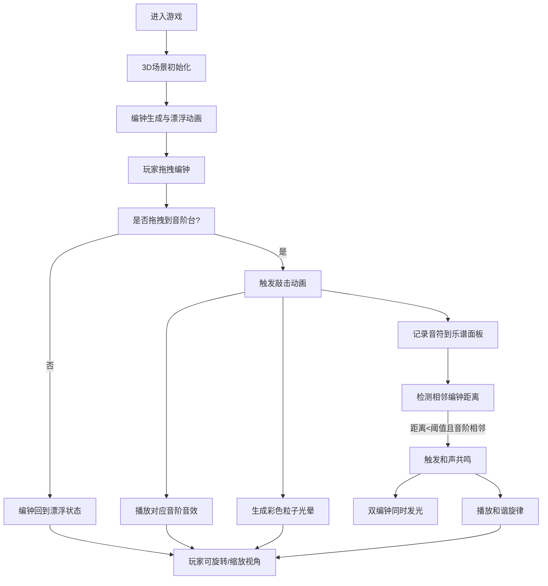

## 1. 产品概述

"空灵编钟"是一款基于3D技术的云端编钟模拟演奏与探索游戏，玩家扮演漂浮在云端的古代乐师，通过拖拽、敲击编钟来创造空灵的天籁之音。

- 主要用途：音乐创作、休闲放松、艺术体验
- 目标用户：音乐爱好者、游戏玩家、艺术创作者
- 产品价值：提供沉浸式的音乐创作体验，将古代编钟文化与现代3D技术结合，让用户在宁静空灵的氛围中创造独特的音乐作品

## 2. 核心功能

### 2.1 用户角色

| 角色 | 注册方式 | 核心权限 |
|------|----------|----------|
| 古代乐师 | 无需注册，直接进入游戏 | 自由演奏、调整编钟、生成旋律 |

### 2.2 功能模块

1. **3D云端场景**：漂浮的云雾平台、动态天空背景、半透明云层效果
2. **编钟系统**：可拖拽的青铜编钟、不同尺寸对应不同音高、敲击动画与音效
3. **音阶台系统**：7个音阶台对应不同音符、放置编钟后固定音高
4. **粒子光晕系统**：敲击时产生彩色粒子、颜色随音高变化、渐变消散效果
5. **和声共鸣系统**：编钟间距检测、相邻音阶自动触发和声、双重发光效果
6. **乐谱记录系统**：实时记录最近10个音符、显示音符名称与时值
7. **视角控制系统**：鼠标旋转视角、滚轮缩放、平滑跟随
8. **控制面板**：力度调节、编钟数量控制、重置功能

### 2.3 页面详情

| 页面名称 | 模块名称 | 功能描述 |
|----------|----------|----------|
| 主游戏界面 | 3D场景模块 | 渲染云端场景、编钟、音阶台，处理3D交互 |
| 主游戏界面 | 控制面板模块 | 力度滑块0-100、编钟数量增减、重置按钮 |
| 主游戏界面 | 乐谱面板模块 | 显示最近10个音符记录、音符名称与时值 |

## 3. 核心流程

### 用户演奏流程

玩家进入游戏后，云端场景中漂浮着多个青铜编钟。玩家可以用鼠标拖拽编钟到音阶台上，松开鼠标时编钟落下触发敲击音效和粒子光晕。已放置的编钟如果与相邻音阶的编钟距离足够近，会自动触发和声共鸣效果，两者同时发光并播放和谐旋律。玩家可以通过鼠标拖动旋转视角，滚轮缩放来观察编钟的全貌。左下角的控制面板可以调节敲击力度、增加或减少编钟数量、重置所有编钟位置。右下角的乐谱面板实时显示最近10个敲击的音符记录。

## 4. 用户界面设计

### 4.1 设计风格

- **主色调**：天空蓝 `#b0d4f1`、云朵白 `#f0f8ff`、编钟青铜 `#cd7f32`
- **粒子颜色**：高音用红橙色调、中音用黄绿色调、低音用蓝紫色调
- **按钮风格**：半透明磨砂玻璃效果、圆角8px、悬停时轻微放大
- **字体**：使用具有古典韵味的字体搭配现代无衬线字体
- **布局风格**：沉浸式全屏3D场景，UI面板采用浮动式设计，带模糊背景
- **视觉元素**：半透明渐变、柔光效果、轻微的辉光滤镜

### 4.2 页面设计概述

| 页面名称 | 模块名称 | UI元素 |
|----------|----------|--------|
| 主游戏界面 | 3D场景 | 天空渐变背景、漂浮云层、青铜编钟、音阶台、粒子效果、光晕动画 |
| 主游戏界面 | 控制面板 | 半透明面板、力度滑块、数字输入框、重置按钮、操作提示 |
| 主游戏界面 | 乐谱面板 | 半透明面板、音符列表、时间轴、高亮显示最近音符 |

### 4.3 响应式

- 桌面端优先设计，全屏沉浸式体验
- UI面板采用固定定位，适应不同分辨率
- 触摸设备支持触屏拖拽和双指缩放
- 最小支持分辨率：1024x768

### 4.4 3D场景指导

- **环境与氛围**：晨曦云雾风格，天空从淡蓝到暖白渐变，远处有朦胧的云层层次
- **光照设置**：柔和的方向光模拟朝阳，配合环境光和轻微的辉光效果，编钟有金属高光反射
- **相机设置**：透视相机，初始位置在场景正前方略高处，支持轨道控制（OrbitControls），平滑跟随鼠标移动
- **构图与焦点**：7个音阶台呈弧形排列在云端平台中央，编钟初始漂浮在平台上方，视觉重心在编钟与音阶台的交互区域
- **交互与动画**：编钟漂浮时轻微上下浮动和旋转，敲击时产生振动动画和缩放效果，粒子从敲击点向外扩散并逐渐消散
- **后期处理**：轻微的泛光（Bloom）效果增强光晕，色彩分级让画面更柔和，可能加入轻微的景深效果
- **性能优化**：编钟数量控制在3-10个，粒子系统使用对象池，绘制调用优化，目标帧率60fps
