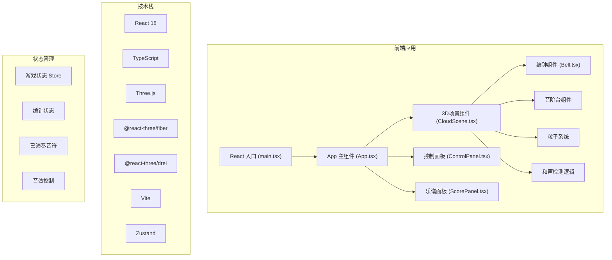

## 1. 架构设计



## 2. 技术描述

- **前端框架**：React 18 + TypeScript + Vite
- **3D渲染**：Three.js + @react-three/fiber + @react-three/drei
- **状态管理**：Zustand
- **音效处理**：Web Audio API
- **样式方案**：Tailwind CSS 3
- **初始化工具**：Vite + react-ts 模板

## 3. 目录结构

```
src/
├── main.tsx              # React 入口文件
├── App.tsx               # 主应用组件
├── index.css             # 全局样式
├── store/
│   └── useGameStore.ts   # Zustand 状态管理
├── scene/
│   ├── CloudScene.tsx    # 3D云端场景
│   ├── Bell.tsx          # 编钟组件
│   ├── ScalePlatform.tsx # 音阶台组件
│   └── Particles.tsx     # 粒子系统组件
├── ui/
│   ├── ControlPanel.tsx  # 控制面板
│   └── ScorePanel.tsx    # 乐谱面板
├── utils/
│   ├── audio.ts          # 音效生成工具
│   └── constants.ts      # 常量定义（音阶、颜色等）
└── types/
    └── index.ts          # TypeScript 类型定义
```

## 4. 数据模型

### 4.1 类型定义

```typescript
// 音阶类型
type ScaleNote = 'C' | 'D' | 'E' | 'F' | 'G' | 'A' | 'B';

// 编钟状态
interface BellState {
  id: string;
  position: [number, number, number];
  targetPosition: [number, number, number] | null;
  scaleNote: ScaleNote | null;
  size: number;
  isDragging: boolean;
  isRinging: boolean;
  isHarmonizing: boolean;
  ringIntensity: number;
}

// 已演奏音符
interface PlayedNote {
  id: string;
  note: ScaleNote;
  octave: number;
  velocity: number; // 力度 0-100
  timestamp: number;
  duration: number;
}

// 游戏状态
interface GameState {
  bells: BellState[];
  playedNotes: PlayedNote[];
  velocity: number; // 全局力度 0-100
  bellCount: number; // 编钟数量
  cameraPosition: [number, number, number];
  // Actions
  setVelocity: (v: number) => void;
  setBellCount: (n: number) => void;
  addBell: () => void;
  removeBell: () => void;
  updateBellPosition: (id: string, pos: [number, number, number]) => void;
  placeBellOnScale: (id: string, note: ScaleNote, pos: [number, number, number]) => void;
  triggerBellRing: (id: string, intensity: number) => void;
  triggerHarmony: (id1: string, id2: string) => void;
  addPlayedNote: (note: PlayedNote) => void;
  resetBells: () => void;
}
```

### 4.2 常量定义

```typescript
// 音阶与频率映射
const SCALE_FREQUENCIES: Record<ScaleNote, number> = {
  C: 261.63,
  D: 293.66,
  E: 329.63,
  F: 349.23,
  G: 392.00,
  A: 440.00,
  B: 493.88,
};

// 音阶相邻关系
const ADJACENT_SCALES: Record<ScaleNote, ScaleNote[]> = {
  C: ['D'],
  D: ['C', 'E'],
  E: ['D', 'F'],
  F: ['E', 'G'],
  G: ['F', 'A'],
  A: ['G', 'B'],
  B: ['A'],
};

// 粒子颜色映射（音高到颜色）
const PARTICLE_COLORS: Record<ScaleNote, string> = {
  C: '#4169e1', // 低音 - 蓝色
  D: '#4682b4',
  E: '#3cb371', // 中音 - 绿色
  F: '#9acd32',
  G: '#ffd700', // 中高音 - 金色
  A: '#ff8c00',
  B: '#ff4500', // 高音 - 红色
};

// 音阶台位置（弧形排列）
const SCALE_POSITIONS: Record<ScaleNote, [number, number, number]> = {
  C: [-6, 0, 0],
  D: [-4, 0.2, 1],
  E: [-2, 0.3, 1.5],
  F: [0, 0.35, 1.7],
  G: [2, 0.3, 1.5],
  A: [4, 0.2, 1],
  B: [6, 0, 0],
};
```

## 5. 核心功能实现要点

### 5.1 拖拽交互
- 使用 `@react-three/drei` 的 `DragControls` 或自定义射线检测实现3D拖拽
- 拖拽时更新编钟位置，检测与音阶台的碰撞
- 释放时判断是否在音阶台范围内，触发放置逻辑

### 5.2 和声检测
- 在 `useFrame` 中每帧检测已放置编钟之间的距离
- 当距离小于阈值（如2.5单位）且音阶相邻时，触发和声效果

### 5.3 音效系统
- 使用 Web Audio API 的 `OscillatorNode` 生成正弦波或三角波
- 叠加泛音模拟编钟的金属质感
- 使用 `GainNode` 控制音量包络（起音、衰减、持续、释放）
- 和声效果使用轻微的延迟和混响

### 5.4 粒子系统
- 使用 `@react-three/drei` 的 `Points` 或 `InstancedMesh` 实现高性能粒子
- 粒子颜色从 `PARTICLE_COLORS` 映射，带透明度渐变
- 粒子从敲击点向外扩散，受轻微重力影响，生命周期约1.5秒

### 5.5 性能优化
- 编钟使用 `useMemo` 缓存几何体和材质
- 粒子使用对象池复用，避免频繁创建销毁
- 和声检测使用空间哈希优化，避免O(n²)复杂度
- 相机控制启用阻尼效果，使旋转更平滑

### 5.6 配置文件

**package.json 核心依赖**：
```json
{
  "dependencies": {
    "react": "^18.2.0",
    "react-dom": "^18.2.0",
    "three": "^0.160.0",
    "@react-three/fiber": "^8.15.12",
    "@react-three/drei": "^9.92.7",
    "zustand": "^4.4.7"
  },
  "devDependencies": {
    "typescript": "^5.3.3",
    "vite": "^5.0.10",
    "@types/react": "^18.2.45",
    "@types/react-dom": "^18.2.18",
    "@types/three": "^0.160.0",
    "tailwindcss": "^3.4.0",
    "@vitejs/plugin-react": "^4.2.1"
  }
}
```
