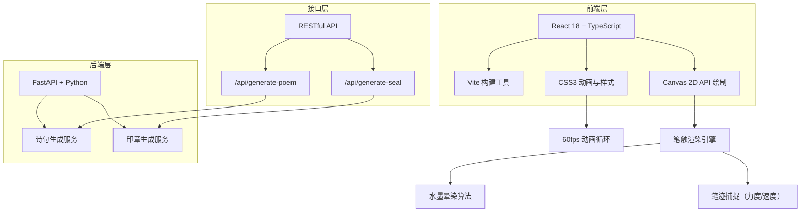
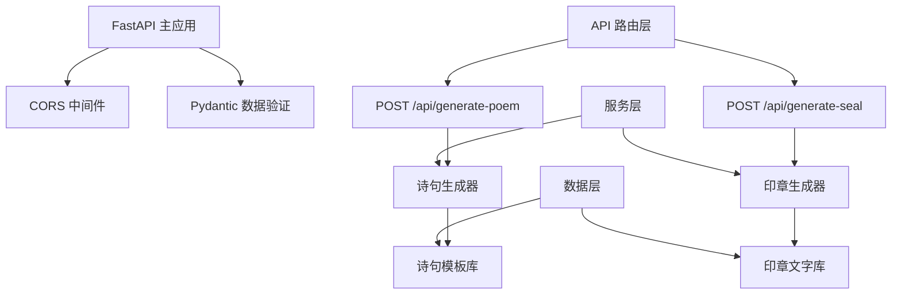

## 1. 架构设计



## 2. 技术描述

- **前端**：React 18 + TypeScript 5 + Vite 5
- **样式**：CSS Modules + CSS Variables（水墨主题色）
- **绘制引擎**：HTML5 Canvas 2D API，自定义笔触渲染
- **后端**：FastAPI + Python 3.10+，Uvicorn ASGI服务器
- **数据格式**：JSON请求响应，前端状态管理使用React Hooks

## 3. 目录结构

```
auto270/
├── package.json
├── tsconfig.json
├── vite.config.ts
├── index.html
├── src/
│   ├── main.tsx           # 入口文件
│   ├── App.tsx            # 主应用组件
│   ├── components/
│   │   ├── Canvas.tsx     # 核心画卷组件
│   │   ├── Toolbox.tsx    # 笔法工具箱
│   │   ├── PoemPanel.tsx  # 诗印面板
│   │   └── ColorPicker.tsx # 颜料盘组件
│   ├── hooks/
│   │   └── useCanvas.ts   # Canvas绘制Hook
│   ├── types/
│   │   └── index.ts       # 类型定义
│   ├── utils/
│   │   ├── brush.ts       # 笔触算法
│   │   ├── ink.ts         # 水墨晕染算法
│   │   └── export.ts      # 导出工具
│   └── styles/
│       └── theme.css      # 主题变量
└── backend/
    ├── main.py            # FastAPI入口
    ├── poem_generator.py  # 诗句生成逻辑
    └── seal_generator.py  # 印章生成逻辑
```

## 4. API 定义

### 4.1 类型定义

```typescript
// 笔法类型
type BrushTechnique = 'cun' | 'ca' | 'dian' | 'ran';

// 墨色类型（墨分五色）
type InkColor = 'jiao' | 'nong' | 'zhong' | 'dan' | 'qing';

// 印章类型
type SealType = 'square' | 'round' | 'leisure';

// 笔触数据
interface StrokeData {
  technique: BrushTechnique;
  inkColor: InkColor;
  brushSize: number;
  points: Point[];
  avgSpeed: number;
  avgPressure: number;
  duration: number;
}

interface Point {
  x: number;
  y: number;
  pressure: number;
  speed: number;
  timestamp: number;
}

// 诗句响应
interface PoemResponse {
  verse: string;
  type: 'five' | 'seven';
  technique: string;
  meaning: string;
}

// 印章响应
interface SealResponse {
  svg: string;
  text: string;
  type: SealType;
}
```

### 4.2 诗句生成API

**POST /api/generate-poem**

请求体：
```typescript
{
  technique: BrushTechnique;  // 笔法类型
  inkColor: InkColor;         // 墨色
  avgSpeed: number;           // 平均速度
  avgPressure: number;        // 平均压力
  strokeCount: number;        // 当前笔触数
}
```

响应体：
```typescript
{
  verse: string;              // 五言或七言诗句
  type: 'five' | 'seven';     // 诗句类型
  technique: string;          // 对应笔法描述
  meaning: string;            // 诗句释义
}
```

### 4.3 印章生成API

**POST /api/generate-seal**

请求体：
```typescript
{
  technique: BrushTechnique;  // 笔法类型
  strokeCount: number;        // 笔触数
  poemVerse: string;          // 最新诗句
}
```

响应体：
```typescript
{
  svg: string;                // 印章SVG字符串
  text: string;               // 印章文字（二字）
  type: SealType;             // 印章类型
}
```

## 5. 后端架构



## 6. 核心技术要点

### 6.1 前端Canvas绘制
- 使用 **requestAnimationFrame** 实现60fps流畅渲染
- 自定义笔触算法，根据速度和压力变化笔触粗细和透明度
- 水墨晕染效果：多层半透明叠加，边缘模糊处理
- 离屏Canvas双缓冲，避免闪烁

### 6.2 性能优化
- 笔触数据对象池复用，减少GC压力
- 增量渲染，仅重绘变化区域
- Web Worker处理复杂水墨算法
- 虚拟画布尺寸大于显示区域，支持缩放平移

### 6.3 交互设计
- 鼠标/触控笔统一事件处理
- 支持压感笔压力识别（Pointer Events API）
- 手势缩放：双指捏合，鼠标滚轮
- 拖拽平移：空格+拖拽，或中键拖拽

### 6.4 导出功能
- PNG导出：Canvas.toBlob()，支持高分辨率
- SVG导出：将笔触矢量化，使用贝塞尔曲线拟合
- 文件名格式：`墨韵丹青_YYYYMMDD_HHMMSS.png`
