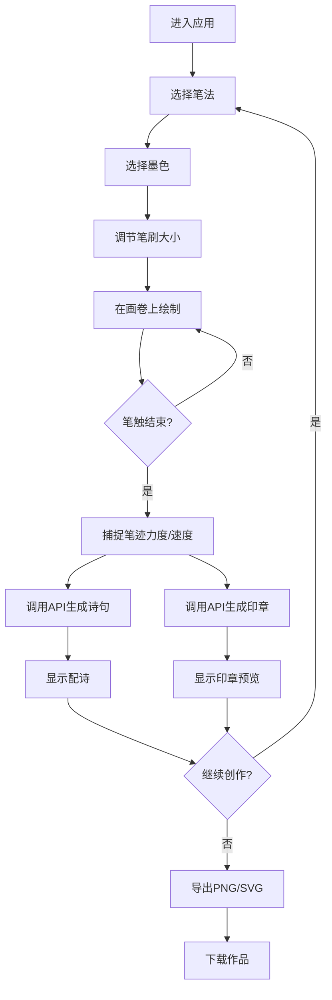

## 1. 产品概述

"墨韵丹青"是一款沉浸式水墨创作全栈Web应用，用户扮演古代画师在虚拟画卷上挥毫泼墨，体验传统中国水墨画的艺术魅力。应用结合现代Web技术与传统书画艺术，提供逼真的笔触效果、智能配诗和自动印章生成功能。

- **核心价值**：让用户无需专业器材即可体验传统水墨画创作，通过智能AI赋予作品诗意内涵
- **目标用户**：书画爱好者、文化体验者、教育工作者
- **市场定位**：文化艺术类Web应用，传承与创新中华传统文化

## 2. 核心功能

### 2.1 用户角色

| 角色 | 注册方式 | 核心权限 |
|------|----------|----------|
| 访客用户 | 无需注册 | 使用所有创作功能，导出作品 |

### 2.2 功能模块

1. **虚拟画卷画布**：支持笔触绘制、水墨晕染、缩放拖拽
2. **笔法工具箱**：皴、擦、点、染四种笔法，撤销、清空操作
3. **颜料盘**：墨分五色（焦、浓、重、淡、清），笔刷大小调节
4. **智能配诗**：根据笔法风格实时生成五言或七言诗句
5. **印章生成**：自动生成风格匹配的篆刻印章（方章、圆章、闲章）
6. **作品导出**：支持PNG和SVG格式导出，带时间戳命名

### 2.3 页面详情

| 页面名称 | 模块名称 | 功能描述 |
|----------|----------|----------|
| 主创作页 | 虚拟画卷 | 中央大面积画布，支持鼠标/触控笔绘制，水墨晕染效果，缩放拖拽查看细节 |
| 主创作页 | 笔法工具箱 | 左侧垂直布局，皴、擦、点、染四种笔法按钮，撤销和清空功能 |
| 主创作页 | 诗印面板 | 右侧垂直布局，实时显示生成的配诗，印章预览 |
| 主创作页 | 颜料控制栏 | 底部水平布局，墨分五色选择，笔刷大小滑块，导出按钮 |

## 3. 核心流程

用户进入应用后，选择笔法和墨色，在画卷上落笔创作。每次完整笔触结束后，系统捕捉笔迹特征，调用后端API生成对应诗句和印章，显示在右侧面板。创作完成后可导出作品。

## 4. 用户界面设计

### 4.1 设计风格

**水墨丹青主题，古朴淡雅**

- **主色调**：
  - 宣纸白 `#f5f0e6`（背景/画卷底色）
  - 墨黑 `#2c2c2c`（文字/主要笔触）
  - 朱砂红 `#c0392b`（印章/强调色）
  - 石青 `#4a90d9`（辅助色/交互元素）
  
- **按钮风格**：圆角矩形，古朴边框，悬停有墨迹晕开效果，按压有凹陷感
- **字体**：标题使用书法风格字体（如"Ma Shan Zheng"），正文使用宋体/仿宋，营造书卷气息
- **布局风格**：三栏式经典布局，中央画卷为主，两侧工具面板采用仿古卷轴样式
- **装饰元素**：木质纹理边框、宣纸质感背景、水墨晕染过渡效果

### 4.2 页面设计概述

| 页面名称 | 模块名称 | UI元素 |
|----------|----------|--------|
| 主创作页 | 虚拟画卷 | 宣纸质感背景，可缩放拖拽，笔触实时渲染60fps，水墨晕染动画 |
| 主创作页 | 笔法工具箱 | 仿古卷轴样式面板，图标按钮带毛笔质感，选中状态有朱砂红边框 |
| 主创作页 | 诗印面板 | 竖排诗句展示，书法字体，印章预览带朱砂红印泥效果 |
| 主创作页 | 颜料控制栏 | 墨色渐变条展示五色，滑块带毛笔图标，导出按钮为印章样式 |

### 4.3 响应式设计

- **桌面优先**：1280px以上为最佳体验，三栏完整布局
- **平板适配**（768-1280px）：左右面板可折叠收起，通过按钮展开
- **移动适配**（<768px）：单列布局，工具箱和诗印面板改为浮动抽屉式
- **触控优化**：支持触控笔压感识别，手势缩放拖拽

### 4.4 动效设计

- 页面加载：画卷缓缓展开动画，卷轴从两侧向中间打开
- 笔触绘制：实时水墨晕染扩散效果，根据速度变化干湿浓淡
- 按钮交互：悬停时墨迹晕开，点击时印章盖下效果
- 诗句生成：文字逐字浮现，如毛笔书写动画
- 印章生成：红色印泥盖下，带有轻微抖动和褪色效果
