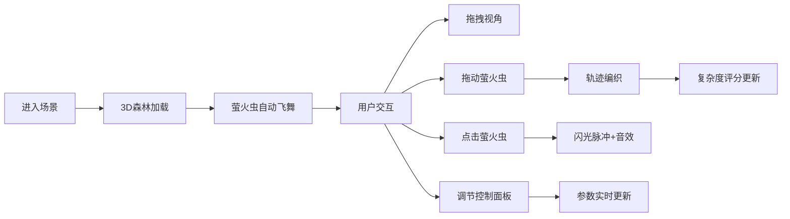

## 1. 产品概述

"萤火之森"是一款结合生态模拟与节奏元素的沉浸式3D互动体验游戏。用户扮演森林守护者，通过引导萤火虫编织光之轨迹，创造动态光网艺术，同时享受与视觉联动的环境音效。

- 核心目的：提供静谧、灵动的沉浸式艺术体验，让用户在互动中感受自然之美
- 目标用户：喜欢艺术、音乐、自然主题的休闲游戏玩家和创意爱好者
- 产品价值：将视觉艺术、音乐节奏与互动游戏完美融合，创造独特的疗愈系体验

## 2. 核心功能

### 2.1 用户角色
| 角色 | 注册方式 | 核心权限 |
|------|----------|----------|
| 森林守护者 | 无需注册，直接体验 | 引导萤火虫、调整参数、重置场景 |

### 2.2 功能模块
1. **3D森林场景**：暗夜森林环境、星空背景、萤火虫群
2. **萤火虫交互系统**：拖拽引导飞行、点击触发闪光脉冲、轨迹编织
3. **节奏同步系统**：萤火虫依循节奏闪烁、音效与光网联动
4. **控制面板**：数量调节、速度调节、轨迹重置
5. **评分系统**：光网复杂度实时评分

### 2.3 页面详情
| 页面名称 | 模块名称 | 功能描述 |
|----------|----------|----------|
| 主场景 | 3D森林夜景 | 全屏3D渲染，包含树木剪影、星空、萤火虫群 |
| 主场景 | 控制面板 | 右下角滑块和按钮，调节萤火虫数量、闪烁速度、重置轨迹 |
| 主场景 | 评分显示 | 左上角实时显示光网复杂度评分 |

## 3. 核心流程

用户进入页面后，自动加载3D森林场景，萤火虫开始随机飞舞。用户可以：
- 拖拽视角旋转观察场景
- 滚动缩放场景
- 按住左键拖动萤火虫改变飞行方向
- 点击萤火虫触发闪光脉冲
- 通过控制面板调整参数

## 4. 用户界面设计

### 4.1 设计风格
- **主色调**：深蓝黑#0a0e1a（背景）、萤火绿#c8ff80（主光色）、星光金#ffd700（点缀色）
- **按钮风格**：半透明玻璃态、圆角、微光边框
- **字体**：现代无衬线字体，采用荧光发光效果
- **布局风格**：全屏沉浸式，UI元素悬浮于3D场景之上
- **动效**：所有元素采用平滑过渡、发光脉冲效果

### 4.2 页面设计概述
| 页面名称 | 模块名称 | UI元素 |
|----------|----------|--------|
| 主场景 | 3D森林夜景 | 深蓝黑背景、树木剪影、星空粒子、萤火虫发光体、渐变光轨 |
| 主场景 | 控制面板 | 半透明深色背景、萤火绿滑块、发光按钮、圆角边框 |
| 主场景 | 评分显示 | 半透明深色背景、荧光文字、动态数字 |

### 4.3 响应性
- 桌面端优先设计，全屏沉浸式体验
- 支持鼠标拖拽、滚轮缩放、点击交互
- UI元素固定定位，不随3D视角变化

### 4.4 3D场景指导
- **环境**：暗夜森林，深蓝黑天空，点缀星光
- **光照**：环境光微弱，主要光源来自萤火虫自身发光
- **相机**：透视相机，支持OrbitControls轨道控制
- **构图**：萤火虫群居中分布，树木剪影环绕四周
- **交互**：拖拽旋转视角、滚轮缩放、左键拖动萤火虫、点击触发脉冲
- **后处理**：Bloom泛光效果，增强发光质感
- **性能**：60fps帧率，萤火虫数量可配置（10-100只）

### 4.5 音效设计
- 背景环境音：夜晚森林虫鸣、微风声
- 交互音效：点击萤火虫产生高亮音效
- 节奏联动：萤火虫闪烁与环境音效节奏同步
