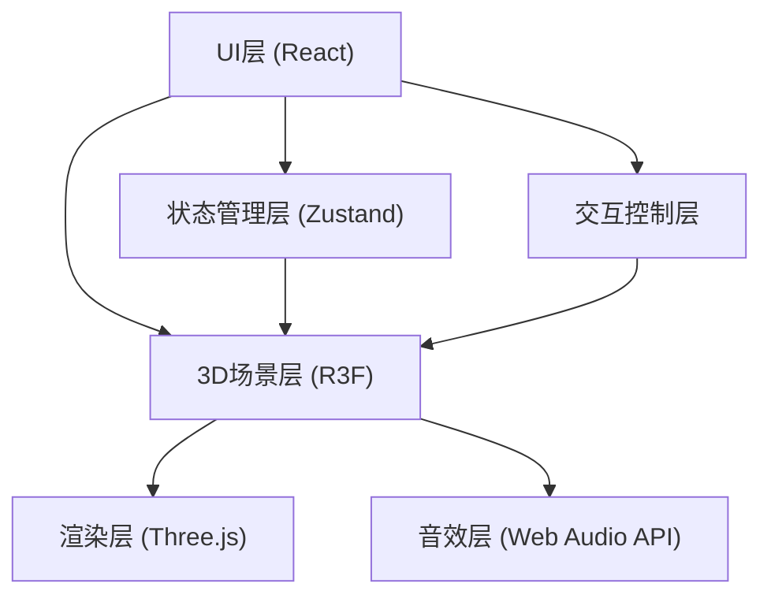

## 1. 架构设计

本项目为纯前端3D交互应用，采用分层架构设计。



## 2. 技术描述

- **前端框架**：React@18 + TypeScript
- **构建工具**：Vite@5
- **3D渲染**：Three.js@0.160 + @react-three/fiber@8 + @react-three/drei@9
- **3D后处理**：@react-three/postprocessing@2
- **状态管理**：Zustand@4
- **样式方案**：TailwindCSS@3
- **图标库**：Lucide React

## 3. 路由定义

| 路由 | 用途 |
|------|------|
| / | 主场景页面，包含3D森林和控制面板 |

## 4. 文件结构

```
src/
├── main.tsx              # 应用入口
├── App.tsx               # 主应用组件
├── store/
│   └── useGameStore.ts   # 游戏状态管理
├── scene/
│   ├── ForestScene.tsx   # 3D森林场景
│   ├── Firefly.tsx       # 萤火虫组件
│   ├── Trails.tsx        # 轨迹渲染
│   ├── Trees.tsx         # 树木剪影
│   └── Stars.tsx         # 星空背景
├── ui/
│   ├── ControlPanel.tsx  # 控制面板
│   └── ScoreDisplay.tsx  # 评分显示
├── hooks/
│   ├── useAudio.ts       # 音效Hook
│   └── useComplexity.ts  # 复杂度计算Hook
├── types/
│   └── index.ts          # 类型定义
└── utils/
    └── audio.ts          # 音频工具
```

## 5. 状态模型

### 5.1 游戏状态定义

```typescript
interface FireflyState {
  id: number;
  position: [number, number, number];
  velocity: [number, number, number];
  targetPosition: [number, number, number];
  flashPhase: number;
  flashIntensity: number;
  trail: [number, number, number][];
  isPulsing: boolean;
  pulseTime: number;
}

interface GameState {
  fireflyCount: number;
  flashSpeed: number;
  fireflies: FireflyState[];
  complexityScore: number;
  setFireflyCount: (count: number) => void;
  setFlashSpeed: (speed: number) => void;
  updateFirefly: (id: number, updates: Partial<FireflyState>) => void;
  resetTrails: () => void;
  triggerPulse: (id: number) => void;
  updateComplexity: () => void;
}
```

### 5.2 复杂度计算算法

基于轨迹交织程度计算：
- 轨迹线段交叉数量
- 萤火虫分布密度
- 轨迹总长度
- 多萤火虫轨迹重叠度

### 5.3 数据流向

1. 用户交互 → 控制面板 → Zustand状态更新
2. 状态更新 → 3D场景 → 萤火虫行为变化
3. 帧循环 → 位置更新 → 轨迹记录
4. 复杂度计算 → 评分显示
5. 交互事件 → 音效播放
