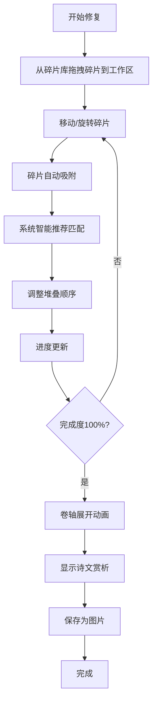

## 1. 产品概述

"织梦古卷"是一款沉浸式古籍修复互动体验应用，让用户化身古代卷轴修复师，通过拖拽、拼接破碎的诗文碎片来修复残缺的古卷。应用融合了拼图游戏的趣味性与传统文化的艺术性，在虚拟宣纸上重现千年诗文之美。

- 核心价值：将传统文化以互动游戏的形式呈现，让用户在修复古卷的过程中感受汉字之美与古典诗文的魅力
- 目标用户：文化爱好者、教育场景学习者、休闲游戏玩家
- 市场定位：轻量级文化互动体验Web应用，适合博物馆导览、教育辅助、文化传播等场景

## 2. 核心功能

### 2.1 用户角色

| 角色 | 注册方式 | 核心权限 |
|------|---------|---------|
| 访客用户 | 无需注册 | 完整体验古卷修复功能，保存修复成果 |

### 2.2 功能模块

1. **修复工作区**：拖拽移动、旋转、吸附对齐、堆叠调整、进度追踪
2. **碎片库面板**：展示未使用碎片、滚动选择、碎片预览
3. **诗文赏析面板**：已拼接诗句展示、作者信息、诗词释义
4. **成果保存**：卷轴特效动画、图片导出

### 2.3 页面详情

| 页面名称 | 模块名称 | 功能描述 |
|---------|---------|---------|
| 主修复页面 | 修复工作区 | 核心交互区域，支持碎片拖拽、旋转、吸附、堆叠，显示拼接进度，完成时触发卷轴展开动画 |
| 主修复页面 | 碎片库面板 | 左侧可滚动区域，展示所有待拼接碎片，显示碎片缩略图，支持点击选中拖拽 |
| 主修复页面 | 诗文赏析面板 | 右侧区域，实时显示已拼接出的完整诗句，附带作者简介和诗词释义 |
| 主修复页面 | 顶部工具栏 | 显示当前修复的古卷名称、修复进度条、重置按钮、保存按钮 |

## 3. 核心流程

### 用户修复古卷流程

用户从碎片库拖拽碎片到工作区 → 自由移动碎片位置 → 点击碎片旋转调整方向 → 碎片靠近时自动吸附对齐 → 系统根据边缘纹理智能推荐匹配 → 堆叠顺序调整（长按拖拽）→ 进度条实时更新 → 完成100%触发卷轴展开动画 → 显示完整诗文赏析 → 用户可保存为带卷轴特效的图片

## 4. 用户界面设计

### 4.1 设计风格

**美学定位**：古籍修复风格，典雅古朴，温润如玉

- **主色调**：
  - 古纸黄 `#f5e6c8` - 背景与工作区主色
  - 墨褐色 `#3e2723` - 文字与主要边框
  - 朱砂印 `#c0392b` - 强调色、印章、进度提示
  - 浅棕 `#8d6e63` - 次级文字、分隔线
  - 米白 `#faf3e0` - 碎片底色

- **字体**：
  - 标题：楷体 (KaiTi, STKaiti, "Noto Serif SC")
  - 正文：宋体 (SimSun, STSong, "Noto Serif SC")
  - 碎片文字：书法风格的楷体/宋体变体

- **视觉元素**：
  - 工作区背景：CSS生成的轻微宣纸纹理（噪点+纤维效果）
  - 碎片样式：不规则毛边效果、墨迹晕染阴影、轻微做旧感
  - 吸附效果：柔和的金色光晕动画
  - 进度条：朱砂红渐变，带毛笔笔触效果
  - 按钮：仿古卷轴造型，悬停微翘动画

- **动效设计**：
  - 拖拽：自然的物理跟随，轻微阴影变化
  - 吸附：金色光晕扩散，平滑的位置过渡
  - 旋转：流畅的90度旋转，带轻微缩放弹性
  - 完成动画：卷轴从中间向两边展开，古卷缓缓呈现

### 4.2 页面设计概述

| 页面名称 | 模块名称 | UI元素 |
|---------|---------|--------|
| 主修复页面 | 修复工作区 | 宣纸纹理背景，可拖拽碎片，吸附光晕效果，进度条，卷轴展开动画 |
| 主修复页面 | 碎片库面板 | 仿古卷轴边框，垂直滚动布局，碎片缩略图带预览，选中态高亮 |
| 主修复页面 | 诗文赏析面板 | 竹简纹理背景，竖排诗文展示，作者印章，释义文字 |
| 主修复页面 | 顶部工具栏 | 古卷标题，朱砂进度条，木质按钮，祥云装饰 |

### 4.3 响应式设计

- **桌面端（>1024px）**：三栏布局，左侧碎片库（240px）+ 中央工作区（自适应）+ 右侧赏析面板（280px）
- **平板端（768-1024px）**：碎片库和赏析面板改为可折叠抽屉，工作区占满
- **移动端（<768px）**：纵向布局，顶部进度条，中间工作区，底部可切换的碎片库/赏析面板标签页
- **触控优化**：移动端拖拽响应区域扩大，长按判定时间调整为500ms，支持双指缩放工作区

### 4.4 性能优化

- 拖拽使用CSS transform而非top/left，确保GPU加速
- 吸附计算使用requestAnimationFrame节流，避免过度计算
- 碎片元素使用will-change: transform优化重绘
- 光晕效果使用CSS box-shadow动画而非filter，提升性能
- 目标帧率：稳定60fps
