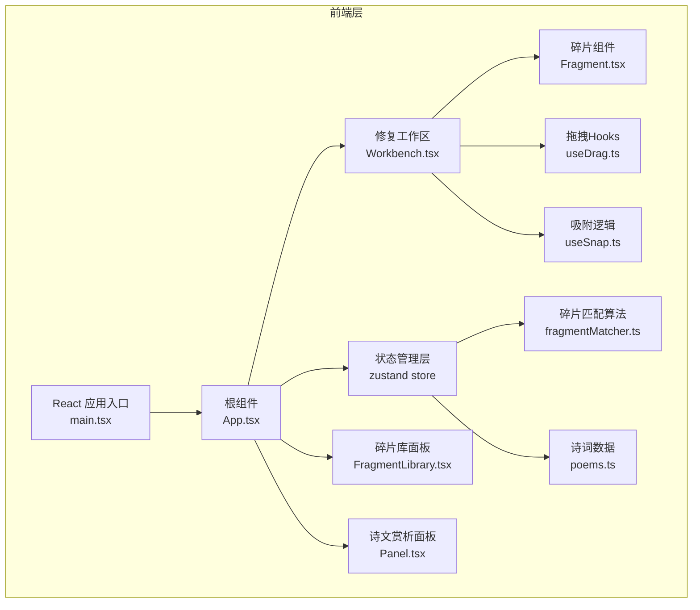

## 1. 架构设计



## 2. 技术描述

- **前端框架**：React 18 + TypeScript 5
- **构建工具**：Vite 5
- **状态管理**：Zustand（轻量级状态管理，适合实时拖拽交互）
- **样式方案**：CSS Modules + CSS Variables（组件级样式隔离，主题变量统一管理）
- **动画方案**：CSS Transitions + CSS Animations + requestAnimationFrame（确保60fps性能）
- **图片导出**：html2canvas（用于保存带卷轴特效的图片）
- **初始化工具**：vite-init

## 3. 目录结构

```
src/
├── components/
│   ├── Workbench.tsx        # 修复工作区主组件
│   ├── FragmentLibrary.tsx  # 左侧碎片库面板
│   ├── Panel.tsx            # 右侧诗文赏析面板
│   ├── Fragment.tsx         # 单个碎片组件
│   ├── Toolbar.tsx          # 顶部工具栏
│   └── ScrollAnimation.tsx  # 卷轴展开动画组件
├── hooks/
│   ├── useDrag.ts           # 拖拽逻辑Hook
│   ├── useSnap.ts           # 吸附对齐逻辑Hook
│   └── useLongPress.ts      # 长按堆叠调整Hook
├── store/
│   └── useFragmentStore.ts  # Zustand状态管理
├── utils/
│   ├── fragmentMatcher.ts   # 碎片匹配算法
│   └── poems.ts             # 诗词数据
├── styles/
│   ├── variables.css        # CSS变量主题
│   └── animations.css       # 动画关键帧
├── types/
│   └── index.ts             # TypeScript类型定义
├── App.tsx                  # 应用根组件
└── main.tsx                 # 应用入口
```

## 4. 数据模型

### 4.1 核心类型定义

```typescript
interface Fragment {
  id: string;
  text: string;           // 碎片上的文字
  poemId: string;         // 所属诗词ID
  position: { x: number; y: number };  // 在工作区的位置
  rotation: number;       // 旋转角度（0, 90, 180, 270）
  zIndex: number;         // 堆叠顺序
  isPlaced: boolean;      // 是否已放置到工作区
  isCorrect: boolean;     // 是否已正确拼接
  edges: {                // 四边纹理特征（用于匹配）
    top: number[];
    right: number[];
    bottom: number[];
    left: number[];
  };
  correctPosition: { x: number; y: number };  // 正确位置
  correctRotation: number;                     // 正确角度
}

interface Poem {
  id: string;
  title: string;
  author: string;
  dynasty: string;
  content: string[];      // 诗句数组
  translation: string;    // 译文
  appreciation: string;   // 赏析
}

interface MatchResult {
  fragmentId1: string;
  fragmentId2: string;
  edge1: 'top' | 'right' | 'bottom' | 'left';
  edge2: 'top' | 'right' | 'bottom' | 'left';
  score: number;          // 匹配得分 0-100
}
```

### 4.2 状态结构

```typescript
interface FragmentState {
  fragments: Fragment[];
  currentPoem: Poem | null;
  progress: number;       // 修复进度 0-100
  isCompleted: boolean;
  showScrollAnimation: boolean;
  
  // Actions
  addFragment: (fragment: Fragment) => void;
  updateFragment: (id: string, updates: Partial<Fragment>) => void;
  rotateFragment: (id: string) => void;
  bringToFront: (id: string) => void;
  checkCompletion: () => void;
  resetWorkbench: () => void;
  saveAsImage: () => Promise<void>;
}
```

## 5. 核心算法

### 5.1 碎片匹配算法 (fragmentMatcher.ts)

```typescript
// 计算两条边的纹理相似度
function calculateEdgeSimilarity(edge1: number[], edge2: number[]): number {
  // 1. 反转其中一条边（因为相邻边是镜像关系）
  const reversedEdge2 = [...edge2].reverse();
  
  // 2. 计算余弦相似度
  const dotProduct = edge1.reduce((sum, val, i) => sum + val * reversedEdge2[i], 0);
  const norm1 = Math.sqrt(edge1.reduce((sum, val) => sum + val * val, 0));
  const norm2 = Math.sqrt(reversedEdge2.reduce((sum, val) => sum + val * val, 0));
  
  // 3. 归一化到0-100
  return Math.round((dotProduct / (norm1 * norm2)) * 100);
}

// 查找最佳匹配
export function findBestMatches(fragments: Fragment[], threshold: number = 70): MatchResult[] {
  const results: MatchResult[] = [];
  const edges: Array<'top' | 'right' | 'bottom' | 'left'> = ['top', 'right', 'bottom', 'left'];
  const oppositeEdges: Record<string, string> = {
    top: 'bottom',
    bottom: 'top',
    left: 'right',
    right: 'left'
  };
  
  for (let i = 0; i < fragments.length; i++) {
    for (let j = i + 1; j < fragments.length; j++) {
      for (const edge1 of edges) {
        const edge2 = oppositeEdges[edge1] as keyof Fragment['edges'];
        const score = calculateEdgeSimilarity(
          fragments[i].edges[edge1],
          fragments[j].edges[edge2]
        );
        if (score >= threshold) {
          results.push({
            fragmentId1: fragments[i].id,
            fragmentId2: fragments[j].id,
            edge1,
            edge2,
            score
          });
        }
      }
    }
  }
  
  return results.sort((a, b) => b.score - a.score);
}
```

### 5.2 吸附对齐算法 (useSnap.ts)

```typescript
const SNAP_THRESHOLD = 15;  // 吸附触发距离（像素）
const SNAP_GRID = 10;       // 网格吸附大小

function snapToGrid(value: number): number {
  return Math.round(value / SNAP_GRID) * SNAP_GRID;
}

function snapToFragments(
  currentPos: { x: number; y: number },
  currentSize: { width: number; height: number },
  otherFragments: Fragment[]
): { x: number; y: number; snapped: boolean } {
  let snapX = currentPos.x;
  let snapY = currentPos.y;
  let snapped = false;
  
  for (const other of otherFragments) {
    if (!other.isPlaced) continue;
    
    const otherSize = { width: 80, height: 80 }; // 假设固定大小
    
    // 检查水平对齐（左-右）
    if (Math.abs(currentPos.x - (other.position.x + otherSize.width)) < SNAP_THRESHOLD) {
      snapX = other.position.x + otherSize.width;
      snapped = true;
    }
    // 检查水平对齐（右-左）
    if (Math.abs((currentPos.x + currentSize.width) - other.position.x) < SNAP_THRESHOLD) {
      snapX = other.position.x - currentSize.width;
      snapped = true;
    }
    // 检查垂直对齐（上-下）
    if (Math.abs(currentPos.y - (other.position.y + otherSize.height)) < SNAP_THRESHOLD) {
      snapY = other.position.y + otherSize.height;
      snapped = true;
    }
    // 检查垂直对齐（下-上）
    if (Math.abs((currentPos.y + currentSize.height) - other.position.y) < SNAP_THRESHOLD) {
      snapY = other.position.y - currentSize.height;
      snapped = true;
    }
  }
  
  return { x: snapX, y: snapY, snapped };
}
```

## 6. 性能优化策略

1. **组件层级优化**：
   - Fragment组件使用React.memo避免不必要重渲染
   - 拖拽状态使用ref而非state，减少重渲染
   - 使用useCallback缓存事件处理函数

2. **渲染性能**：
   - 拖拽使用transform: translate(x, y)而非top/left
   - 为碎片添加will-change: transform提示GPU加速
   - 吸附计算使用requestAnimationFrame节流到每帧一次

3. **内存管理**：
   - 组件卸载时清理事件监听器
   - 及时取消requestAnimationFrame回调
   - 大图片资源使用懒加载

4. **触摸优化**：
   - 使用passive: true提升滚动性能
   - 避免touchstart/touchmove中执行重计算
   - 实现触控防抖，避免误触

## 7. 浏览器兼容性

- 现代浏览器：Chrome 90+, Firefox 88+, Safari 14+, Edge 90+
- 使用CSS @supports进行特性检测
- 为transform提供-webkit-前缀
- 不支持IE系列浏览器
