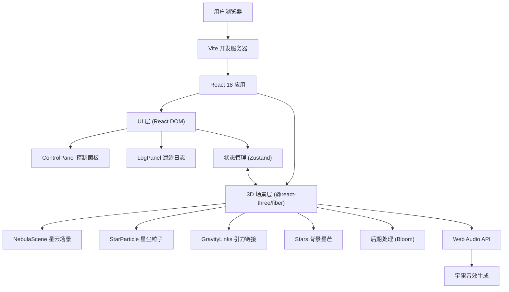

## 1. 架构设计



## 2. 技术描述

- **前端框架**：React 18 + TypeScript 5
- **3D渲染**：Three.js r160 + @react-three/fiber 8 + @react-three/drei 9
- **后期处理**：@react-three/postprocessing
- **构建工具**：Vite 5
- **状态管理**：Zustand（轻量级，适合3D场景状态共享）
- **样式方案**：TailwindCSS 3（UI面板样式）
- **音频**：Web Audio API（程序化生成宇宙音效）

## 3. 项目结构

```
src/
├── main.tsx              # 应用入口
├── App.tsx               # 根组件，组装场景和UI
├── store/
│   └── useStore.ts       # Zustand状态管理
├── scene/
│   ├── NebulaScene.tsx   # 3D主场景，粒子生成和引力网络
│   ├── StarParticle.tsx  # 单个粒子组件
│   ├── GravityLinks.tsx  # 引力链接线组件
│   ├── BackgroundStars.tsx # 背景星芒
│   └── Asteroid.tsx      # 小行星（拾取后的粒子）
├── ui/
│   ├── ControlPanel.tsx  # 左下角控制面板
│   ├── LogPanel.tsx      # 右下角日志面板
│   └── DistanceTooltip.tsx # 距离提示组件
├── utils/
│   ├── audio.ts          # 音效生成工具
│   ├── noise.ts          # 噪声函数
│   └── types.ts          # TypeScript类型定义
└── styles/
    └── index.css         # 全局样式和TailwindCSS
```

## 4. 路由定义

| 路由 | 用途 |
|-------|---------|
| / | 主场景页面，包含3D星云和所有UI面板 |

## 5. 数据模型

### 5.1 粒子数据类型
```typescript
interface ParticleData {
  id: string;
  position: [number, number, number];
  type: 'gold' | 'purple' | 'blue' | 'crystal';
  size: number;
  collected: boolean;
  timestamp: number;
}

interface CollectedLog {
  id: string;
  type: ParticleType;
  size: number;
  distance: number;
  timestamp: number;
}

interface LinkData {
  id: string;
  particleA: string;
  particleB: string;
  distance: number;
  highlighted: boolean;
}

interface AppState {
  particles: ParticleData[];
  collectedLogs: CollectedLog[];
  scanSpeed: number;
  totalCollected: number;
  highlightedLink: string | null;
  addParticle: () => void;
  collectParticle: (id: string) => void;
  setScanSpeed: (speed: number) => void;
  highlightLink: (id: string | null) => void;
  resetCamera: () => void;
}
```

### 5.2 状态管理设计
使用Zustand管理全局状态，包括：
- 粒子数组（位置、类型、收集状态）
- 收集日志记录
- 扫描速度参数
- 高亮链接ID
- 操作方法（添加粒子、收集粒子等）

## 6. 关键技术实现

### 6.1 3D场景优化
- 使用 `InstancedMesh` 批量渲染多个粒子，减少Draw Call
- 使用 `useFrame` 钩子实现平滑动画，避免阻塞主线程
- 粒子数量动态控制（上限200个），确保60fps
- 距离剔除：远处粒子简化渲染

### 6.2 引力链接网络
- 每帧计算粒子间距离，低于阈值则创建链接
- 使用 `LineSegments` 渲染链接线，支持动态更新
- 链接透明度随距离变化，营造深度感
- 点击链接触发高亮，显示距离信息

### 6.3 粒子拾取动画
- 使用 `@react-spring/three` 实现平滑缩放过渡
- 拾取时播放膨胀动画和发光效果
- 生成程序化宇宙音效（不同粒子类型不同音调）

### 6.4 后期处理
- Bloom效果增强粒子发光感
- 轻微色差模拟宇宙视觉
- 色彩分级增强星云色调

### 6.5 性能监控
- 使用 `@react-three/drei` 的 `Stats` 组件监控帧率
- 粒子间距离计算使用空间哈希优化
- 音频生成使用离屏AudioContext避免卡顿
