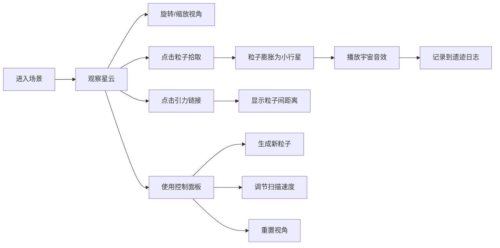

## 1. 产品概述

"星尘回响"是一个沉浸式3D交互可视化体验项目，让用户化身为星际考古学家，在神秘的三维星云中探索、扫描和收集远古星尘遗迹粒子。通过拾取粒子、观察引力链接网络、聆听宇宙音效，用户可以获得深度的沉浸感和探索乐趣。

- **核心目标**：打造一个视觉震撼、交互流畅的3D星云探索体验
- **目标用户**：喜欢宇宙探索、艺术装置、交互体验的用户
- **产品价值**：通过精美的视觉效果和流畅的交互，让用户感受宇宙的浩瀚与神秘

## 2. 核心功能

### 2.1 用户角色
无需注册登录，所有用户以"星际考古学家"身份直接进入体验。

### 2.2 功能模块
1. **3D星云场景**：全屏沉浸式星云背景，动态星芒和光晕效果
2. **星尘粒子系统**：随机生成可拾取的星尘遗迹粒子，带有不同类型和属性
3. **引力链接网络**：粒子间动态形成引力线，构成可视化网络
4. **交互控制系统**：鼠标旋转视角、滚轮缩放、点击交互
5. **粒子拾取系统**：点击粒子拾取，粒子膨胀为小行星并播放音效
6. **控制面板**：粒子生成、扫描速度调节、视角重置
7. **遗迹日志面板**：记录拾取的粒子数据和统计信息

### 2.3 页面详情
| 页面名称 | 模块名称 | 功能描述 |
|-----------|-------------|---------------------|
| 主场景页 | 3D星云场景 | 全屏Three.js渲染，动态星云背景，星尘粒子漂浮 |
| 主场景页 | 引力链接网络 | 粒子间动态连线，点击高亮显示距离信息 |
| 主场景页 | 控制面板 | 左下角悬浮面板，包含生成按钮、速度滑块、重置按钮 |
| 主场景页 | 遗迹日志 | 右下角悬浮面板，显示粒子数量、类型、距离统计 |

## 3. 核心流程

用户进入页面后，首先看到深邃的星云背景和漂浮的星尘粒子。用户可以：
1. 拖动鼠标旋转视角，滚轮缩放观察星云
2. 点击星尘粒子进行拾取，粒子膨胀为小行星并播放宇宙音效
3. 观察粒子之间的引力链接网络，点击连线查看粒子间距离
4. 使用控制面板生成新粒子、调节扫描速度、重置视角
5. 在日志面板查看收集的遗迹数据统计

## 4. 用户界面设计

### 4.1 设计风格
- **设计方向**：星云极光风格，深邃神秘的宇宙美学
- **主色调**：深空蓝 `#0a0e1a`（背景）、星尘金 `#ffd700`（粒子/高亮）、极光绿 `#00ff88`（链接/交互）
- **辅助色**：星尘紫 `#8b5cf6`、星云蓝 `#3b82f6`、光晕白 `rgba(255,255,255,0.8)`
- **按钮风格**：半透明玻璃态，圆角8px，悬停时发光效果
- **字体**：使用 Orbitron 作为标题字体（科技感），Inter 作为正文字体
- **布局风格**：全屏3D场景为主体，UI面板采用浮动玻璃态设计，悬浮于场景之上
- **图标风格**：线性细边图标，科技感十足，带有发光效果

### 4.2 页面设计概述
| 页面名称 | 模块名称 | UI元素 |
|-----------|-------------|-------------|
| 主场景页 | 3D星云场景 | 深空蓝背景渐变、动态星芒闪烁、粒子光晕效果、景深模糊 |
| 主场景页 | 星尘粒子 | 金色发光球体、脉冲动画、拾取后膨胀带纹理 |
| 主场景页 | 引力链接 | 绿色渐变线条、流动光效、点击高亮加粗 |
| 主场景页 | 控制面板 | 玻璃态背景、模糊效果、金色按钮、绿色滑块 |
| 主场景页 | 遗迹日志 | 玻璃态背景、数据卡片、数字动画、粒子类型标签 |

### 4.3 响应式
- 桌面端优先设计，确保1920x1080及以上分辨率体验最佳
- UI面板采用固定定位，适配不同屏幕尺寸
- 3D场景自适应窗口大小，保持正确的宽高比
- 触摸设备支持双指缩放和单指旋转

### 4.4 3D场景指导
- **环境/HDRI**：程序化生成星云背景，使用多层渐变和噪声纹理模拟宇宙尘埃
- **光照设置**：环境光 + 点光源，粒子自身发光材质，营造神秘氛围
- **相机设置**：PerspectiveCamera，fov=60，开启轨道控制器，限制最小最大缩放距离
- **构图和焦点元素**：粒子群位于场景中心，引力网络形成视觉焦点
- **交互和动画**：粒子漂浮动画、拾取膨胀动画、链接流动光效、相机平滑过渡
- **后期处理**：Bloom泛光效果、轻微景深、色彩分级增强星云感
- **性能预算**：粒子数量控制在50-200个，使用InstancedMesh优化，目标60fps
