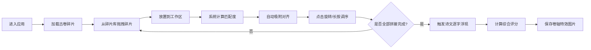

## 1. 产品概述

"织梦古卷"是一款沉浸式古籍修复互动Web应用，用户扮演古代卷轴修复师，通过拖拽、拼接破碎的文本碎片来修复残缺的古卷。应用融合拼图游戏玩法与传统文化元素，让用户在互动中体验古籍修复的乐趣，感受中华传统文化之美。

- 核心价值：将古籍修复转化为趣味互动体验，寓教于乐地传播传统文化
- 目标用户：传统文化爱好者、拼图游戏玩家、教育场景用户
- 市场差异化：独特的古籍修复主题 + 智能碎片匹配 + 卷轴视觉特效

## 2. 核心功能

### 2.1 用户角色

| 角色 | 注册方式 | 核心权限 |
|------|----------|----------|
| 修复师（用户） | 无需注册，直接使用 | 拖拽碎片、旋转调整、拼接修复、保存成果 |

### 2.2 功能模块

1. **主修复工作台**：碎片拖拽放置、90度旋转、长按调整堆叠顺序、自动吸附对齐
2. **碎片库面板**：展示未使用的碎片列表、按墨迹/字形分类筛选、碎片预览
3. **诗文赏析面板**：显示拼接结果、匹配度进度条、逐字浮现动画、修复评分
4. **智能匹配系统**：基于墨迹纹理向量计算边缘匹配度、推荐相邻碎片位置
5. **成果保存**：卷轴展开动画、生成带特效的图片文件下载

### 2.3 页面详情

| 页面名称 | 模块名称 | 功能描述 |
|----------|----------|----------|
| 修复工作台 | 中央宣纸工作区 | 宣纸质感画布，支持碎片放置、旋转、堆叠、吸附，60fps流畅拖拽 |
| 修复工作台 | 左侧碎片库 | 可滚动碎片列表，按颜色/字形分类，拖拽起始半透明预览 |
| 修复工作台 | 右侧诗文赏析 | 显示完整诗文、作者、释义，匹配度进度条，修复评分（精度+用时） |
| 修复工作台 | 顶部工具栏 | 重置画布、撤销操作、保存图片、音效开关 |

## 3. 核心流程

用户进入应用 → 系统加载古卷碎片数据 → 用户从碎片库拖拽碎片到工作区 → 系统实时计算匹配度并显示 → 用户点击旋转/长按调整堆叠 → 碎片自动吸附到最佳匹配位置 → 全部拼接完成后触发诗文逐字浮现动画 → 系统计算综合评分 → 用户可保存为卷轴特效图片。

## 4. 用户界面设计

### 4.1 设计风格

- **主色调**：古纸黄 `#f5e6c8`、墨褐 `#3e2723`、朱砂印 `#c62828`
- **辅助色**：淡竹青 `#a8c29a`、藏青 `#2c3e50`、米白 `#faf5e6`
- **字体**：标题使用书法风格字体（如"Ma Shan Zheng"、"ZCOOL XiaoWei"），正文使用清晰易读的衬线字体
- **按钮风格**：毛笔书法边框，圆角微方，悬停有墨晕扩散效果，按压有朱砂印反馈
- **布局风格**：三栏式古籍装帧布局，中央为卷轴工作区，左右为木刻板风格面板
- **图标**：采用线描风格的古籍元素图标（毛笔、印章、卷轴、砚台等）

### 4.2 页面设计概述

| 页面名称 | 模块名称 | UI元素 |
|----------|----------|--------|
| 修复工作台 | 宣纸工作区 | 古纸纹理背景、毛边边框、墨迹晕染效果、拖拽阴影、吸附光晕粒子 |
| 修复工作台 | 碎片库面板 | 木板纹理背景、分类标签（篆刻风格）、碎片卡片（破损纸边效果） |
| 修复工作台 | 诗文赏析面板 | 竖排文字、古籍句读、朱砂印章、匹配度进度条（水墨填充） |
| 修复工作台 | 全局动效 | 碎片弹性拖拽动画、吸附音效+粒子光晕、诗文逐字淡入、卷轴展开动效 |

### 4.3 响应式设计

- **桌面端（>1200px）**：三栏布局，中央工作区占60%，左右面板各占20%
- **平板端（768px-1200px）**：左右面板可折叠，工作区自适应缩放
- **移动端（<768px）**：底部选项卡切换（碎片库/修复/赏析），工作区占满屏幕，支持触摸拖拽和双指旋转
- 工作区Canvas自动适配屏幕尺寸，保持古卷纵横比例

### 4.4 视觉特效细节

- **碎片拖拽**：跟随鼠标的半透明预览，z轴阴影随拖拽高度变化，释放时有弹性回弹动画
- **吸附效果**：碎片接近匹配位置时显示淡色光晕，吸附瞬间播放轻微"嗒"声音效和金色粒子爆散
- **诗文浮现**：每字以0.15秒间隔淡入，配有毛笔书写动画轨迹，完整浮现后加盖朱砂印章
- **保存动效**：拼接好的古卷从两侧向中间卷起，再缓缓展开呈现完整画面，随后触发下载
