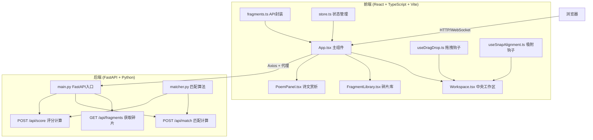
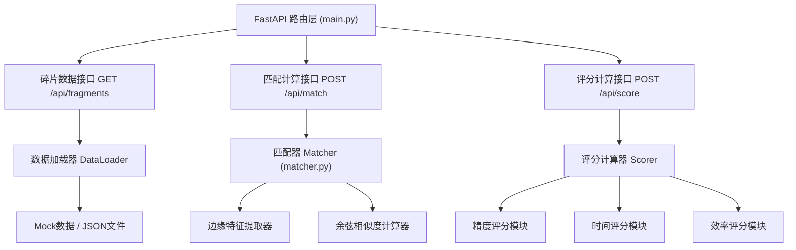
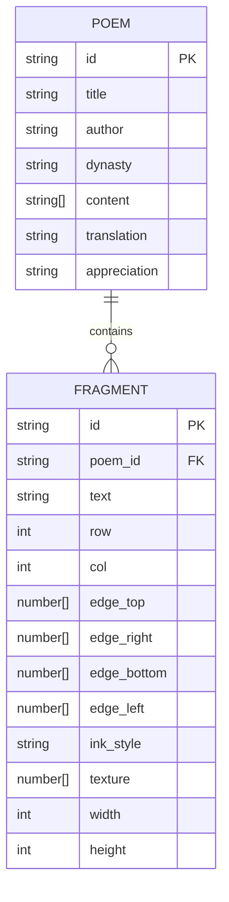

## 1. 架构设计



## 2. 技术描述

- **前端框架**：React 18 + TypeScript 5 + Vite 5
- **状态管理**：Zustand（轻量级，适合游戏状态）
- **样式方案**：Tailwind CSS 3 + CSS Modules（组件级样式隔离）
- **拖拽库**：@dnd-kit/core（高性能拖拽，支持触摸和指针事件）
- **HTTP客户端**：Axios（带拦截器和类型定义）
- **音效处理**：Web Audio API（内置吸附音效合成）
- **图形导出**：html2canvas（生成卷轴特效图片）
- **动画库**：Framer Motion（复杂动画和过渡效果）
- **后端框架**：FastAPI 0.100+（高性能异步Python Web框架）
- **ASGI服务器**：Uvicorn
- **匹配算法**：基于边缘特征向量的余弦相似度计算
- **初始化工具**：Vite 官方 react-ts 模板

## 3. 路由定义

| 路由 | 用途 |
|------|------|
| `/` | 主修复工作台页面（单页应用，唯一入口） |
| `/api/fragments` | 后端API - 获取碎片数据 |
| `/api/match` | 后端API - 计算碎片匹配度 |
| `/api/score` | 后端API - 计算修复评分 |

## 4. API 定义

### TypeScript 类型定义

```typescript
export interface Fragment {
  id: string;
  text: string;
  position: { row: number; col: number };
  edges: {
    top: number[];
    right: number[];
    bottom: number[];
    left: number[];
  };
  inkStyle: string;
  texture: number[];
  width: number;
  height: number;
  rotation: number;
}

export interface PlacedFragment extends Fragment {
  x: number;
  y: number;
  zIndex: number;
  isPlaced: boolean;
  matchScore: number;
}

export interface MatchResult {
  fragmentId: string;
  adjacentId: string;
  edge: 'top' | 'right' | 'bottom' | 'left';
  score: number;
  suggestedPosition: { x: number; y: number };
}

export interface ScoreRequest {
  placedFragments: PlacedFragment[];
  totalTime: number;
  totalMoves: number;
}

export interface ScoreResponse {
  totalScore: number;
  accuracyScore: number;
  timeScore: number;
  efficiencyScore: number;
  grade: 'S' | 'A' | 'B' | 'C' | 'D';
  poemRevealed: string;
}

export interface PoemData {
  id: string;
  title: string;
  author: string;
  dynasty: string;
  content: string[];
  translation: string;
  appreciation: string;
}
```

### 请求/响应 Schema

**GET /api/fragments**
- 响应：`{ fragments: Fragment[], poem: PoemData }`

**POST /api/match**
- 请求体：`{ fragment: Fragment, placedFragments: PlacedFragment[] }`
- 响应：`{ matches: MatchResult[], bestMatch: MatchResult | null }`

**POST /api/score**
- 请求体：`ScoreRequest`
- 响应：`ScoreResponse`

## 5. 后端架构图



## 6. 数据模型

### 6.1 数据模型定义



### 6.2 模拟数据结构

```python
# backend/data/poems.json
{
  "poems": [
    {
      "id": "poem_001",
      "title": "静夜思",
      "author": "李白",
      "dynasty": "唐",
      "content": ["床前明月光", "疑是地上霜", "举头望明月", "低头思故乡"],
      "translation": "明亮的月光洒在床前的窗户纸上...",
      "appreciation": "这首诗写的是在寂静的月夜思念家乡的感受..."
    }
  ]
}

# backend/data/fragments.json
{
  "fragments": [
    {
      "id": "frag_001_0_0",
      "poem_id": "poem_001",
      "text": "床",
      "row": 0,
      "col": 0,
      "edge_top": [0.1, 0.3, 0.2, ...],
      "edge_right": [0.5, 0.2, 0.8, ...],
      "width": 80,
      "height": 80,
      "ink_style": "regular",
      "texture": [0.3, 0.5, 0.2, ...]
    }
  ]
}
```

## 7. 前端性能优化方案

1. **GPU加速**：所有碎片使用 `transform: translate3d()` 和 `will-change: transform` 启用硬件加速
2. **按需渲染**：使用 `React.memo` 包裹碎片组件，避免不必要的重渲染
3. **事件节流**：拖拽事件使用 `requestAnimationFrame` 节流，确保60fps
4. **虚拟滚动**：碎片库超过20个碎片时使用虚拟滚动
5. **离屏计算**：匹配度计算在 Web Worker 中进行，不阻塞主线程
6. **CSS变量**：主题色和动画参数使用CSS变量，便于运行时调整

## 8. 项目文件结构

```
auto274/
├── .trae/documents/
│   ├── PRD_织梦古卷.md
│   └── TECH_织梦古卷.md
├── src/
│   ├── components/
│   │   ├── Workspace.tsx          # 中央工作区
│   │   ├── FragmentLibrary.tsx    # 左侧碎片库
│   │   ├── PoemPanel.tsx          # 右侧诗文赏析
│   │   ├── Fragment.tsx           # 单个碎片组件
│   │   ├── Toolbar.tsx            # 顶部工具栏
│   │   └── ScrollEffect.tsx       # 卷轴特效组件
│   ├── hooks/
│   │   ├── useDragDrop.ts         # 拖拽逻辑
│   │   ├── useSnapAlignment.ts    # 吸附对齐逻辑
│   │   └── useTimer.ts            # 计时器
│   ├── store/
│   │   └── useFragmentStore.ts    # Zustand状态管理
│   ├── api/
│   │   └── fragments.ts           # API封装
│   ├── types/
│   │   └── index.ts               # TypeScript类型定义
│   ├── utils/
│   │   ├── audio.ts               # 音效工具
│   │   ├── animation.ts           # 动画工具
│   │   └── export.ts              # 图片导出工具
│   ├── App.tsx                    # 主组件
│   ├── main.tsx                   # 入口文件
│   └── index.css                  # 全局样式
├── backend/
│   ├── __init__.py
│   ├── main.py                    # FastAPI入口
│   ├── matcher.py                 # 匹配算法
│   └── data/
│       ├── poems.json             # 诗文数据
│       └── fragments.json         # 碎片数据
├── package.json
├── tsconfig.json
├── vite.config.ts
└── tailwind.config.js
```
