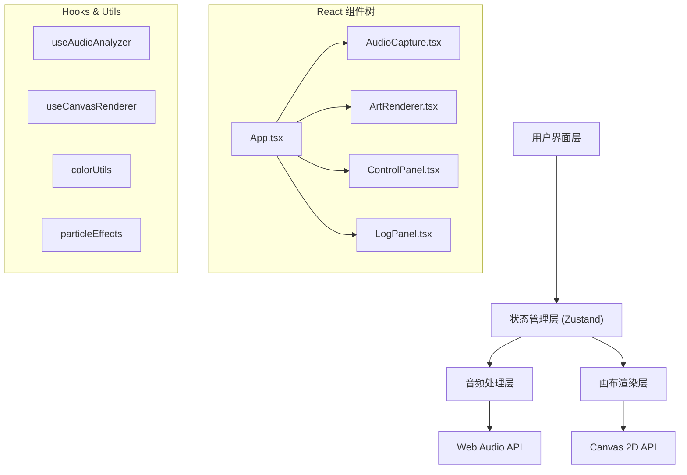
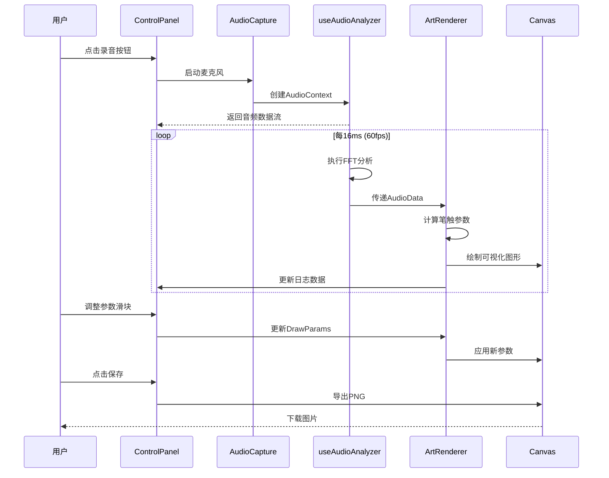

## 1. 架构设计



## 2. 技术描述

- **前端框架**: React 18 + TypeScript 5 + Vite 5
- **样式方案**: TailwindCSS 3 + CSS Variables
- **状态管理**: Zustand
- **图标库**: lucide-react
- **音频处理**: Web Audio API (AnalyserNode, AudioContext)
- **图形渲染**: Canvas 2D API
- **开发工具**: Vite, TypeScript Strict Mode

## 3. 项目结构

```
d:\Solocoder\VersionFast\tasks\auto275\
├── public/
│   └── index.html
├── src/
│   ├── main.tsx              # 入口文件
│   ├── App.tsx               # 根组件
│   ├── store/
│   │   └── useAppStore.ts    # 全局状态管理
│   ├── audio/
│   │   ├── AudioCapture.tsx  # 音频输入组件
│   │   └── useAudioAnalyzer.ts # 音频分析Hook
│   ├── canvas/
│   │   ├── ArtRenderer.tsx   # 画布渲染组件
│   │   └── useCanvasRenderer.ts # 画布渲染Hook
│   ├── ui/
│   │   ├── ControlPanel.tsx  # 控制面板
│   │   └── LogPanel.tsx      # 日志面板
│   ├── types/
│   │   └── index.ts          # 类型定义
│   └── utils/
│       ├── colorUtils.ts     # 颜色工具
│       └── particleEffects.ts # 粒子效果
├── package.json
├── tsconfig.json
├── vite.config.ts
└── tailwind.config.js
```

## 4. 核心数据类型定义

```typescript
// 音频分析数据
interface AudioData {
  frequencyData: Uint8Array;     // 频谱数据
  timeDomainData: Uint8Array;    // 时域数据
  volume: number;                // 音量 0-1
  peakFrequency: number;         // 峰值频率 Hz
  dominantPitch: number;         // 主导音高 Hz
  frequencyBands: FrequencyBands; // 频段能量
}

// 频段能量分布
interface FrequencyBands {
  bass: number;      // 低频 20-250Hz
  lowMid: number;    // 中低频 250-500Hz
  mid: number;       // 中频 500-2000Hz
  highMid: number;   // 中高频 2000-4000Hz
  treble: number;    // 高频 4000-20000Hz
}

// 绘制参数
interface DrawParams {
  hue: number;           // 色相 0-360
  saturation: number;    // 饱和度 0-100
  lightness: number;     // 亮度 0-100
  strokeWidth: number;   // 笔触粗细 1-20
  granularity: number;   // 粒度 1-10
  distortion: number;    // 扭曲强度 0-100
  opacity: number;       // 透明度 0-1
}

// 颜色主题
interface ColorTheme {
  id: string;
  name: string;
  hueStart: number;
  hueEnd: number;
  accentColor: string;
  bgColor: string;
}

// 画布状态
interface CanvasState {
  history: ImageData[];     // 撤销历史
  currentFrame: number;     // 当前帧数
  particles: Particle[];    // 粒子系统
}

// 粒子
interface Particle {
  x: number;
  y: number;
  vx: number;
  vy: number;
  life: number;
  maxLife: number;
  color: string;
  size: number;
}

// 应用状态
interface AppState {
  isRecording: boolean;
  audioSource: 'mic' | 'file' | null;
  audioData: AudioData | null;
  drawParams: DrawParams;
  currentTheme: string;
  colorThemes: ColorTheme[];
  logMessages: LogMessage[];
}
```

## 5. 核心流程时序



## 6. 性能优化策略

1. **音频分析优化**
   - 使用AnalyserNode的smoothingTimeConstant=0.8减少数据抖动
   - FFT大小设为2048，平衡精度与性能
   - 音频数据在requestAnimationFrame回调中读取

2. **Canvas渲染优化**
   - 使用离屏Canvas预绘制静态元素
   - 分层渲染：背景层、绘制层、粒子层
   - requestAnimationFrame驱动，确保60fps
   - 合理使用save()/restore()减少状态切换

3. **React性能优化**
   - 使用useMemo/useCallback避免不必要重渲染
   - 音频数据通过useRef传递而非state
   - 组件拆分，使用React.memo优化子组件

4. **内存管理**
   - 撤销历史限制最多20步
   - 粒子系统自动回收过期粒子
   - AudioContext在组件卸载时正确关闭
