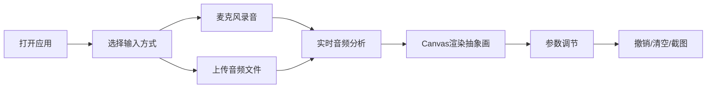

## 1. 产品概述
"声纹画境"是一款交互式音频可视化应用，用户通过捕捉声音的波形和频谱，在画布上实时生成抽象艺术画。将声音转化为视觉艺术，让用户体验"声音画家"的创作乐趣。

- 核心价值：通过声音与视觉的跨界融合，提供独特的艺术创作体验
- 目标用户：艺术爱好者、音乐创作者、视觉设计师、普通用户

## 2. 核心功能

### 2.1 功能模块

| 模块 | 核心功能 |
|------|---------|
| 音频输入 | 麦克风实时录音、上传wav/mp3音频文件 |
| 音频分析 | 实时频谱分析、音量检测、音调识别 |
| 画布渲染 | 抽象画生成、频率→色彩映射、音量→笔触映射、音调→扭曲动画 |
| 控制面板 | 录音/停止、文件上传、颜色主题、笔触参数调节、撤销/清空/截图 |
| 日志面板 | 实时显示频率峰值、音量、音调数据 |

### 2.2 页面详情

| 页面名称 | 模块名称 | 功能描述 |
|---------|----------|---------|
| 主页面 | 画布区域 | 全屏Canvas画布，实时渲染音频可视化抽象画 |
| 主页面 | 控制面板 | 录音按钮（脉冲动画）、文件上传、颜色主题选择、笔触参数滑块、操作按钮 |
| 主页面 | 日志面板 | 实时显示当前频率峰值、音量分贝、音调变化等数据 |

## 3. 核心流程

用户打开应用 → 选择音频输入方式（麦克风/上传文件）→ 开始音频捕捉 → 画布实时生成可视化艺术 → 调整参数优化效果 → 撤销/清空/保存作品

## 4. 用户界面设计

### 4.1 设计风格
- **赛博朋克风格**：深黑背景(#0a0a0f)，霓虹紫(#b300ff)和暗青(#00e5ff)为主色调
- **按钮风格**：渐变色填充 + 发光边框 + 圆角设计，hover有粒子爆炸动画和微震动
- **字体**：Orbitron（标题）+ Rajdhani（正文），未来科技感
- **布局**：画布居中，控制面板和日志面板采用浮动卡片式布局，半透明玻璃拟态效果
- **图标**：lucide-react线性图标，发光效果

### 4.2 页面设计

| 区域 | 模块 | UI元素 |
|------|------|---------|
| 画布区 | 主画布 | 全屏Canvas，深色背景，频谱可视化笔触，扭曲动画效果 |
| 控制面板 | 输入控制 | 圆形录音按钮（脉冲动画）、文件上传按钮 |
| 控制面板 | 颜色控制 | 三个主题预设按钮、自定义色相滑块 |
| 控制面板 | 笔触控制 | 粗细滑块、粒度滑块、扭曲强度滑块（带实时数值） |
| 控制面板 | 操作按钮 | 撤销、清空、截图保存按钮 |
| 日志面板 | 数据显示 | 频率峰值、音量分贝、音调值，实时更新数字动画 |

### 4.3 响应式设计
- 桌面端：三栏布局（控制面板-画布-日志面板）
- 平板端：上下布局（画布居中，控制面板和日志面板折叠为底部/顶部抽屉）
- 移动端：画布全屏，控制面板采用圆角卡片式底部弹窗，按钮加大触控区域
- 触控优化：按钮最小44x44px，滑动手势支持参数调节

### 4.4 动画与交互
- 录音按钮：脉冲扩散动画，边框发光呼吸效果
- 滑块交互：拖动时有震动反馈和数值实时更新
- 按钮点击：微小粒子爆炸动画 + 微震动效果
- 画布绘制：60fps流畅动画，音调变化触发画面扭曲
- 页面加载：元素渐入动画， staggered 延迟效果
