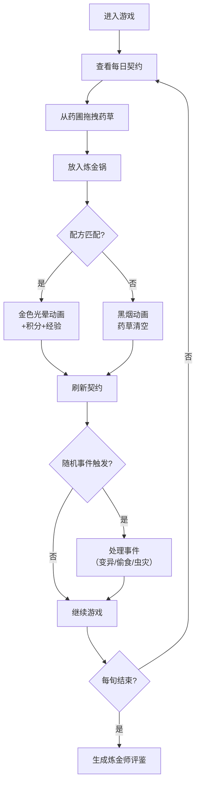

## 1. 产品概述

药园契约是一款沉浸式炼金主题的网页游戏，玩家扮演植物契约师，在虚拟药园中培育药草、解锁古代炼金配方，完成每日契约任务获取积分。

- 核心玩法：通过拖拽药草到炼金锅组合配方，应对随机事件，提升炼金等级
- 目标用户：喜欢休闲策略游戏、炼金术/魔法题材的玩家
- 产品价值：提供轻松有趣的策略养成体验，结合精美的视觉动画效果

## 2. 核心功能

### 2.1 用户角色
| 角色 | 注册方式 | 核心权限 |
|------|----------|----------|
| 植物契约师 | 无需注册，本地存储 | 培育药草、炼制药剂、完成契约、查看评鉴 |

### 2.2 功能模块
1. **药圃主场景**：网格布局展示药草，支持拖拽操作，生长动画与状态指示
2. **炼金锅系统**：药草组合检测，成功/失败动画反馈，配方匹配逻辑
3. **每日契约面板**：倒计时、任务展示、积分奖励、契约刷新
4. **随机事件系统**：药草变异、灵兽偷食、虫灾等事件
5. **炼金师评鉴**：每旬总结报告，基于完成度、经验值和事件处理

### 2.3 页面详情
| 页面名称 | 模块名称 | 功能描述 |
|----------|----------|----------|
| 主应用页 | 整体布局 | 桌面端左右布局（药圃+炼金锅），移动端上下布局，右侧固定契约面板 |
| 药圃页面 | 药草网格 | 6x6网格展示药草，显示生长状态、属性标签，支持拖拽 |
| 炼金锅页面 | 配方组合 | 炼金锅容器，拖入药草后检测配方，播放成功/失败动画 |
| 契约面板 | 任务系统 | 显示当前契约、所需药草、倒计时、积分奖励，完成后刷新 |

## 3. 核心流程

玩家进入游戏 → 查看每日契约 → 从药圃拖拽药草到炼金锅 → 系统检测配方匹配 → 成功获得积分和经验 / 失败药草枯萎 → 应对随机事件 → 每旬生成评鉴报告

## 4. 用户界面设计

### 4.1 设计风格
- **主色调**：古卷褐 #3e2723（背景）、药草绿 #4caf50（药草）、炼金金 #ffd54f（高亮）
- **辅助色**：深紫 #4a148c（神秘）、暗红 #b71c1c（危险）
- **按钮风格**：金属质感渐变，发光边框，hover时有微粒子效果
- **字体**：展示字体使用 Cinzel（古典衬线），正文字体使用 Source Han Serif（优雅宋体）
- **布局**：卡片式布局，深度阴影，微妙的星辰粒子背景动画
- **图标风格**：炼金术符号、植物图案、魔法光效元素

### 4.2 页面设计概述
| 页面名称 | 模块名称 | UI元素 |
|----------|----------|--------|
| 主应用 | 整体布局 | 暗黑炼金术背景、星辰粒子动画、金属质感面板、发光边框 |
| 药圃页面 | 药草网格 | 6x6网格、药草卡片（生长进度条、属性图标、状态指示）、拖拽拖尾效果 |
| 炼金锅页面 | 炼金锅 | 3D质感炼金锅、药草放入吸附效果、金色爆炸光晕/黑烟动画 |
| 契约面板 | 任务展示 | 倒计时动画、配方图标、积分数字滚动、完成时的闪光效果 |

### 4.3 响应式设计
- 桌面端（>768px）：药圃与炼金锅左右并排，契约面板固定右侧
- 移动端（≤768px）：药圃在上，炼金锅在下，契约面板可折叠
- 触控设备：支持触摸拖拽，优化触控热区

### 4.4 动画与交互
- 药草生长：缩放+透明度渐变，使用CSS transform硬件加速
- 拖拽效果：粒子拖尾、碰撞吸附反馈
- 炼金成功：金色光晕爆炸、屏幕轻微震动、清脆音效
- 炼金失败：黑烟冒出、药草消失动画
- 随机事件：全屏警告闪烁、事件卡片滑入
