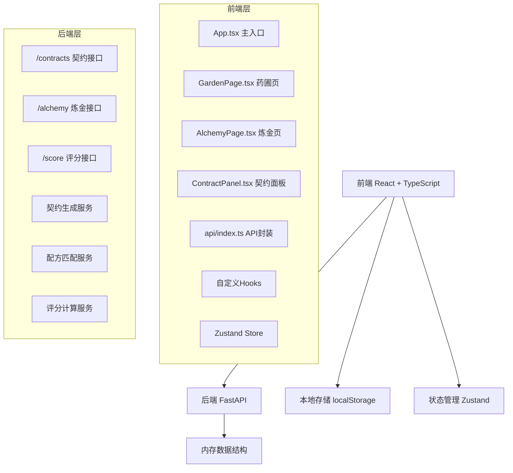
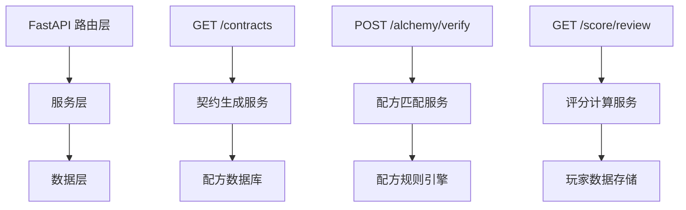
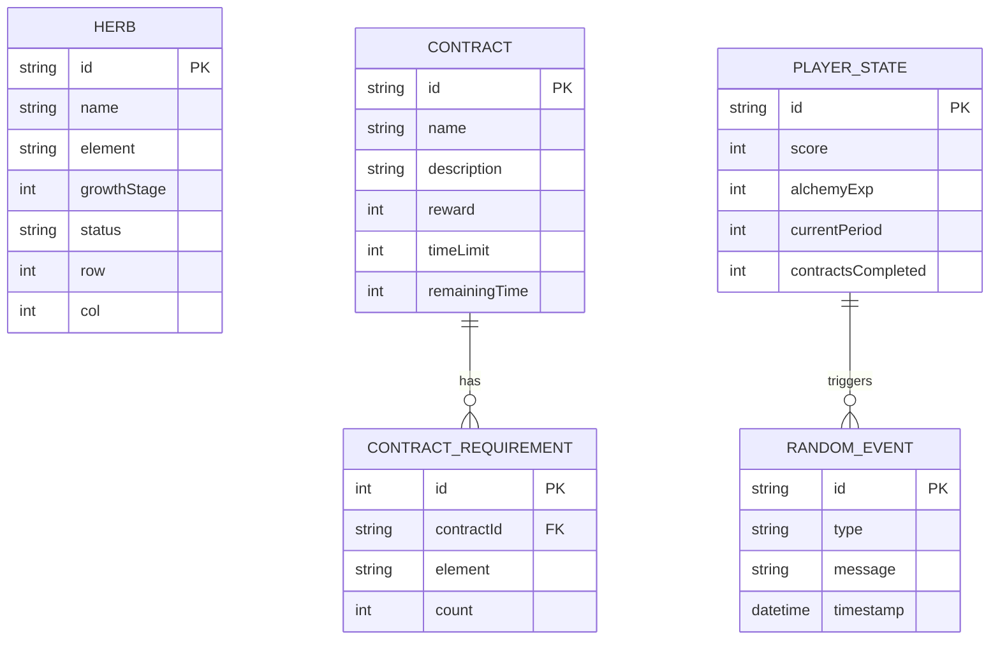

## 1. 架构设计



## 2. 技术栈说明

- **前端**：React@18 + TypeScript@5 + Vite@5
- **状态管理**：Zustand@4
- **HTTP客户端**：Axios@1
- **样式**：TailwindCSS@3 + CSS变量
- **后端**：FastAPI@0.109 + Python@3.11
- **后端依赖**：uvicorn、pydantic、random
- **初始化工具**：vite-init

## 3. 路由定义
| 路由 | 用途 |
|------|------|
| / | 主应用页面（药圃+炼金锅+契约面板） |

## 4. API 定义

### 4.1 TypeScript 类型定义
```typescript
// 药草类型
interface Herb {
  id: string;
  name: string;
  element: 'fire' | 'water' | 'earth' | 'wind' | 'light' | 'dark';
  growthStage: number; // 0-100
  status: 'healthy' | 'withered' | 'mutated' | 'infested';
  position: { row: number; col: number };
}

// 契约类型
interface Contract {
  id: string;
  name: string;
  description: string;
  requiredHerbs: { element: string; count: number }[];
  reward: number;
  timeLimit: number; // 秒
  remainingTime: number;
}

// 炼金结果
interface AlchemyResult {
  success: boolean;
  message: string;
  expGained: number;
  scoreGained: number;
  eventTriggered?: RandomEvent;
}

// 随机事件
interface RandomEvent {
  type: 'mutation' | 'beast' | 'pest';
  message: string;
  affectedHerbIds: string[];
}

// 炼金师评鉴
interface AlchemistReview {
  period: number;
  contractsCompleted: number;
  totalContracts: number;
  alchemyExp: number;
  eventsHandled: number;
  grade: 'S' | 'A' | 'B' | 'C' | 'D';
  comment: string;
}
```

### 4.2 接口定义

**GET /contracts** - 获取每日契约列表
```typescript
// Response: Contract[]
```

**POST /alchemy/verify** - 验证炼金配方
```typescript
// Request: { herbIds: string[]; contractId: string }
// Response: AlchemyResult
```

**GET /alchemy/recipes** - 获取已解锁配方列表

**GET /score/review** - 获取炼金师评鉴
```typescript
// Response: AlchemistReview
```

**POST /events/handle** - 处理随机事件
```typescript
// Request: { eventId: string; action: string }
// Response: { success: boolean; message: string }
```

## 5. 后端架构



## 6. 数据模型

### 6.1 数据模型定义


### 6.2 核心数据结构（后端）
```python
# 配方规则
RECIPES = {
    "healing_elixir": {
        "name": "治愈药剂",
        "elements": ["water", "light"],
        "exp": 100,
        "description": "恢复生命力的神圣药剂"
    },
    "flame_tincture": {
        "name": "烈焰酊剂",
        "elements": ["fire", "earth"],
        "exp": 120,
        "description": "蕴含火焰之力的烈性药剂"
    }
}

# 药草种类
HERB_TYPES = [
    {"name": "火焰草", "element": "fire", "growthTime": 300},
    {"name": "水莲", "element": "water", "growthTime": 250},
    {"name": "地根", "element": "earth", "growthTime": 350},
    {"name": "风叶", "element": "wind", "growthTime": 200},
    {"name": "光花", "element": "light", "growthTime": 400},
    {"name": "暗菌", "element": "dark", "growthTime": 450}
]
```
