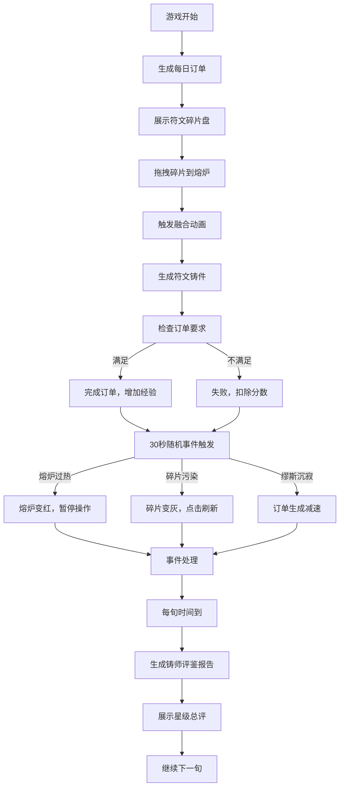

## 1. 产品概述

符文工坊·铸炉是一款奇幻风格的符文铸造模拟Web应用，玩家扮演古代符文铸造师，通过拖拽融合不同属性的符文碎片来完成订单，应对随机事件，积累经验并获得铸师评鉴。

- 核心玩法：拖拽符文碎片到熔炉进行融合，根据订单要求生产符文铸件
- 目标用户：喜欢休闲模拟、策略经营和奇幻题材的玩家
- 产品价值：提供沉浸式的符文铸造体验，融合策略、反应和随机事件的趣味玩法

## 2. 核心功能

### 2.1 用户角色

| 角色 | 注册方式 | 核心权限 |
|------|----------|----------|
| 铸师 | 无需注册，本地存储进度 | 符文铸造、订单完成、事件处理、评鉴查看 |

### 2.2 功能模块

1. **主界面**：3D熔炉、符文碎片盘、订单面板、状态日志
2. **拖拽融合系统**：符文碎片拖拽、熔炉融合动画、粒子特效
3. **订单系统**：每日订单生成、限时铸造、难度星级
4. **随机事件系统**：熔炉过热、碎片污染、缪斯沉寂
5. **评分评鉴系统**：每旬评鉴报告、星级总评
6. **音效反馈**：融合音效、事件音效、成功/失败音效

### 2.3 页面详情

| 页面名称 | 模块名称 | 功能描述 |
|----------|----------|----------|
| 主界面 | 3D熔炉区域 | 八边形熔炉，熔岩粒子流动，碎片拖入高亮，融合粒子特效 |
| 主界面 | 符文碎片盘 | 8-12个低多边形符文碎片，支持拖拽，属性颜色标识 |
| 主界面 | 订单面板 | 竖排卡片显示当前订单、剩余时间、难度星级 |
| 主界面 | 状态日志 | 最近5次操作记录，滚动显示 |
| 主界面 | 事件弹窗 | 随机事件警告，事件处理提示 |
| 主界面 | 评鉴报告 | 每旬结束弹出，显示统计数据和星级总评 |

## 3. 核心流程

玩家进入游戏后，从左侧碎片盘拖拽符文碎片到中央熔炉，熔炉触发融合动画生成符文铸件。根据顶部订单要求，在限时内完成正确组合可获得分数。每隔30秒触发随机事件，玩家需要正确应对避免扣分。每旬结束生成《铸师评鉴》报告。

## 4. 用户界面设计

### 4.1 设计风格

- **主色调**：熔岩橙 #ff6600、暗铁灰 #2a2a2a、魔法蓝 #00aaff
- **视觉风格**：符文奇幻风，深色星空渐变背景，发光渐变元素
- **按钮样式**：发光边框、渐变填充、hover时微震动动画
- **字体**：ZCOOL KuaiLe（标题）、Noto Sans SC（正文）
- **布局**：中央熔炉占70%，左侧碎片盘，右侧订单面板和状态日志

### 4.2 页面设计概述

| 页面名称 | 模块名称 | UI元素 |
|----------|----------|----------|
| 主界面 | 3D熔炉 | 八边形熔炉模型，熔岩粒子系统，融合爆炸特效 |
| 主界面 | 符文碎片 | 低多边形风格，属性图标，发光边框，拖拽阴影 |
| 主界面 | 订单卡片 | 竖排卡片，星级评分，倒计时进度条，完成状态 |
| 主界面 | 状态日志 | 半透明背景，滚动动画，彩色文字提示 |
| 主界面 | 事件弹窗 | 中央警告图标，事件描述，处理按钮 |
| 主界面 | 评鉴报告 | 卷轴风格，数据统计，星级展示，确认按钮 |

### 4.3 响应式

- **桌面端**：完整布局，中央熔炉占70%宽度
- **iPad端**：自适应缩放，碎片盘改为底部横向排列
- **触摸优化**：拖拽区域增大，按钮尺寸适配触摸操作

### 4.4 3D场景指导

- **环境**：深色星空背景，微弱环境光，定向光模拟熔炉火光
- **光照**：熔炉内部点光源（橙红色），环境光强度0.3，主光强度0.8
- **相机**：PerspectiveCamera，位置(0, 2, 5)，看向原点，fov=60
- **熔炉**：八边形柱体，金属材质，边缘发光，内部熔岩粒子流动
- **粒子系统**：BufferGeometry，PointsMaterial，200个粒子以内
- **融合动画**：碎片旋转收缩，光球缩放，爆炸粒子散射
- **性能**：帧率60fps，粒子数量≤200，draw call≤10
