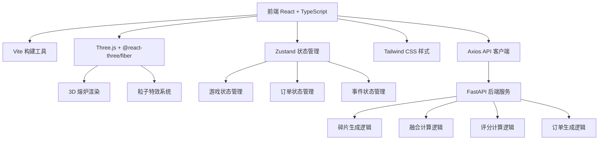

## 1. 架构设计



## 2. 技术描述

- **前端**：React 18 + TypeScript 5 + Vite 5
- **3D 渲染**：Three.js 0.160 + @react-three/fiber 8.15 + @react-three/drei 9.92
- **状态管理**：Zustand 4.4
- **样式**：Tailwind CSS 3.4
- **HTTP 客户端**：Axios 1.6
- **后端**：FastAPI 0.104 + Python 3.11 + Uvicorn 0.24
- **数据验证**：Pydantic 2.5

## 3. 前端目录结构

```
frontend/
├── src/
│   ├── main.tsx              # 应用入口
│   ├── App.tsx               # 主应用组件
│   ├── index.css             # 全局样式
│   ├── components/
│   │   ├── Furnace.tsx       # 3D熔炉组件
│   │   ├── RunePanel.tsx     # 符文碎片盘
│   │   ├── OrderPanel.tsx    # 订单面板
│   │   ├── StatusLog.tsx     # 状态日志
│   │   ├── EventModal.tsx    # 事件弹窗
│   │   └── EvaluationReport.tsx  # 评鉴报告
│   ├── store/
│   │   └── useGameStore.ts   # Zustand状态管理
│   ├── types/
│   │   └── index.ts          # 类型定义
│   ├── utils/
│   │   ├── api.ts            # API接口
│   │   └── sound.ts          # 音效工具
│   └── hooks/
│       └── useDragDrop.ts    # 拖拽钩子
├── package.json
├── tsconfig.json
└── vite.config.ts
```

## 4. 后端目录结构

```
backend/
├── main.py              # FastAPI主入口
├── models.py            # Pydantic模型
├── game_logic.py        # 游戏逻辑
└── requirements.txt     # 依赖列表
```

## 5. 类型定义

```typescript
// 符文属性
type RuneElement = 'fire' | 'water' | 'earth' | 'wind';

// 符文碎片
interface RuneShard {
  id: string;
  element: RuneElement;
  x: number;
  y: number;
  contaminated: boolean;
}

// 符文铸件
interface RuneCasting {
  id: string;
  elements: RuneElement[];
  name: string;
  attributes: Record<string, number>;
  score: number;
}

// 订单
interface Order {
  id: string;
  title: string;
  description: string;
  requirements: {
    minFire?: number;
    minWater?: number;
    minEarth?: number;
    minWind?: number;
    requiredElements?: RuneElement[];
  };
  timeLimit: number;
  difficulty: 1 | 2 | 3;
  reward: number;
  completed: boolean;
  remainingTime: number;
}

// 随机事件
type GameEventType = 'overheat' | 'contamination' | 'muse_silence';

interface GameEvent {
  id: string;
  type: GameEventType;
  title: string;
  description: string;
  duration: number;
  startTime: number;
}

// 评鉴报告
interface EvaluationReport {
  period: number;
  orderCompletionRate: number;
  averageCastingAttributes: number;
  eventHandlingScore: number;
  totalScore: number;
  starRating: 1 | 2 | 3 | 4 | 5;
  summary: string;
}

// 游戏状态
interface GameState {
  shards: RuneShard[];
  orders: Order[];
  currentPeriod: number;
  periodTimeRemaining: number;
  score: number;
  experience: number;
  level: number;
  currentEvent: GameEvent | null;
  logs: LogEntry[];
  isFusing: boolean;
  fusionShards: RuneShard[];
}

interface LogEntry {
  id: string;
  message: string;
  type: 'success' | 'failure' | 'event' | 'info';
  timestamp: number;
}
```

## 6. API 接口定义

```typescript
// GET /api/shards - 获取符文碎片
// Response: { shards: RuneShard[] }

// POST /api/fuse - 融合符文碎片
// Request: { shardIds: string[] }
// Response: { casting: RuneCasting, success: boolean, message: string }

// GET /api/orders - 获取订单列表
// Response: { orders: Order[] }

// POST /api/orders/:id/complete - 完成订单
// Request: { castingId: string }
// Response: { success: boolean, reward: number, message: string }

// POST /api/events/trigger - 触发随机事件
// Response: { event: GameEvent }

// POST /api/events/:id/handle - 处理事件
// Request: { action: string }
// Response: { success: boolean, score: number }

// GET /api/evaluation - 获取评鉴报告
// Response: { report: EvaluationReport }

// POST /api/evaluation - 保存评鉴报告
// Request: EvaluationReport
// Response: { success: boolean }
```

## 7. 数据模型（Pydantic）

```python
from pydantic import BaseModel, Field
from typing import List, Optional, Dict, Literal
from enum import Enum

class RuneElement(str, Enum):
    FIRE = "fire"
    WATER = "water"
    EARTH = "earth"
    WIND = "wind"

class RuneShard(BaseModel):
    id: str
    element: RuneElement
    x: float
    y: float
    contaminated: bool = False

class RuneCasting(BaseModel):
    id: str
    elements: List[RuneElement]
    name: str
    attributes: Dict[str, float]
    score: int

class OrderRequirements(BaseModel):
    min_fire: Optional[int] = Field(None, ge=0)
    min_water: Optional[int] = Field(None, ge=0)
    min_earth: Optional[int] = Field(None, ge=0)
    min_wind: Optional[int] = Field(None, ge=0)
    required_elements: Optional[List[RuneElement]] = None

class Order(BaseModel):
    id: str
    title: str
    description: str
    requirements: OrderRequirements
    time_limit: int
    difficulty: Literal[1, 2, 3]
    reward: int
    completed: bool = False
    remaining_time: int

class GameEventType(str, Enum):
    OVERHEAT = "overheat"
    CONTAMINATION = "contamination"
    MUSE_SILENCE = "muse_silence"

class GameEvent(BaseModel):
    id: str
    type: GameEventType
    title: str
    description: str
    duration: int
    start_time: float

class EvaluationReport(BaseModel):
    period: int
    order_completion_rate: float
    average_casting_attributes: float
    event_handling_score: float
    total_score: float
    star_rating: Literal[1, 2, 3, 4, 5]
    summary: str
```

## 8. 融合配方表

| 组合 | 铸件名称 | 主属性 | 次属性 |
|------|----------|--------|--------|
| 火+火 | 烈焰符文 | 攻击力+50 | 暴击率+10% |
| 水+水 | 寒冰符文 | 防御力+40 | 生命回复+5% |
| 土+土 | 岩石符文 | 生命值+80 | 减伤+15% |
| 风+风 | 疾风符文 | 速度+30 | 闪避率+12% |
| 火+水 | 蒸汽符文 | 混合伤害+35 | 持续伤害+8% |
| 火+土 | 熔岩符文 | 攻击力+30 | 灼烧+10% |
| 火+风 | 烈焰风暴 | 范围伤害+45 | 攻速+15% |
| 水+土 | 泥沼符文 | 控制+40 | 减速+20% |
| 水+风 | 冰霜风暴 | 冰冻+35 | 冷却缩减+12% |
| 土+风 | 沙尘符文 | 视野+25 | 致盲+15% |
| 三元素 | 元素符文 | 全属性+20 | 随机加成 |
| 四元素 | 混沌符文 | 全属性+40 | 传奇加成 |
