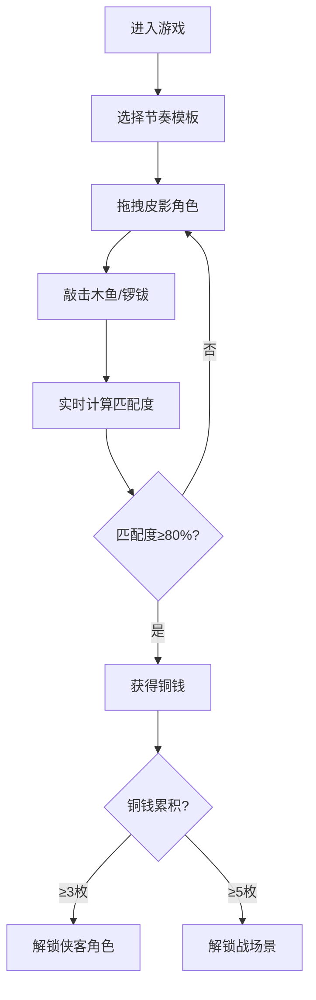

## 1. 产品概述

基于浏览器的古代影戏（皮影戏）角色操控与幕布光影交互模拟游戏，让用户体验北宋汴京瓦舍影戏艺人的表演乐趣。

- 核心玩法：用户在虚拟白色幕布后拖拽皮影角色，配合敲击节奏完成表演
- 目标用户：对传统文化感兴趣的休闲游戏玩家、文化教育场景用户

## 2. 核心功能

### 2.1 用户角色
| 角色 | 注册方式 | 核心权限 |
|------|----------|----------|
| 普通用户 | 无需注册，直接使用 | 操控皮影角色、敲击乐器、获得铜钱、解锁新内容 |

### 2.2 功能模块
1. **幕布场景**：白色生绢纹理幕布、灯烛光影系统、皮影角色投影
2. **角色操控**：拖拽移动武将/仕女/神仙三个皮影角色
3. **节奏表演**：木鱼/锣钹敲击、三种BPM节奏模板、实时匹配度计算
4. **积分解锁**：铜钱奖励系统、新角色解锁、新背景布景解锁
5. **光影特效**：距离相关模糊度、透明度变化、重叠混叠效果

### 2.3 页面详情
| 页面名称 | 模块名称 | 功能描述 |
|----------|----------|----------|
| 主界面 | 幕布区域 | 显示皮影角色投影、实时光影变化、背景布景 |
| 主界面 | 灯烛控制面板 | 显示灯烛位置（幕布顶部中央）、提供视觉焦点 |
| 主界面 | 角色状态栏 | 显示当前匹配度、铜钱数量、解锁提示 |
| 主界面 | 节奏控制区 | 木鱼/锣钹敲击按钮、三种BPM模板切换 |

## 3. 核心流程

用户进入游戏后，幕布上显示三个皮影角色。用户拖拽角色移动的同时，按照选择的节奏模板敲击木鱼或锣钹。系统实时计算敲击与节拍的匹配度，当匹配度达到80%时，用户获得一枚铜钱。累积铜钱可解锁新角色和背景布景。

## 4. 用户界面设计

### 4.1 设计风格
- **主色调**：深棕色#3a1a0a（木纹背景）、朱红色#cc0000（边框）、米黄色#fefae0（幕布）、暗金色#8b4513（装饰）
- **按钮风格**：米黄色圆角矩形，悬停时变暗，带有微妙阴影
- **字体**：衬线字体（模拟古籍风格），数字使用等宽字体
- **布局风格**：中央幕布式布局，顶部灯烛，底部控制区
- **视觉质感**：木纹纹理背景、生绢质感幕布、牛皮雕刻皮影剪影

### 4.2 页面设计概述
| 页面名称 | 模块名称 | UI元素 |
|----------|----------|--------|
| 主界面 | 幕布区域 | 白色生绢纹理背景、朱红色边框、皮影角色投影（clip-path剪影）、灯烛光晕、匹配度数字、铜钱计数、战场景/庭院背景 |
| 主界面 | 节奏控制区 | 木鱼按钮（椭圆形#d2b48c）、锣钹按钮（圆形#ffd700）、BPM切换按钮（慢板/中板/快板）、敲击脉冲动画 |
| 主界面 | 反馈效果 | 命中金光闪烁、未命中红光闪烁、敲击扩散环动画 |

### 4.3 响应性
- 桌面优先设计，适配1440x900和1024x768分辨率
- 幕布区域使用百分比布局，确保不同屏幕尺寸下比例协调
- 交互元素最小尺寸保证可点击性

## 4.4 动画与交互
- 皮影拖拽：使用framer-motion实现平滑过渡动画
- 敲击反馈：脉冲扩散环、命中/未命中闪烁效果
- 光影变化：模糊半径和透明度实时过渡动画
- 角色动作：挥手、转身、跳跃等动作切换
