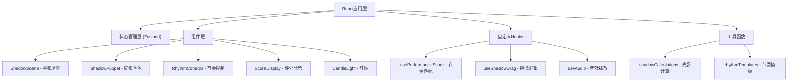

## 1. 架构设计



## 2. 技术描述

- **前端框架**：React@18 + TypeScript + Vite
- **状态管理**：Zustand
- **动画库**：framer-motion
- **样式方案**：CSS Modules + 内联样式（动态光影效果）
- **音频处理**：Web Audio API

## 3. 核心数据模型

### 皮影角色状态
```typescript
interface ShadowPuppet {
  id: string;
  name: 'general' | 'lady' | 'god' | 'warrior';
  color: string;
  position: { x: number; y: number };
  action: 'idle' | 'wave' | 'turn' | 'jump';
  isUnlocked: boolean;
}
```

### 游戏状态
```typescript
interface GameState {
  puppets: ShadowPuppet[];
  coins: number;
  background: 'courtyard' | 'battlefield';
  currentBpm: 90 | 120 | 160;
  matchPercentage: number;
  consecutiveHits: number;
  hitHistory: boolean[];
}
```

## 4. 目录结构
```
src/
├── components/
│   ├── ShadowScene.tsx      # 幕布场景主组件
│   ├── ShadowPuppet.tsx     # 皮影角色组件
│   ├── RhythmControls.tsx   # 节奏控制区（木鱼/锣钹）
│   ├── ScoreDisplay.tsx     # 匹配度和铜钱显示
│   └── CandleLight.tsx      # 灯烛组件
├── hooks/
│   ├── usePerformanceScore.ts  # 节奏匹配逻辑
│   ├── useShadowDrag.ts        # 拖拽逻辑
│   └── useAudio.ts             # 音效Hook
├── store/
│   └── useGameStore.ts         # Zustand状态管理
├── utils/
│   ├── shadowCalculations.ts   # 光影计算工具
│   └── rhythmTemplates.ts      # 节奏模板数据
├── types/
│   └── index.ts                # 类型定义
├── App.tsx
├── main.tsx
└── index.css
```

## 5. 关键技术实现

### 5.1 光影计算
- 灯烛位置：幕布顶部中央
- 距离计算：角色位置与灯烛的欧氏距离
- 模糊半径：distance / 100 * 8px（范围0-8px）
- 透明度：1 - (distance / 100) * 0.7（范围0.3-1）

### 5.2 节奏匹配算法
- 模板节拍间隔：60000 / BPM 毫秒
- 允许偏差：±200ms，优秀偏差<100ms
- 滑动窗口：最近10个节拍，命中≥8个即达到80%匹配度
- 连续8拍优秀偏差触发匹配度计数

### 5.3 拖拽实现
- 使用React Mouse事件监听
- 位置更新通过Zustand状态管理
- 结合framer-motion实现平滑动画

### 5.4 混叠效果
- 使用CSS `mix-blend-mode: multiply`
- 角色重叠时自动应用混叠
- 叠加区域颜色趋近于#8b4513

## 6. 性能优化
- 使用`requestAnimationFrame`实现30+ FPS的光影更新
- 节奏检测使用时间戳对比，延迟<50ms
- 组件 memoization 避免不必要重渲染
- CSS transform 和 opacity 动画触发 GPU 加速
