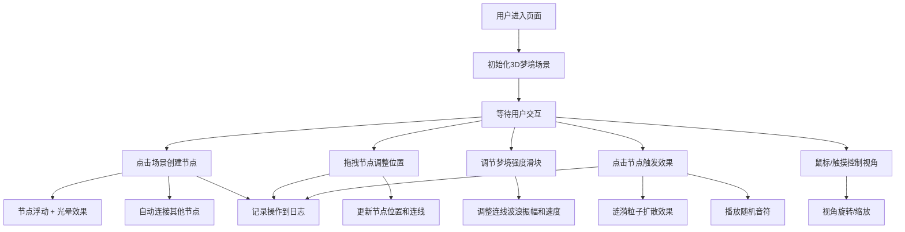

## 1. 产品概述

"编织梦境"是一个沉浸式3D交互可视化项目，让用户化身为梦之织匠，在三维空间中创建、连接和交互梦境节点。项目通过梦幻霓虹美学和流畅的动画效果，营造出超现实的梦境体验。

- 核心价值：提供富有创意和艺术感的3D交互体验，让用户在虚拟空间中编织属于自己的梦境
- 目标用户：对创意交互、数字艺术和3D可视化感兴趣的用户群体

## 2. 核心功能

### 2.1 用户角色
| 角色 | 注册方式 | 核心权限 |
|------|----------|----------|
| 访客用户 | 无需注册 | 完整使用所有交互功能 |

### 2.2 功能模块
1. **3D梦境场景**：全屏Three.js渲染场景，支持视角旋转和缩放
2. **梦境节点系统**：节点创建、浮动动画、光晕效果、涟漪粒子
3. **节点连接系统**：动态连线、波浪流动动画、强度控制
4. **音频反馈系统**：Web Audio API生成随机音符
5. **控制面板**：节点生成、梦境强度滑块、重置视角
6. **梦境日志**：最近5次交互记录及时间戳

### 2.3 页面详情
| 页面名称 | 模块名称 | 功能描述 |
|-----------|-------------|---------------------|
| 主页面 | 3D场景模块 | 全屏3D梦境空间，支持节点创建、拖拽、点击交互 |
| 主页面 | 控制面板模块 | 左下角控制面板，包含节点生成按钮、强度滑块、重置视角按钮 |
| 主页面 | 日志面板模块 | 右下角梦境日志，显示最近5次操作记录 |

## 3. 核心流程

用户进入页面后，看到全屏深空蓝背景的3D场景。通过点击场景创建梦境节点，节点缓慢浮动并发出霓虹光晕。拖拽节点可调整位置，节点间自动连线形成梦境网络。调节梦境强度滑块可改变连线的波浪动画效果。点击节点触发涟漪扩散并播放随机音符。所有操作实时记录在梦境日志中。

## 4. 用户界面设计

### 4.1 设计风格
- **主色调**：梦幻紫 #9b59b6、霓虹粉 #ff6b6b
- **背景色**：深空蓝 #0a0a1a，带有微妙的星光粒子背景
- **节点样式**：半透明渐变球体，带有柔和的发光光晕
- **连线样式**：流动光带，随强度产生波浪变形
- **字体**：使用优雅的无衬线字体，标题使用具有梦幻感的字体
- **UI面板**：半透明玻璃态效果，带有霓虹边框发光
- **动画风格**：柔和缓动、流体运动、粒子扩散

### 4.2 页面设计概述
| 页面名称 | 模块名称 | UI元素 |
|-----------|-------------|-------------|
| 主页面 | 3D场景模块 | 全屏深空蓝背景、浮动梦境节点、动态波浪连线、粒子涟漪效果 |
| 主页面 | 控制面板模块 | 半透明玻璃面板、霓虹发光按钮、渐变滑块、图标+文字组合 |
| 主页面 | 日志面板模块 | 半透明玻璃面板、时间戳标签、操作类型图标、滚动列表 |

### 4.3 响应式
- 桌面端优先设计，全屏3D场景
- 控制面板和日志面板使用固定定位
- 触摸设备支持：双指缩放、单指拖拽视角、触摸创建节点
- 移动端调整面板尺寸，确保可用性

### 4.4 3D场景指导
- **环境**：深空蓝背景，散布微弱的星光粒子，营造宇宙梦境氛围
- **光照**：环境光提供基础照明，点光源跟随节点产生光晕效果，柔和的全局光照
- **相机设置**：PerspectiveCamera，初始位置(0, 0, 15)，朝向原点，支持OrbitControls
- **构图**：节点分布在三维空间中，连线形成网状结构，视觉焦点在场景中心
- **交互和动画**：节点正弦浮动动画、连线波浪流动、点击涟漪粒子扩散、视角平滑过渡
- **后处理效果**：Bloom泛光效果增强霓虹光晕，轻微的晕影营造氛围
- **性能预算**：控制节点数量，使用InstancedMesh优化粒子效果，目标帧率60fps
