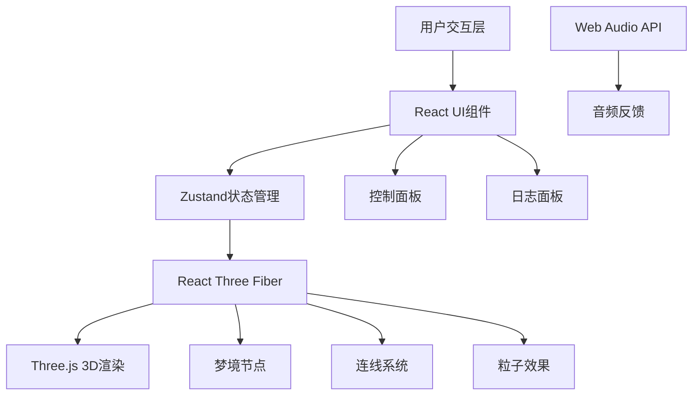

## 1. 架构设计



## 2. 技术描述
- **前端框架**：React 18 + TypeScript
- **构建工具**：Vite 5
- **3D渲染**：Three.js + @react-three/fiber + @react-three/drei
- **状态管理**：Zustand
- **样式方案**：TailwindCSS 3
- **图标库**：Lucide React
- **音频**：Web Audio API（浏览器原生）

## 3. 目录结构
```
src/
├── main.tsx              # 应用入口
├── App.tsx               # 主应用组件，组装场景和UI
├── index.css             # 全局样式和Tailwind配置
├── store/
│   └── useDreamStore.ts  # Zustand状态管理
├── scene/
│   ├── DreamScene.tsx    # 3D场景主组件
│   ├── DreamNode.tsx     # 单个梦境节点组件
│   ├── DreamConnection.tsx # 节点连线组件
│   └── RippleEffect.tsx  # 涟漪粒子效果
├── ui/
│   ├── ControlPanel.tsx  # 控制面板组件
│   └── LogPanel.tsx      # 日志面板组件
├── types/
│   └── dream.ts          # 类型定义
└── utils/
    └── audio.ts          # 音频工具函数
```

## 4. 类型定义

```typescript
// 梦境节点类型
interface DreamNode {
  id: string;
  position: [number, number, number];
  color: string;
  createdAt: number;
}

// 连线类型
interface DreamConnection {
  id: string;
  from: string;
  to: string;
}

// 日志记录类型
interface LogEntry {
  id: string;
  type: 'create' | 'drag' | 'click';
  message: string;
  timestamp: Date;
  nodeId?: string;
}

// 全局状态类型
interface DreamState {
  nodes: DreamNode[];
  connections: DreamConnection[];
  dreamIntensity: number;
  logs: LogEntry[];
  selectedNodeId: string | null;
  addNode: (position: [number, number, number]) => void;
  updateNodePosition: (id: string, position: [number, number, number]) => void;
  setDreamIntensity: (intensity: number) => void;
  addLog: (type: 'create' | 'drag' | 'click', message: string, nodeId?: string) => void;
  setSelectedNode: (id: string | null) => void;
  resetCamera: () => void;
}
```

## 5. 核心数据流

1. **节点创建**：用户点击场景 → Three.js射线检测 → 获取3D坐标 → Zustand addNode → 生成新DreamNode → 自动创建与最近节点的连接 → 记录日志
2. **节点拖拽**：PointerDown选中节点 → PointerMove更新位置 → updateNodePosition → 连线自动更新 → 记录日志
3. **强度调节**：滑块onChange → setDreamIntensity → 连线组件响应 → 波浪动画参数更新
4. **节点点击**：PointerDown → 触发涟漪粒子效果 → Web Audio播放音符 → 记录日志
5. **视角控制**：OrbitControls处理旋转/缩放 → 重置按钮触发相机位置动画

## 6. 性能优化策略

- **节点渲染**：使用instanced材质减少draw call
- **动画优化**：使用useFrame钩子，仅在必要时更新矩阵
- **粒子系统**：使用Points和BufferGeometry实现高效粒子渲染
- **状态更新**：Zustand选择器避免不必要的重渲染
- **内存管理**：及时清理音频上下文和Three.js资源
- **帧率监控**：使用drei的PerformanceMonitor动态调整质量
