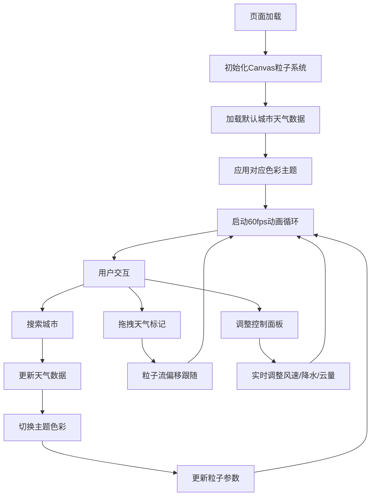

## 1. 产品概述
"墨迹云图"是一款交互式动态天气可视化艺术页面，让用户化身气象艺术家，通过选择城市或拖拽天气标记，在画布上实时生成水墨风格的流体风场、粒子雨滴和絮状云层，结合动态色彩主题，创造独特的天气艺术作品。

- 核心价值：将气象数据转化为可交互的数字艺术体验，融合东方水墨美学与现代科技感
- 目标用户：设计爱好者、气象爱好者、艺术创作者

## 2. 核心功能

### 2.1 功能模块
1. **主画布区域**：基于Canvas 2D的流体风场粒子系统，实时渲染风线、雨滴、云层
2. **城市搜索与天气卡片**：左上角城市下拉搜索框，当前选中城市天气信息展示
3. **控制面板**：右下角风速、降水强度、云量滑块，重置按钮
4. **主题色彩系统**：根据天气类型自动切换氛围色彩（雷暴暗紫、晴空金黄、雪景冰蓝等）
5. **交互反馈系统**：拖拽标记粒子跟随、点击卡片缩放动画、滑块实时参数调整

### 2.2 页面详情

| 页面名称 | 模块名称 | 功能描述 |
|---------|---------|----------|
| 主页面 | 动态画布 | Canvas 2D渲染流体风场、雨滴粒子、絮状云层，60fps流畅动画 |
| 主页面 | 城市搜索 | 下拉搜索框，支持模糊匹配城市，选择后切换天气数据 |
| 主页面 | 天气信息卡片 | 展示当前城市温度、天气类型、湿度、风力等信息，点击触发缩放动画 |
| 主页面 | 控制面板 | 风速滑块（0-100）、降水强度滑块（0-100）、云量滑块（0-100）、重置按钮 |
| 主页面 | 拖拽交互 | 地图上可拖拽天气标记，粒子流实时跟随偏移 |
| 主页面 | 主题系统 | 根据天气类型自动切换背景渐变、粒子色彩、整体氛围 |

## 3. 核心流程
用户进入页面 → 默认展示预设城市天气效果 → 画布自动播放流体动画 → 用户可选择：
1. 通过搜索框切换城市 → 天气数据更新 → 主题色彩切换 → 粒子参数自动调整
2. 拖拽画布上的天气标记 → 粒子流跟随偏移 → 实时渲染效果变化
3. 调整控制面板滑块 → 风速/降水/云量参数变化 → 粒子系统实时响应
4. 点击重置按钮 → 恢复默认状态

## 4. 用户界面设计

### 4.1 设计风格
- **整体调性**：水墨淡彩与数字科技融合，东方美学 meets 现代流体动力学
- **主色调**：根据天气动态变化，基础色为渐变灰白（宣纸质感）
- **粒子色彩**：风线用半透明青色（#4ECDC4 60%），雨滴用细长白点（#FFFFFF 85%），云层用灰蓝絮状（#7A93AC 40%）
- **主题色映射**：
  - 雷暴：深紫渐变（#2D1B69 → #1A0A2E），粒子带闪电高光
  - 晴空：金黄渐变（#F7DC6F → #FEF9E7），风线偏暖色调
  - 雪景：冰蓝渐变（#AED6F1 → #EBF5FB），粒子呈雪花状
  - 阴雨：灰蓝渐变（#566573 → #2C3E50），雨滴密度增加

### 4.2 页面设计概述

| 页面名称 | 模块名称 | UI元素 |
|---------|---------|--------|
| 主页面 | 动态画布 | 全屏Canvas，z-index: 0，背景渐变模拟宣纸纹理，叠加噪点质感 |
| 主页面 | 城市搜索框 | 左上角，毛玻璃效果（backdrop-filter: blur(12px)），圆角12px，半透明白底 |
| 主页面 | 天气信息卡片 | 搜索框下方，毛玻璃卡片，包含温度（大号字体）、天气图标、湿度、风力 |
| 主页面 | 控制面板 | 右下角，毛玻璃容器，垂直排列三个滑块和重置按钮 |
| 主页面 | 天气标记 | 画布上可拖拽圆点，带柔和阴影，拖动时有涟漪扩散效果 |

### 4.3 动效设计
- **画布入场**：粒子从稀疏到密集渐进式加载（0.8s）
- **城市切换**：交叉淡化过渡（0.5s），色彩主题渐变切换
- **滑块交互**：滑块拖动时参数实时变化，粒子数量/速度平滑过渡
- **卡片点击**：柔和缩放（scale: 1.02 → 1.0，duration: 0.3s）
- **标记拖拽**：粒子流跟随偏移有0.1s延迟，营造自然惯性
- **重置按钮**：粒子系统快速消散后重新聚集（0.6s）

### 4.4 排版与字体
- **标题字体**：使用"Noto Serif SC"（思源宋体），体现东方水墨韵味
- **正文字体**：使用"Inter"，保证数字信息清晰度
- **字号层级**：温度显示36px，城市名20px，天气参数14px，滑块标签12px

### 4.5 响应式设计
- 桌面端为主设计，画布始终铺满视口
- 移动端：控制面板移至底部，搜索框和天气卡片移至顶部，滑块改为横向排列
- 触摸设备优化：增大可点击区域（最小44px），支持双指缩放

## 5. 性能要求
- **帧率目标**：稳定60fps（16.6ms/帧）
- **粒子自适应**：根据设备性能自动调整粒子数量
  - 高端设备：风粒子300+，雨滴粒子200+，云层粒子80+
  - 中端设备：风粒子180，雨滴粒子120，云层粒子50
  - 低端设备：风粒子100，雨滴粒子60，云层粒子30
- **性能检测**：初始化时检测requestAnimationFrame帧率，连续3帧<45fps自动降级
- **内存优化**：对象池复用粒子，避免频繁GC，离屏canvas预渲染云层纹理
