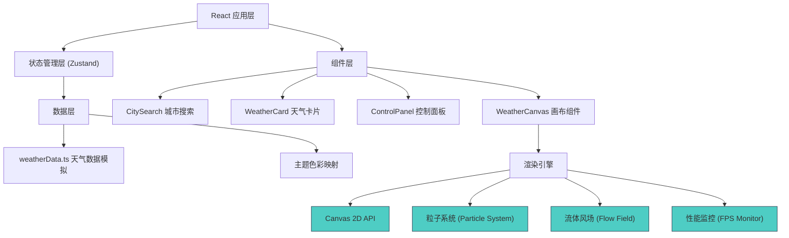

## 1. 架构设计



## 2. 技术描述

- **前端框架**：React 18 + TypeScript 5
- **构建工具**：Vite 5
- **状态管理**：Zustand（轻量级，适合频繁更新的粒子状态）
- **样式方案**：Tailwind CSS 3 + CSS Variables（动态主题）
- **渲染引擎**：Canvas 2D API（所有视觉效果由Canvas绘制）
- **图标库**：lucide-react

## 3. 项目结构

```
├── package.json
├── tsconfig.json
├── vite.config.ts
├── tailwind.config.js
├── postcss.config.js
├── index.html
└── src/
    ├── main.tsx
    ├── App.tsx
    ├── index.css
    ├── components/
    │   ├── WeatherCanvas.tsx      # 核心画布渲染（粒子系统+动画循环）
    │   ├── CitySearch.tsx         # 城市搜索下拉框
    │   ├── WeatherCard.tsx        # 天气信息展示卡片
    │   └── ControlPanel.tsx       # 控制面板（滑块+重置）
    ├── hooks/
    │   ├── useParticleSystem.ts   # 粒子系统逻辑Hook
    │   ├── useFlowField.ts        # 流体风场Hook
    │   └── usePerformance.ts      # 性能监控与自适应Hook
    ├── store/
    │   └── useWeatherStore.ts     # Zustand全局状态
    ├── types/
    │   └── weather.ts             # TypeScript类型定义
    └── utils/
        └── weatherData.ts         # 模拟天气数据+主题色映射
```

## 4. 核心数据模型

### 4.1 TypeScript 类型定义

```typescript
// 天气类型
type WeatherType = 'sunny' | 'cloudy' | 'rainy' | 'thunderstorm' | 'snowy';

// 城市数据
interface City {
  id: string;
  name: string;
  lat: number;
  lng: number;
}

// 天气数据
interface WeatherData {
  cityId: string;
  cityName: string;
  temperature: number;
  humidity: number;
  windSpeed: number;        // 基础风速 0-100
  precipitation: number;    // 降水强度 0-100
  cloudCover: number;       // 云量 0-100
  weatherType: WeatherType;
}

// 主题色彩
interface ThemeColors {
  bgGradient: [string, string];    // 背景渐变色
  windLine: string;                // 风线颜色
  raindrop: string;                // 雨滴颜色
  cloud: string;                   // 云层颜色
  accent: string;                  // 强调色
  text: string;                    // 文字颜色
}

// 粒子基类
interface Particle {
  x: number;
  y: number;
  vx: number;
  vy: number;
  life: number;
  maxLife: number;
  size: number;
  opacity: number;
}

// 风粒子
interface WindParticle extends Particle {
  trail: { x: number; y: number }[];
}

// 雨滴粒子
interface RainParticle extends Particle {
  length: number;
  angle: number;
}

// 云层粒子
interface CloudParticle extends Particle {
  baseRadius: number;
  noiseOffset: number;
}

// 画布状态
interface CanvasState {
  width: number;
  height: number;
  dpr: number;
  isDragging: boolean;
  dragOffset: { x: number; y: number };
  markerPosition: { x: number; y: number };
}
```

## 5. 状态管理 (Zustand Store)

```typescript
interface WeatherStore {
  // 数据
  currentCity: City | null;
  weatherData: WeatherData | null;
  themeColors: ThemeColors;
  
  // 用户可调参数
  windSpeed: number;      // 0-100
  precipitation: number;  // 0-100
  cloudCover: number;     // 0-100
  
  // 性能参数
  particleCount: { wind: number; rain: number; cloud: number };
  performanceLevel: 'high' | 'medium' | 'low';
  
  // Actions
  setCity: (city: City) => void;
  setWeatherData: (data: WeatherData) => void;
  setWindSpeed: (value: number) => void;
  setPrecipitation: (value: number) => void;
  setCloudCover: (value: number) => void;
  setPerformanceLevel: (level: 'high' | 'medium' | 'low') => void;
  reset: () => void;
}
```

## 6. 核心算法

### 6.1 流体风场 (Perlin Noise Flow Field)
- 使用简化的2D Perlin噪声生成连续流畅的向量场
- 网格分辨率：40x40px，每帧更新噪声时间偏移
- 粒子根据所在网格的向量场角度更新速度方向
- 风力参数影响向量场强度和噪声演化速度

### 6.2 粒子系统
- **对象池模式**：预分配粒子数组，避免运行时创建销毁
- **三种粒子独立管理**：风粒子、雨滴粒子、云层粒子
- **边界处理**：粒子超出画布后从对侧重生或重置生命周期

### 6.3 性能自适应
- 初始化运行3秒性能检测，计算平均FPS
- 每10秒重新评估性能等级
- 性能降级策略：减少粒子数、降低风场分辨率、跳过云层模糊效果
- 使用`performance.now()`精确计算每帧耗时

### 6.4 拖拽交互
- 鼠标/触摸事件监听，计算拖拽偏移量
- 偏移量通过缓动函数（easeOut）应用到所有粒子位置
- 拖拽时在标记位置生成额外的"干扰粒子"，增强视觉反馈

## 7. 渲染优化

1. **分层渲染**：
   - Layer 1: 背景渐变（CSS处理，非Canvas）
   - Layer 2: 云层（预渲染到离屏Canvas，每N帧更新）
   - Layer 3: 风线（每帧绘制）
   - Layer 4: 雨滴（每帧绘制）
   - Layer 5: 交互标记（DOM元素，非Canvas）

2. **离屏Canvas预渲染**：
   - 云层纹理预渲染，减少实时模糊计算
   - 风粒子轨迹复用前帧数据，仅做轻微偏移

3. **绘制优化**：
   - 使用`globalCompositeOperation = 'lighter'`实现粒子叠加发光
   - 批量绘制同类型粒子，减少状态切换
   - 低性能模式关闭`lineCap`、`lineJoin`等高级特性

## 8. API 定义（模拟数据）

```typescript
// 城市列表
const CITIES: City[] = [
  { id: 'bj', name: '北京', lat: 39.9, lng: 116.4 },
  { id: 'sh', name: '上海', lat: 31.2, lng: 121.5 },
  { id: 'gz', name: '广州', lat: 23.1, lng: 113.3 },
  { id: 'sz', name: '深圳', lat: 22.5, lng: 114.1 },
  { id: 'cd', name: '成都', lat: 30.7, lng: 104.1 },
  { id: 'hz', name: '杭州', lat: 30.3, lng: 120.2 },
  { id: 'xa', name: '西安', lat: 34.3, lng: 109.0 },
  { id: 'nj', name: '南京', lat: 32.1, lng: 118.8 },
];

// 天气主题映射
const THEME_MAP: Record<WeatherType, ThemeColors> = {
  sunny: {
    bgGradient: ['#FEF9E7', '#F7DC6F'],
    windLine: 'rgba(78, 205, 196, 0.6)',
    raindrop: 'rgba(255, 255, 255, 0.85)',
    cloud: 'rgba(122, 147, 172, 0.4)',
    accent: '#F39C12',
    text: '#2C3E50',
  },
  thunderstorm: {
    bgGradient: ['#2D1B69', '#1A0A2E'],
    windLine: 'rgba(155, 89, 182, 0.7)',
    raindrop: 'rgba(255, 255, 255, 0.9)',
    cloud: 'rgba(52, 73, 94, 0.6)',
    accent: '#9B59B6',
    text: '#ECF0F1',
  },
  // ... 其他主题
};
```
