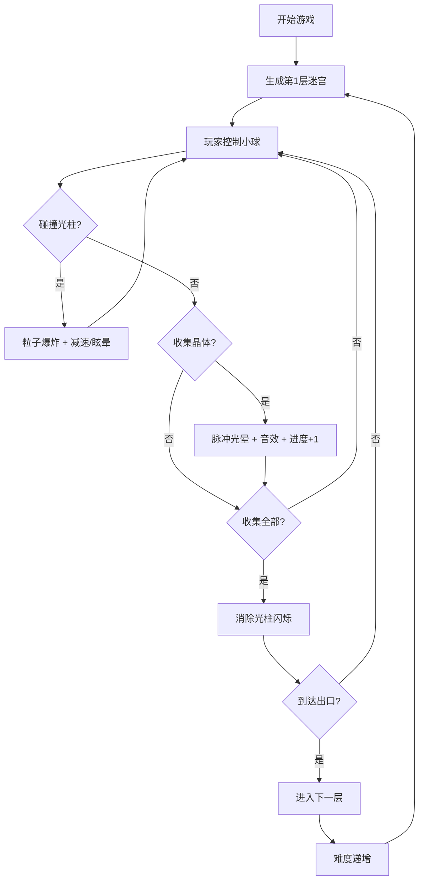

## 1. 产品概述

光影迷宫是一款3D解谜游戏，玩家在不断旋转变化的立方体迷宫中控制发光小球，穿过几何光柱障碍，收集能量晶体解锁下一层。

- 核心玩法：根据光柱闪烁节奏规划路径，控制小球在重力下移动跳跃
- 目标用户：喜欢解谜和休闲游戏的玩家，支持PC和移动端
- 产品价值：提供视觉冲击力强、难度递进的沉浸式解谜体验

## 2. 核心功能

### 2.1 用户角色
| 角色 | 注册方式 | 核心权限 |
|------|----------|----------|
| 玩家 | 无需注册 | 进行游戏、查看进度、调整设置 |

### 2.2 功能模块
1. **3D迷宫场景**：多层旋转立方体迷宫，随机生成光柱障碍
2. **玩家控制**：发光小球移动、跳跃、重力物理
3. **收集系统**：能量晶体收集、反馈效果、进度追踪
4. **障碍系统**：光柱闪烁、减速/眩晕效果、碰撞粒子
5. **游戏UI**：层数显示、进度条、计时器、控制按钮
6. **难度系统**：每层递增旋转速度和闪烁节奏

### 2.3 页面详情
| 页面名称 | 模块名称 | 功能描述 |
|----------|----------|----------|
| 游戏主界面 | 3D场景渲染 | 迷宫、小球、晶体、光柱的实时渲染 |
| 游戏主界面 | 左侧信息面板 | 当前层数、收集进度、计时显示 |
| 游戏主界面 | 右侧控制面板 | 重置按钮、暂停按钮 |
| 游戏主界面 | 视角控制 | 鼠标拖拽旋转、滚轮缩放、触摸适配 |

## 3. 核心流程

## 4. 用户界面设计

### 4.1 设计风格
- **主色调**：霓虹紫 `#b300ff`、暗青 `#00e5ff`、背景深黑 `#0a0a0f`
- **按钮风格**：渐变发光边框，悬停时霓虹光效扩散
- **字体**：显示字体使用 Orbitron（赛博朋克风格），正文字体使用 JetBrains Mono
- **布局**：左右浮动面板，中间3D场景，半透明玻璃拟态风格
- **视觉元素**：霓虹光效、网格背景、扫描线、故障艺术效果

### 4.2 页面设计概述
| 页面名称 | 模块名称 | UI元素 |
|----------|----------|--------|
| 游戏主界面 | 3D场景 | 旋转立方体迷宫、发光小球、光柱障碍、能量晶体、粒子效果 |
| 游戏主界面 | 左侧信息面板 | 半透明卡片、霓虹文字、进度条动画、计时闪烁效果 |
| 游戏主界面 | 右侧控制面板 | 渐变边框按钮、发光悬停效果、暂停遮罩 |

### 4.3 响应式
- **桌面端**：左右面板固定宽度，3D场景自适应
- **移动端**：面板改为上下布局，按钮尺寸增大，支持触摸操作
- **触摸优化**：虚拟摇杆或滑动控制，双指缩放视角

### 4.4 3D场景指南
- **环境**：深黑背景 + 霓虹网格地面，雾效营造空间感
- **光照**：主光源紫色、补光青色，小球自发光，晶体闪烁光
- **相机**：透视相机，支持轨道控制，跟随小球移动
- **后处理**：辉光效果、轻微色差、动态模糊
- **动画**：迷宫缓慢旋转、光柱闪烁、晶体漂浮、小球拖尾
