## 1. 架构设计

```mermaid
graph TD
    A["用户输入"] --> B["React UI层"]
    B --> C["状态管理 (useState/useReducer)"]
    C --> D["3D场景层 (@react-three/fiber)"]
    D --> E["Three.js 渲染引擎"]
    E --> F["WebGL 画布"]
    
    D --> G["迷宫生成器"]
    D --> H["物理系统"]
    D --> I["粒子系统"]
    D --> J["音效系统"]
    
    K["游戏循环 (useFrame)"] --> D
    K --> L["动画系统"]
```



## 2. 技术描述

- **前端框架**：React 18 + TypeScript
- **构建工具**：Vite 5
- **3D渲染**：Three.js + @react-three/fiber + @react-three/drei
- **后处理**：@react-three/postprocessing
- **样式方案**：Tailwind CSS 3
- **物理模拟**：自定义轻量物理（重力、碰撞检测）
- **音效**：Web Audio API

## 3. 目录结构

```
src/
├── main.tsx              # 入口文件
├── App.tsx               # 主应用组件
├── types/
│   └── game.ts           # 游戏类型定义
├── hooks/
│   ├── useGameState.ts   # 游戏状态管理
│   ├── usePlayerControl.ts # 玩家控制
│   └── useAudio.ts       # 音效管理
├── scene/
│   ├── MazeScene.tsx     # 迷宫场景
│   ├── PlayerBall.tsx    # 玩家小球
│   ├── EnergyCrystal.tsx # 能量晶体
│   ├── LightBeam.tsx     # 光柱障碍
│   └── Particles.tsx     # 粒子效果
├── ui/
│   ├── InfoPanel.tsx     # 左侧信息面板
│   ├── ControlPanel.tsx  # 右侧控制面板
│   └── NeonButton.tsx    # 霓虹按钮组件
└── utils/
    ├── mazeGenerator.ts  # 迷宫生成算法
    └── colors.ts         # 颜色常量
```

## 4. 核心类型定义

```typescript
interface GameState {
  level: number;
  crystalsCollected: number;
  totalCrystals: number;
  time: number;
  isPaused: boolean;
  isStunned: boolean;
  speedMultiplier: number;
  beamsDisabled: boolean;
}

interface Crystal {
  id: string;
  position: [number, number, number];
  collected: boolean;
}

interface LightBeam {
  id: string;
  position: [number, number, number];
  rotation: [number, number, number];
  flashFrequency: number;
  isFlashing: boolean;
}

interface PlayerState {
  position: [number, number, number];
  velocity: [number, number, number];
  isGrounded: boolean;
}
```

## 5. 性能优化策略

1. **对象池化**：粒子系统使用对象池复用
2. **层级剔除**：Three.js 视锥体剔除
3. **LOD**：远距离对象降低细节
4. **帧率控制**：useFrame 中使用 delta 时间
5. **状态分片**：避免不必要的重渲染
6. **Web Worker**：迷宫生成在 Worker 中执行（可选）
