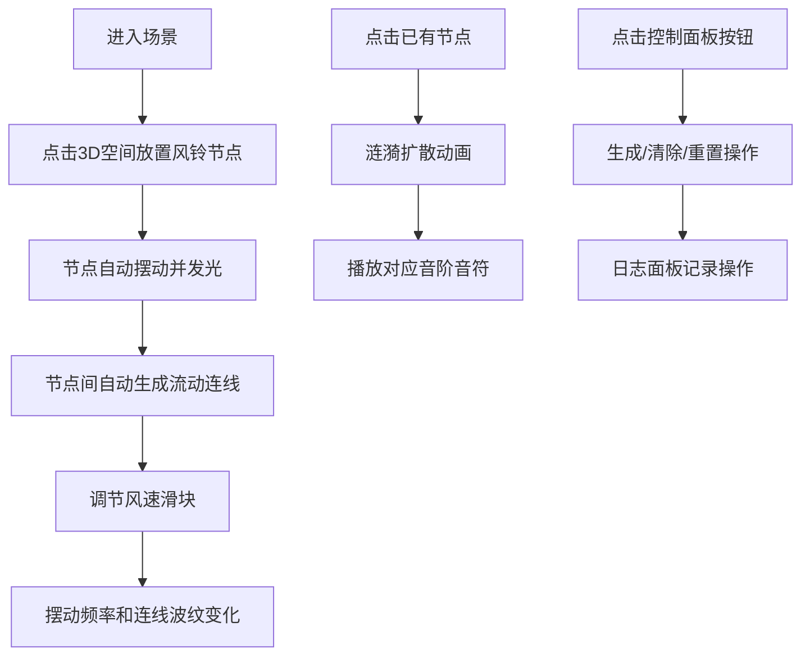

## 1. 产品概述

"风语织痕"是一款沉浸式3D交互可视化应用，用户化身为风之诗人，在三维空间中通过点击和拖拽放置风铃节点，创造随风摇曳的诗意场景。每个节点如同真实风铃般摆动发光，节点间的连线随风速产生流动波纹，点击节点则触发音阶涟漪，共同编织出梦幻的视听体验。

- **核心价值**：将抽象的风的韵律转化为可视可听的艺术体验，让用户在创造中感受宁静与美感
- **目标用户**：艺术爱好者、创意工作者、寻求放松体验的普通用户
- **市场定位**：轻量级创意交互应用，兼具艺术性与治愈性

## 2. 核心特性

### 2.1 用户角色
| 角色 | 注册方式 | 核心权限 |
|------|----------|----------|
| 访客用户 | 无需注册 | 完整使用所有交互功能，创建和欣赏风铃场景 |

### 2.2 功能模块
1. **3D场景模块**：风铃节点渲染、摆动动画、光晕效果、连线流动
2. **交互控制模块**：点击放置节点、点击触发涟漪、风速调节
3. **音频模块**：Web Audio音阶生成、音符与节点高度映射
4. **控制面板模块**：节点生成、风速滑块、清除重置功能
5. **日志面板模块**：操作记录、淡入淡出动画

### 2.3 页面详情
| 页面名称 | 模块名称 | 功能描述 |
|---------|----------|----------|
| 主场景页 | 3D渲染场景 | 全屏三维空间，支持鼠标交互放置和点击节点 |
| 主场景页 | 控制面板 | 左下角半透明面板，包含生成按钮、风速滑块、清除和重置按钮 |
| 主场景页 | 日志面板 | 右下角半透明面板，显示最近5次操作记录 |

## 3. 核心流程

**主要用户流程**：用户进入场景后，随意点击空间放置风铃节点，节点自动连接形成网络。用户可调节风速改变整体氛围，点击单个节点触发专属音符，创造独一无二的风之乐章。

## 4. 用户界面设计

### 4.1 设计风格
- **主色调**：紫罗兰 `#8a2be2`、暖橙 `#ff8c00`、深空蓝 `#0a0e1a`
- **辅助色板**：柔和渐变的马卡龙色系（粉紫、薄荷绿、淡金、柔蓝）
- **背景**：深空蓝渐变，带微弱星点效果
- **字体**：采用优雅的无衬线字体，显示字体选用带有飘逸感的字体
- **按钮样式**：半透明磨砂玻璃效果，圆角设计，悬停时有柔和光晕
- **整体风格**：梦幻、空灵、诗意、治愈系

### 4.2 页面设计概述
| 页面名称 | 模块名称 | UI元素 |
|---------|----------|--------|
| 主场景页 | 3D场景 | 半透明渐变球体风铃、发光光晕、流动光带连线、涟漪扩散特效 |
| 主场景页 | 控制面板 | 半透明深色背景（`rgba(10,14,26,0.85)`）、灰白文字、紫罗兰滑块、暖橙主按钮 |
| 主场景页 | 日志面板 | 半透明深色背景、最新记录高亮、淡入淡出过渡动画 |

### 4.3 响应式设计
- 桌面端优先设计，全屏3D场景自适应窗口大小
- 控制面板和日志面板使用固定定位，保持在屏幕角落
- 触控设备支持触摸点击和滑动操作

### 4.4 3D场景指导
- **环境**：深空蓝背景，微弱环境光配合定向主光营造立体感
- **光照**：环境光（低强度）+ 半球光（天空蓝/地面紫）+ 节点自发光
- **相机**：透视相机，初始位置(0, 2, 8)，支持OrbitControls轨道控制
- **构图**：节点分布在中心区域，相机可自由环绕观察
- **交互动画**：节点摆动使用正弦波模拟，连线使用Shader实现流动波纹，涟漪使用缩放+透明度动画
- **后处理**：Bloom泛光效果增强发光质感，轻微色调映射
- **性能**：节点上限30个，连线距离优化，帧率目标60fps
