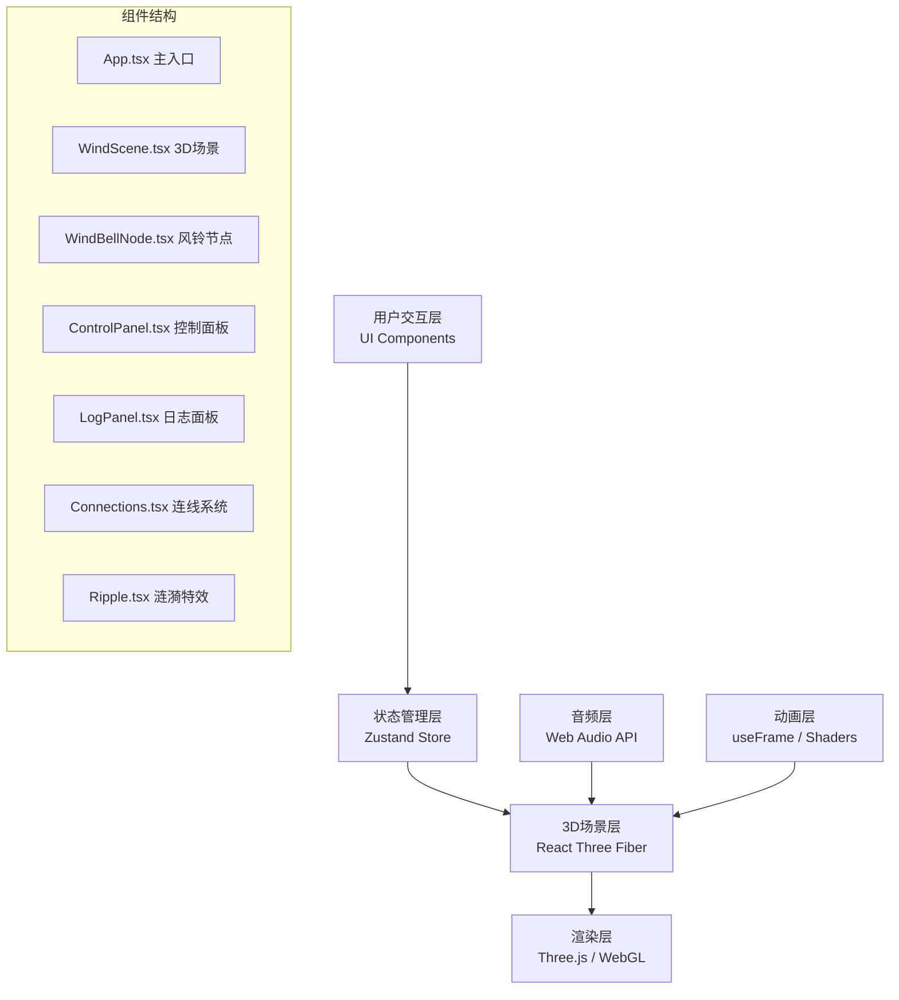

## 1. 架构设计



## 2. 技术描述

- **前端框架**：React 18 + TypeScript 5
- **3D渲染**：Three.js r160 + @react-three/fiber 8 + @react-three/drei 9
- **后处理效果**：@react-three/postprocessing
- **构建工具**：Vite 5
- **状态管理**：Zustand 4
- **样式方案**：Tailwind CSS 3
- **音频处理**：原生 Web Audio API
- **图标库**：Lucide React

## 3. 目录结构

```
src/
├── main.tsx              # 应用入口
├── App.tsx               # 主应用组件
├── index.css             # 全局样式
├── store/
│   └── useWindStore.ts   # 全局状态管理
├── scene/
│   ├── WindScene.tsx     # 3D场景容器
│   ├── WindBellNode.tsx  # 风铃节点组件
│   ├── Connections.tsx   # 连线系统
│   └── Ripple.tsx        # 涟漪特效
├── components/
│   ├── ControlPanel.tsx  # 控制面板
│   └── LogPanel.tsx      # 日志面板
├── hooks/
│   ├── useAudio.ts       # 音频钩子
│   └── useWindPhysics.ts # 风动物理钩子
├── types/
│   └── index.ts          # 类型定义
└── utils/
    ├── colorPalette.ts   # 色板工具
    └── math.ts           # 数学工具
```

## 4. 状态模型 (Zustand)

```typescript
interface WindBellNode {
  id: string;
  position: [number, number, number];
  color: string;
  phase: number;
  swingAmplitude: number;
}

interface LogEntry {
  id: string;
  message: string;
  timestamp: number;
}

interface WindState {
  nodes: WindBellNode[];
  windSpeed: number;
  logs: LogEntry[];
  ripples: { id: string; position: [number, number, number]; color: string }[];
  addNode: (position: [number, number, number]) => void;
  removeAllNodes: () => void;
  setWindSpeed: (speed: number) => void;
  addLog: (message: string) => void;
  triggerRipple: (position: [number, number, number], color: string) => void;
  removeRipple: (id: string) => void;
}
```

## 5. 核心技术实现要点

### 5.1 风铃节点实现
- 使用 `@react-three/drei` 的 `Sphere` 组件配合自定义材质
- 摆动动画通过 `useFrame` 更新节点旋转，使用正弦波模拟
- 光晕效果通过 `MeshBasicMaterial` + 透明度实现，或使用 `Points` 精灵
- 自定义 Shader 实现表面渐变和发光效果

### 5.2 连线系统实现
- 使用 `Line2` 或自定义 `BufferGeometry` 实现宽带效果
- 顶点 Shader 中实现波浪动画，参数包括风速、时间、距离
- 片段 Shader 实现渐变色彩和流动光效
- 距离检测：仅连接 2-3 个单位内的节点

### 5.3 涟漪特效
- 点击节点时创建一个圆环几何体
- 通过 `useFrame` 动画：半径从 0 扩展到 2，透明度从 1 降到 0
- 动画完成后自动销毁组件

### 5.4 音频系统
- Web Audio API 创建 `OscillatorNode` 和 `GainNode`
- 音高映射：节点 Y 坐标越高，频率越高（C4 到 C6 音阶）
- 音色：正弦波配合轻微混响，模拟风铃音色
- 攻击-释放包络：快速攻击，缓慢释放

### 5.5 性能优化
- 节点上限 30 个，超过时提示用户
- 连线使用 `InstancedMesh` 或合并几何
- `useFrame` 中仅更新必要的矩阵
- 后处理效果按需开启
