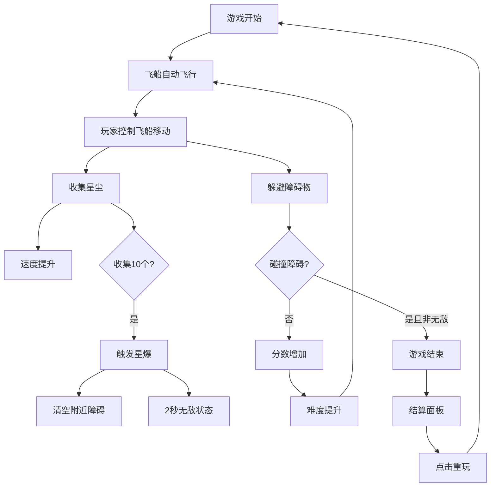

## 1. 产品概述
星轨漂流是一款太空主题的跑酷游戏，玩家操控飞船在动态生成的星轨上躲避障碍、收集星尘，体验紧张刺激的深空冒险。
- 核心玩法：躲避障碍（陨石、黑洞、能量风暴），收集星尘加速，触发星爆特效
- 目标用户：休闲游戏玩家，喜欢太空主题和快节奏游戏的用户

## 2. 核心功能

### 2.1 功能模块
1. **游戏主场景**：飞船控制、星轨生成、障碍生成、碰撞检测、分数系统
2. **玩家系统**：飞船移动、尾焰粒子效果、碰撞处理、无敌状态
3. **星尘系统**：星尘生成、收集、加速效果、星爆触发
4. **障碍系统**：三种障碍类型（陨石、黑洞、能量风暴）、动态难度
5. **UI系统**：分数显示、星尘计数、暂停按钮、结算面板
6. **特效系统**：碰撞红闪、屏幕震动、星爆白闪、霓虹发光效果

### 2.3 页面详情
| 页面名称 | 模块名称 | 功能描述 |
|-----------|-------------|---------------------|
| 游戏主界面 | 游戏画布 | 中央全屏显示游戏内容，60fps流畅运行 |
| 游戏主界面 | 左上角UI | 实时显示当前分数和收集的星尘数量 |
| 游戏主界面 | 右下角UI | 暂停按钮，点击后暂停/继续游戏 |
| 结算面板 | 游戏结束界面 | 显示最终分数、星尘数、历史最高分，提供重玩按钮 |

## 3. 核心流程
玩家开始游戏后，飞船自动向前飞行，玩家通过鼠标或触摸控制飞船上下左右移动，躲避不断生成的障碍物。收集金色星尘可以提升速度，每收集10个星尘触发一次星爆特效，清空屏幕附近障碍并获得2秒无敌时间。随着分数增加，游戏速度和障碍密度逐渐提升。撞到障碍物后游戏结束，弹出结算面板显示成绩。

## 4. 用户界面设计

### 4.1 设计风格
- **主色调**：深空蓝黑 #0b0f2a（背景）
- **渐变配色**：紫 #7b2ff7 到 粉 #ff4b8b（星轨）
- **障碍色**：暗红 #cc0000 加发光边框
- **星尘色**：金色 #ffd700（粒子效果）
- **飞船色**：亮青 #00e5ff（霓虹发光）
- **设计风格**：深空霓虹风，科幻感，发光特效，粒子系统

### 4.2 页面设计概述
| 页面名称 | 模块名称 | UI元素 |
|-----------|-------------|-------------|
| 游戏主界面 | 游戏画布 | 全屏Canvas，深蓝黑背景，动态星轨，发光粒子效果 |
| 游戏主界面 | 左上角UI | 白色文字，显示"分数: XXXX"和"星尘: XX"，字体清晰 |
| 游戏主界面 | 右下角UI | 半透明圆形按钮，霓虹发光边框，暂停图标 |
| 结算面板 | 游戏结束界面 | 半透明深黑色面板，霓虹边框，居中显示，标题"游戏结束"，三项数据展示，重玩按钮 |

### 4.3 交互反馈
- **飞船尾焰**：持续的粒子拖尾效果，随速度变化
- **碰撞反馈**：屏幕闪烁红光 + 屏幕震动
- **星爆特效**：全屏短暂亮白闪 + 粒子爆炸效果
- **按钮交互**：悬停放大，点击反馈

### 4.4 响应性
- 桌面端：全屏显示，鼠标控制
- 移动端：全屏显示，触摸控制，禁止页面滚动
- 自适应：游戏画布按比例缩放，保持画面比例
