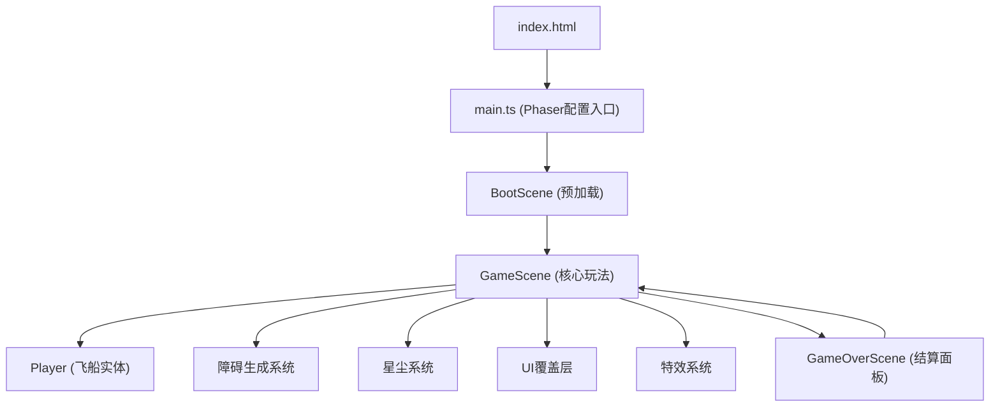

## 1. 架构设计



## 2. 技术描述
- **前端框架**：Phaser 3.70 + TypeScript 5
- **构建工具**：Vite 5
- **渲染方式**：Canvas 2D（Phaser自动管理）
- **状态管理**：Phaser Scene 内置状态管理
- **粒子系统**：Phaser 内置粒子系统
- **数据持久化**：localStorage（保存最高分）

## 3. 项目结构

```
src/
├── main.ts                    # Phaser游戏配置入口
├── scenes/
│   ├── BootScene.ts           # 预加载素材和生成纹理
│   ├── GameScene.ts           # 核心玩法逻辑、障碍生成、碰撞检测、UI
│   └── GameOverScene.ts       # 结算面板、重玩按钮
└── entities/
    └── Player.ts              # 飞船控制、尾焰粒子、碰撞处理
```

## 4. 核心配置文件

### package.json 依赖
- phaser: ^3.70.0
- typescript: ^5.3.0
- vite: ^5.0.0
- @types/node: ^20.10.0

### tsconfig.json
- 严格模式: strict: true
- 目标: ES2020
- 模块: ESNext
- 模块解析: Bundler

### vite.config.ts
- 简单Vite配置，支持Phaser
- 端口: 5173

### index.html
- 入口文件
- CSS: body { margin: 0; overflow: hidden; max-width: 100vw; }

## 5. 核心类和方法

### Player 类
- 属性: x, y, speed, isInvincible, trailParticles
- 方法: update(), move(), createTrail(), hit(), activateStarBurst()

### GameScene 类
- 属性: score, stardust, gameSpeed, obstacleGroup, stardustGroup
- 方法: create(), update(), spawnObstacle(), spawnStardust(), checkCollisions(), triggerStarBurst(), shakeScreen(), flashScreen()

### 障碍类型
1. 陨石: 圆形，旋转，中等速度
2. 黑洞: 圆形，吸引效果，慢速
3. 能量风暴: 矩形，横向移动，快速

## 6. 性能优化
- 对象池模式: 复用障碍物和星尘对象
- 视野剔除: 屏幕外对象暂停更新
- 粒子限制: 控制粒子数量上限
- requestAnimationFrame: Phaser内置60fps循环
