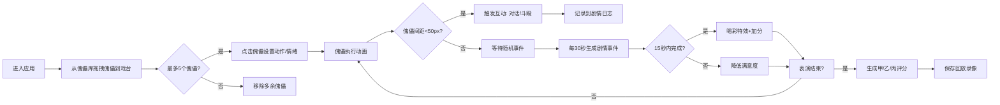

## 1. 产品概述

"傀儡戏台"是一款融合中国传统文化与现代交互设计的全栈Web应用，用户扮演古代傀儡师，通过拖拽和组合生、旦、净、末、丑五种角色傀儡，在虚拟戏台上演绎随机生成的折子戏。系统根据傀儡的走位、动作和台词自动匹配剧情分支，最终生成可回放的表演录像。

- **核心价值**：让用户以沉浸式交互体验中国传统戏曲文化，通过创造性的傀儡编排获得艺术创作的乐趣
- **目标用户**：戏曲爱好者、文化体验者、互动艺术创作者
- **产品特色**：古风美学设计、实时物理互动、智能剧情生成、表演回放系统

## 2. 核心功能

### 2.1 用户角色

| 角色 | 注册方式 | 核心权限 |
|------|----------|----------|
| 傀儡师 | 无需注册，直接使用 | 拖拽傀儡、设置动作情绪、触发剧情、保存回放、查看评分 |

### 2.2 功能模块

1. **傀儡库面板**：展示五种角色傀儡缩略图，支持拖拽到戏台
2. **戏台组件**：Canvas 2D渲染舞台背景，处理傀儡拖拽、动画、碰撞检测
3. **傀儡控制面板**：点击傀儡弹出动作（走、跑、打、唱、念）和情绪（喜、怒、哀、乐）选择菜单
4. **剧情日志面板**：显示最近5条事件和操作记录
5. **互动系统**：傀儡距离小于50px时触发对话或斗殴，带粒子特效
6. **随机事件系统**：每30秒生成剧情事件，15秒内完成指定动作组合
7. **评分系统**：基于动作准确率、互动次数、事件成功率给出甲/乙/丙等级
8. **回放系统**：表演完成后保存为可回放录像

### 2.3 页面详情

| 页面名称 | 模块名称 | 功能描述 |
|----------|----------|----------|
| 主戏台页面 | 傀儡库面板 | 左侧可滚动面板，展示生、旦、净、末、丑五种傀儡缩略图及名称，支持拖拽 |
| 主戏台页面 | 戏台组件 | 中央70%宽度Canvas区域，古铜色背景，网格吸附点，支持傀儡拖拽、动画、碰撞检测 |
| 主戏台页面 | 剧情日志面板 | 右侧面板，显示最近5条剧情事件、操作记录、观众满意度、事件倒计时 |
| 主戏台页面 | 动作情绪菜单 | 点击傀儡弹出，5种动作选择、4种情绪选择，确认后执行对应动画 |
| 主戏台页面 | 特效系统 | 喝彩花瓣特效、斗殴火星特效、光环闪烁特效、边框警告特效 |
| 主戏台页面 | 评分面板 | 表演结束后弹出，显示甲/乙/丙等级、各项评分、音效反馈 |

## 3. 核心流程

## 4. 用户界面设计

### 4.1 设计风格

- **主色调**：古铜色 `#b87333`（戏台背景）、朱红 `#e63946`（傀儡主色）、墨黑 `#1d1c1c`（傀儡辅色）
- **辅助色**：宣纸白 `#fefae0`（文字）、暗金色 `#d4a855`（按钮渐变）
- **按钮风格**：暗金渐变背景，木质纹理边框，圆角4px，hover时轻微上浮
- **字体**：标题用书法风格字体（如Ma Shan Zheng），正文用宋体/思源宋体
- **布局风格**：三栏布局，中央戏台为主，两侧面板为辅，木质边框装饰
- **装饰元素**：木质纹理边框、卷轴效果、传统纹样点缀

### 4.2 页面设计概述

| 页面名称 | 模块名称 | UI元素 |
|----------|----------|--------|
| 主戏台页面 | 傀儡库面板 | 纵向可滚动，每个傀儡卡片含角色插画、名称、情绪图标，拖拽时半透明 |
| 主戏台页面 | 戏台组件 | Canvas绘制木质戏台边框、网格点、帷幕背景，拖拽时网格高亮 |
| 主戏台页面 | 剧情日志面板 | 卷轴样式背景，每条记录带时间戳、事件图标、淡入动画 |
| 主戏台页面 | 动作情绪菜单 | 弹出式菜单，动作图标（走/跑/打/唱/念），情绪表情（喜/怒/哀/乐） |
| 主戏台页面 | 满意度条 | 顶部进度条，颜色从绿到红渐变，低于50%时屏幕边框变红 |
| 主戏台页面 | 倒计时 | 事件触发时顶部显示，脉搏动动画，最后3秒变红闪烁 |
| 主戏台页面 | 评分面板 | 居中弹窗，大字体等级显示，烟花特效，操作按钮 |

### 4.3 响应式

- **桌面端优先**：三栏布局（左侧傀儡库15% + 中央戏台70% + 右侧日志15%）
- **平板端**：两栏布局（傀儡库和日志合并为底部可滑动面板，戏台占满宽度）
- **移动端**：单栏布局，傀儡库和日志为浮动抽屉，戏台自适应缩放
- **触摸优化**：增大点击区域（≥44px），支持触摸拖拽，双击放大戏台

### 4.4 Canvas场景设计

- **背景**：多层渐变模拟古旧木质戏台，顶部绘制红色帷幕，地面绘制网格点
- **光照**：聚光灯效果从上方照射戏台中心，边缘渐暗
- **傀儡绘制**：每个傀儡由头部（带脸谱）、身体（戏服）、四肢组成，支持骨骼动画
- **粒子系统**：斗殴时火星粒子，喝彩时花瓣粒子，动作完成时光环粒子
- **性能优化**：离屏Canvas缓存静态元素，requestAnimationFrame动画循环
