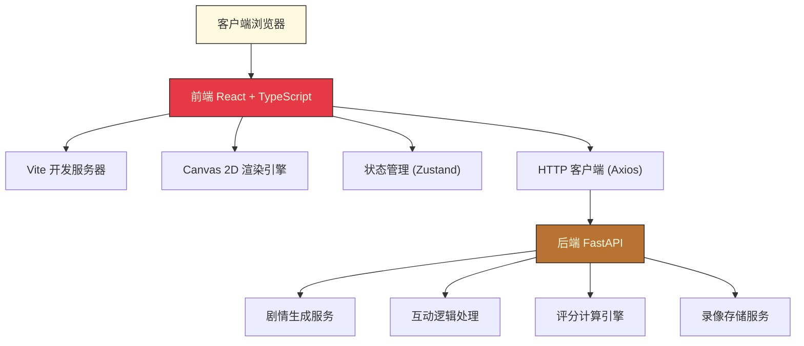
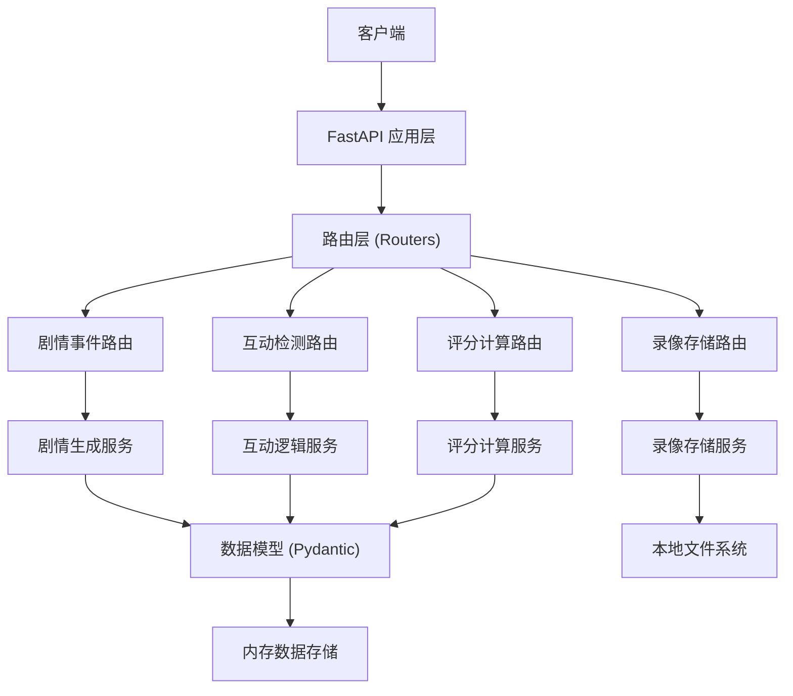
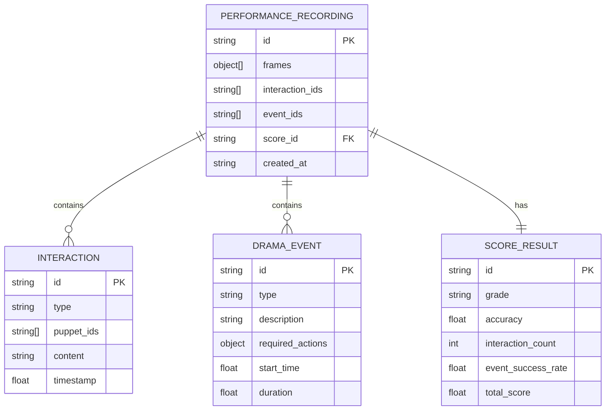

## 1. 架构设计



## 2. 技术描述

### 2.1 前端技术栈
- **框架**: React 18 + TypeScript 5
- **构建工具**: Vite 5
- **路由**: React Router DOM 6
- **状态管理**: Zustand 4
- **HTTP客户端**: Axios 1.6
- **样式**: Tailwind CSS 3 + CSS Modules
- **图标**: Lucide React
- **字体**: Google Fonts (Ma Shan Zheng, Noto Serif SC)

### 2.2 后端技术栈
- **框架**: FastAPI 0.109
- **ASGI服务器**: Uvicorn 0.27
- **数据序列化**: Pydantic 2.5
- **跨域处理**: CORSMiddleware

### 2.3 项目初始化
- 使用 Vite React TypeScript 模板初始化
- 手动创建后端目录结构
- 配置路径别名 `@/*` 指向 `frontend/src/*`

## 3. 路由定义

| 路由 | 用途 |
|------|------|
| `/` | 主戏台页面，包含傀儡库、戏台、剧情日志 |
| `/replay/:id` | 表演回放页面 |
| `/about` | 关于页面 |

## 4. API 定义

### 4.1 TypeScript 类型定义

```typescript
// 傀儡角色类型
type PuppetRole = '生' | '旦' | '净' | '末' | '丑';

// 动作类型
type ActionType = '走' | '跑' | '打' | '唱' | '念';

// 情绪类型
type EmotionType = '喜' | '怒' | '哀' | '乐';

// 互动类型
type InteractionType = '对话' | '斗殴';

// 剧情事件类型
type EventType = '巡游' | '比武' | '吟诗' | '相会' | '征战';

// 评分等级
type Grade = '甲' | '乙' | '丙';

// 傀儡状态
interface Puppet {
  id: string;
  role: PuppetRole;
  x: number;
  y: number;
  action: ActionType;
  emotion: EmotionType;
  frame: number;
  isDragging: boolean;
}

// 剧情事件
interface DramaEvent {
  id: string;
  type: EventType;
  description: string;
  requiredActions: { role: PuppetRole; action: ActionType }[];
  startTime: number;
  duration: number;
}

// 互动记录
interface Interaction {
  id: string;
  type: InteractionType;
  puppets: string[];
  content: string;
  timestamp: number;
}

// 评分结果
interface ScoreResult {
  grade: Grade;
  accuracy: number;
  interactionCount: number;
  eventSuccessRate: number;
  totalScore: number;
}

// 表演录像
interface PerformanceRecording {
  id: string;
  frames: { timestamp: number; puppets: Puppet[] }[];
  interactions: Interaction[];
  events: DramaEvent[];
  score: ScoreResult;
  createdAt: string;
}
```

### 4.2 API 端点

| 方法 | 路径 | 请求体 | 响应 | 用途 |
|------|------|--------|------|------|
| `POST` | `/api/events/generate` | `{ count: number }` | `{ events: DramaEvent[] }` | 生成随机剧情事件 |
| `POST` | `/api/interactions/detect` | `{ puppets: Puppet[] }` | `{ interactions: Interaction[] }` | 检测傀儡互动 |
| `POST` | `/api/dialogue/generate` | `{ emotion1: EmotionType; emotion2: EmotionType }` | `{ lines: string[] }` | 生成随机对话台词 |
| `POST` | `/api/score/calculate` | `{ completedActions: number; totalActions: number; interactions: Interaction[]; events: DramaEvent[] }` | `ScoreResult` | 计算表演评分 |
| `POST` | `/api/recordings/save` | `PerformanceRecording` | `{ id: string; url: string }` | 保存表演录像 |
| `GET` | `/api/recordings/:id` | - | `PerformanceRecording` | 获取表演录像 |

### 4.3 后端 Pydantic 模型

```python
from pydantic import BaseModel
from typing import List, Literal, Optional

PuppetRole = Literal['生', '旦', '净', '末', '丑']
ActionType = Literal['走', '跑', '打', '唱', '念']
EmotionType = Literal['喜', '怒', '哀', '乐']
InteractionType = Literal['对话', '斗殴']
EventType = Literal['巡游', '比武', '吟诗', '相会', '征战']
Grade = Literal['甲', '乙', '丙']

class Puppet(BaseModel):
    id: str
    role: PuppetRole
    x: float
    y: float
    action: ActionType
    emotion: EmotionType
    frame: int
    isDragging: bool

class DramaEvent(BaseModel):
    id: str
    type: EventType
    description: str
    requiredActions: List[dict]
    startTime: float
    duration: float

class Interaction(BaseModel):
    id: str
    type: InteractionType
    puppets: List[str]
    content: str
    timestamp: float

class ScoreResult(BaseModel):
    grade: Grade
    accuracy: float
    interactionCount: int
    eventSuccessRate: float
    totalScore: float

class PerformanceRecording(BaseModel):
    id: Optional[str] = None
    frames: List[dict]
    interactions: List[Interaction]
    events: List[DramaEvent]
    score: ScoreResult
    createdAt: Optional[str] = None
```

## 5. 服务器架构图



## 6. 数据模型

### 6.1 数据模型定义



### 6.2 前端状态管理 (Zustand Store)

```typescript
interface StageState {
  puppets: Puppet[];
  selectedPuppetId: string | null;
  currentEvent: DramaEvent | null;
  eventCountdown: number;
  satisfaction: number;
  interactions: Interaction[];
  completedActions: number;
  totalActions: number;
  isRecording: boolean;
  recordingFrames: { timestamp: number; puppets: Puppet[] }[];
  scoreResult: ScoreResult | null;
  showScorePanel: boolean;
  
  addPuppet: (puppet: Puppet) => void;
  removePuppet: (id: string) => void;
  updatePuppet: (id: string, updates: Partial<Puppet>) => void;
  setSelectedPuppet: (id: string | null) => void;
  setCurrentEvent: (event: DramaEvent | null) => void;
  setEventCountdown: (seconds: number) => void;
  setSatisfaction: (value: number) => void;
  addInteraction: (interaction: Interaction) => void;
  incrementCompletedActions: () => void;
  incrementTotalActions: () => void;
  startRecording: () => void;
  stopRecording: () => void;
  addRecordingFrame: (puppets: Puppet[]) => void;
  setScoreResult: (result: ScoreResult | null) => void;
  setShowScorePanel: (show: boolean) => void;
  resetStage: () => void;
}
```

## 7. 项目文件结构

```
auto285/
├── .trae/
│   └── documents/
│       ├── PRD.md
│       └── TECH_ARCH.md
├── frontend/
│   ├── src/
│   │   ├── components/
│   │   │   ├── Stage.tsx          # 戏台Canvas组件
│   │   │   ├── PuppetLibrary.tsx  # 傀儡库面板
│   │   │   ├── PuppetCard.tsx     # 傀儡卡片
│   │   │   ├── ActionMenu.tsx     # 动作情绪菜单
│   │   │   ├── DramaLog.tsx       # 剧情日志面板
│   │   │   ├── SatisfactionBar.tsx # 满意度条
│   │   │   ├── EventCountdown.tsx # 事件倒计时
│   │   │   ├── ScorePanel.tsx     # 评分面板
│   │   │   └── ParticleSystem.tsx # 粒子特效
│   │   ├── hooks/
│   │   │   ├── useStageLogic.ts   # 戏台逻辑Hook
│   │   │   ├── useAnimationLoop.ts # 动画循环Hook
│   │   │   ├── useCollisionDetection.ts # 碰撞检测Hook
│   │   │   └── useEventSystem.ts  # 事件系统Hook
│   │   ├── store/
│   │   │   └── useStageStore.ts   # Zustand状态管理
│   │   ├── types/
│   │   │   └── index.ts           # 类型定义
│   │   ├── utils/
│   │   │   ├── puppetRenderer.ts  # 傀儡渲染工具
│   │   │   ├── canvasUtils.ts     # Canvas工具函数
│   │   │   ├── api.ts             # API请求封装
│   │   │   └── constants.ts       # 常量配置
│   │   ├── App.tsx
│   │   └── main.tsx
│   ├── index.html
│   ├── package.json
│   ├── tsconfig.json
│   ├── vite.config.ts
│   └── tailwind.config.js
├── backend/
│   ├── main.py                    # FastAPI入口
│   ├── routers/
│   │   ├── events.py              # 剧情事件路由
│   │   ├── interactions.py        # 互动路由
│   │   ├── score.py               # 评分路由
│   │   └── recordings.py          # 录像路由
│   ├── services/
│   │   ├── drama_generator.py     # 剧情生成服务
│   │   ├── interaction_logic.py   # 互动逻辑服务
│   │   ├── score_calculator.py    # 评分计算服务
│   │   └── storage.py             # 存储服务
│   ├── models/
│   │   └── schemas.py             # Pydantic模型
│   └── requirements.txt
└── README.md
```
