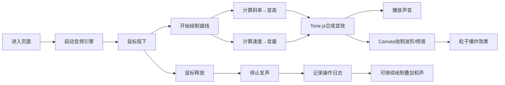

## 1. 产品概述
「光音织痕」是一款交互式声音可视化创意工具，用户通过在画布上绘制曲线即可实时生成声音与视觉效果，体验声音设计师的创作乐趣。

- **核心价值**：将视觉绘画与声音创作融合，让用户通过直观的图形操作创造独特的音频视觉作品
- **目标用户**：音乐爱好者、视觉设计师、创意工作者、普通用户

## 2. 核心功能

### 2.1 功能模块
1. **可视化画布**：中央Canvas区域，支持鼠标绘制、波形动画、频谱可视化
2. **控制面板**：波形选择、频谱开关、重置按钮、音量调节
3. **声音日志**：记录最近5次绘制操作的音高和时长信息

### 2.2 页面详情
| 页面名称 | 模块名称 | 功能描述 |
|-----------|-------------|---------------------|
| 主页面 | 可视化画布 | 鼠标绘制曲线，实时波形/频谱动画，粒子爆炸效果，多曲线和声叠加 |
| 主页面 | 控制面板 | 波形类型下拉选择（正弦/方波/锯齿/三角波），频谱显示开关，重置画布按钮，主音量滑块 |
| 主页面 | 声音日志 | 显示最近5次绘制记录，包含音高范围、时长、波形类型 |

## 3. 核心流程

用户进入页面 → 启动音频引擎 → 鼠标按下开始绘制 → 实时计算曲线斜率和绘制速度 → 生成对应音高和音量的合成音效 → 绘制波形动画和频谱 → 鼠标释放停止发声 → 记录操作日志 → 可叠加多条曲线形成和声

## 4. 用户界面设计

### 4.1 设计风格
- **主色调**：霓虹紫 `#b300ff`、暗青 `#00e5ff`
- **背景色**：深黑 `#0a0a0f`，带有渐变网格背景
- **按钮样式**：渐变背景 + 发光边框 + hover时震动效果
- **字体**：Orbitron（赛博朋克风格标题）+ JetBrains Mono（等宽数据显示）
- **视觉效果**：霓虹发光、粒子爆炸、曲线渐变描边、频谱柱状动画

### 4.2 页面布局
| 区域 | 位置 | 尺寸占比 | 主要元素 |
|-----------|-------------|----------|-------------|
| 可视化画布 | 中央 | 约80%面积 | Canvas绘制区，波形动画，频谱柱状图，粒子效果 |
| 控制面板 | 左下角 | 固定宽度320px | 下拉选择框、开关按钮、重置按钮、音量滑块 |
| 声音日志 | 右下角 | 固定宽度320px | 5条操作记录列表，音高/时长/波形信息 |

### 4.3 响应式设计
- 桌面端优先设计，保持三区域布局
- 画布区域随窗口大小自适应
- 控制面板和日志面板固定高度，内部可滚动

### 4.4 交互反馈
- 鼠标按下：震动效果 + 粒子爆炸
- 绘制中：曲线发光描边，实时频谱跳动
- 鼠标释放：淡出效果 + 日志记录动画
- 按钮hover：边框发光增强 + 轻微震动
