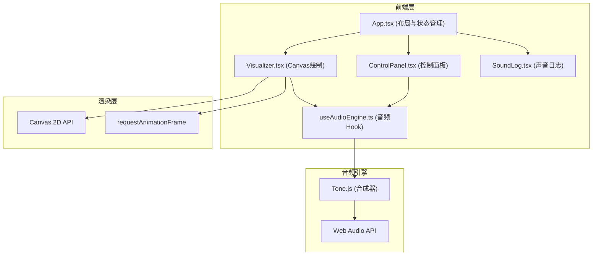

## 1. 架构设计



## 2. 技术描述
- **前端框架**：React@18 + TypeScript
- **构建工具**：Vite@5
- **状态管理**：React useState/useRef (轻量级状态，无需额外库)
- **音频合成**：Tone.js@14
- **图形渲染**：Canvas 2D API + requestAnimationFrame
- **样式方案**：原生CSS + CSS变量（赛博朋克风格）

## 3. 项目文件结构
```
├── package.json
├── tsconfig.json
├── vite.config.js
├── index.html
└── src/
    ├── main.tsx          # 入口文件，挂载App
    ├── App.tsx           # 主组件，布局和状态管理
    ├── components/
    │   ├── Visualizer.tsx    # 画布绘制和音频联动
    │   ├── ControlPanel.tsx  # 控制面板
    │   └── SoundLog.tsx      # 声音日志面板
    ├── hooks/
    │   └── useAudioEngine.ts # 音频合成逻辑
    └── types/
        └── index.ts      # 类型定义
```

## 4. 类型定义
```typescript
interface Point {
  x: number;
  y: number;
  timestamp: number;
}

interface Curve {
  id: string;
  points: Point[];
  waveform: OscillatorType;
  color: string;
  startTime: number;
  endTime: number;
}

interface SoundLogEntry {
  id: string;
  pitch: { min: number; max: number; avg: number };
  duration: number;
  waveform: OscillatorType;
  timestamp: number;
}

interface AudioEngineState {
  isPlaying: boolean;
  masterVolume: number;
  waveform: OscillatorType;
  showSpectrum: boolean;
}
```

## 5. 核心技术方案

### 5.1 音频映射算法
- **斜率 → 音高**：曲线斜率范围 [-2, 2] 映射到音高范围 [130Hz, 1046Hz]（C3 ~ C6）
- **绘制速度 → 音量**：像素/毫秒 映射到 [0, 1] 音量范围，做平滑处理
- **多曲线和声**：每条曲线独立Synth实例，频率独立控制

### 5.2 性能优化
- 使用 `requestAnimationFrame` 确保60fps渲染
- Canvas分层：背景层、曲线层、频谱层、粒子层
- 粒子对象池复用，避免频繁GC
- 音频数据缓存，避免重复计算

### 5.3 视觉效果实现
- **霓虹发光**：Canvas `shadowBlur` + `shadowColor`
- **粒子爆炸**：鼠标按下/释放时生成粒子，带速度和生命周期
- **震动效果**：CSS `transform: translate()` 动画
- **频谱可视化**：Tone.js Analyser 获取FFT数据，绘制柱状图
