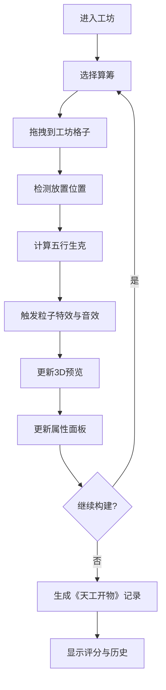

## 1. 产品概述

"算筹·天工"是一款融合中国古代五行文化与3D交互体验的全栈Web应用。用户扮演古代工匠，通过拖拽五行算筹在虚拟工坊中构建各类器物，体验传统工艺与现代技术的完美结合。

- 核心价值：将抽象的五行相生相克理论具象化为可交互的3D构建体验，寓教于乐
- 目标用户：对中国传统文化感兴趣的玩家、教育工作者、设计爱好者
- 市场定位：文化传承类创意互动应用，兼具娱乐性与教育性

## 2. 核心特性

### 2.1 用户角色

| 角色 | 注册方式 | 核心权限 |
|------|----------|----------|
| 工匠玩家 | 无需注册，直接使用 | 构建器物、查看评分、生成《天工开物》记录 |

### 2.2 功能模块

1. **工坊工作区**：3D场景渲染、算筹放置交互、器物实时预览、粒子特效
2. **算筹仓库**：五行算筹展示、滚动选择、拖拽发起、属性预览
3. **器物信息面板**：属性展示、评分系统、建造日志、历史记录
4. **组合计算引擎**：五行生克计算、属性加成计算、评分算法
5. **交互反馈系统**：拖拽动画、音效反馈、粒子特效、过渡动画

### 2.3 页面详情

| 页面名称 | 模块名称 | 功能描述 |
|----------|----------|----------|
| 主工坊页面 | 工坊工作区 | Three.js 3D场景渲染、格子放置系统、算筹交互（拖拽/翻转/旋转/长按）、五行生克粒子特效 |
| 主工坊页面 | 算筹仓库 | 五行算筹（木/金/火/水/土）展示、滚动选择器、拖拽源、算筹属性预览 |
| 主工坊页面 | 器物信息面板 | 当前器物属性（坚固度/锋利度/音律等）实时展示、评分计算、建造日志、《天工开物》记录生成 |
| 主工坊页面 | 交互反馈系统 | 拖拽弹性动画、放置音效、面板缩放过渡、流畅动画效果 |

## 3. 核心流程

### 3.1 器物构建流程

用户进入工坊 → 从左侧仓库拖拽算筹 → 放置到中央工坊格子 → 系统计算五行生克效果 → 实时更新3D预览和属性 → 继续添加/调整算筹 → 构建完成 → 生成《天工开物》记录

### 3.2 算筹交互流程

点击算筹 → 翻转/旋转 → 更新视觉表现  
长按算筹 → 弹出属性面板 → 显示详细属性 → 松开收起

## 4. 用户界面设计

### 4.1 设计风格

- **色彩主题**：古代竹简风格
  - 主色：竹黄 `#e8d5b3`
  - 文字：墨黑 `#2b1e0e`
  - 强调色：朱红 `#c0392b`
  - 辅助色：五行色（木青/金白/火红/水黑/土黄）

- **视觉质感**：古朴竹简纹理、纸张毛边效果、印章水印装饰

- **字体**：
  - 标题：楷体/宋体风格，体现古韵
  - 正文：清晰易读的衬线字体
  - 数字：等宽字体用于属性数值

- **按钮样式**：圆角矩形，竹简边框效果，按压时有凹陷动画

- **布局风格**：三栏式古典布局，中央为重，两侧为辅

### 4.2 页面设计概览

| 页面名称 | 模块名称 | UI元素 |
|----------|----------|--------|
| 主工坊页面 | 工坊工作区 | 3D场景容器、网格格子、放置高亮、粒子特效层、相机控制 |
| 主工坊页面 | 算筹仓库 | 垂直滚动列表、算筹卡片（带纹理和五行色）、拖拽预览、悬浮阴影 |
| 主工坊页面 | 器物信息面板 | 属性进度条、评分星级、日志滚动区、《天工开物》卷轴样式 |
| 主工坊页面 | 属性弹出层 | 半透明竹简背景、缩放动画、属性详情列表 |

### 4.3 响应式设计

- **桌面端优先**：三栏布局，中央3D场景占60%宽度，左右面板各占20%
- **平板端**：左右面板可折叠收起，通过侧边按钮呼出
- **移动端**：垂直堆叠布局，工坊场景全屏，面板通过底部Tab切换
- **触摸优化**：增加算筹触控热区，优化拖拽灵敏度

### 4.4 3D场景指导

- **环境氛围**：古代工坊室内场景，柔和暖光，木质台面，竹简背景
- **光照设置**：主方向光模拟窗户自然光，环境光提供基础照明，点光源突出器物细节
- **相机设置**：透视相机，45度俯视角，可通过鼠标拖拽旋转、滚轮缩放
- **构图**：工坊台面居中，算筹放置在网格上，3D器物在台面上生成
- **交互动画**：算筹放置时有轻微弹跳，生克效果有粒子爆发动画，器物成形时有组装动画
- **后处理效果**：轻微泛光（Bloom）、胶片颗粒（Grain）增强古朴质感、环境光遮蔽（AO）
- **性能预算**：单个算筹模型面数<500，场景总面数<5000，帧率稳定60fps

### 4.5 动效设计

- **拖拽算筹**：跟随鼠标，带轻微弹性延迟，透明度80%
- **放置反馈**：算筹下落有重力加速，到位后弹跳1-2次，播放木石撞击音效
- **五行生克**：触发时两算筹之间产生连线粒子，对应五行颜色的光晕扩散
- **面板过渡**：弹出时从0.8倍缩放至1倍，伴随淡入；收起时反向
- **属性更新**：数值变化时有滚动数字动画，进度条有平滑填充动画
