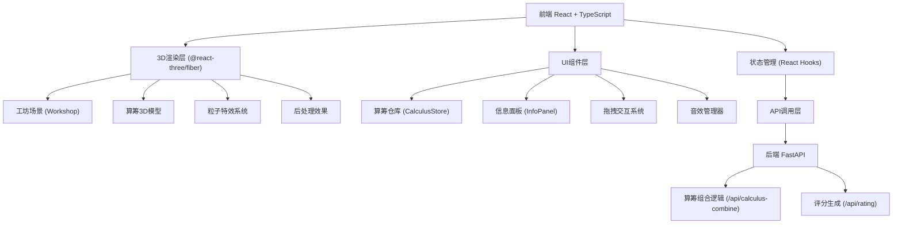
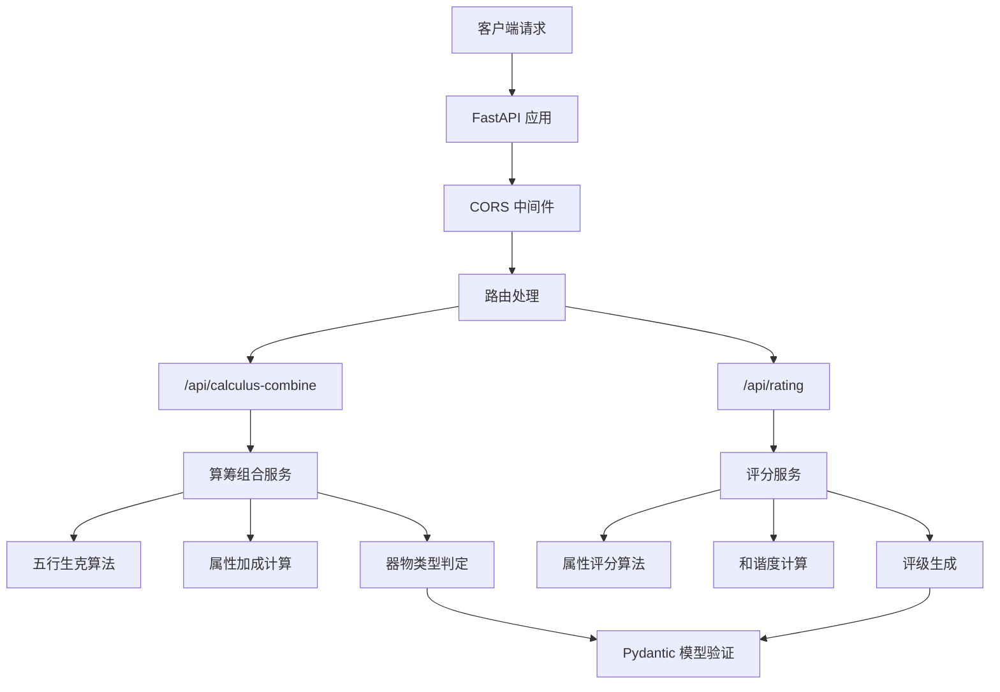
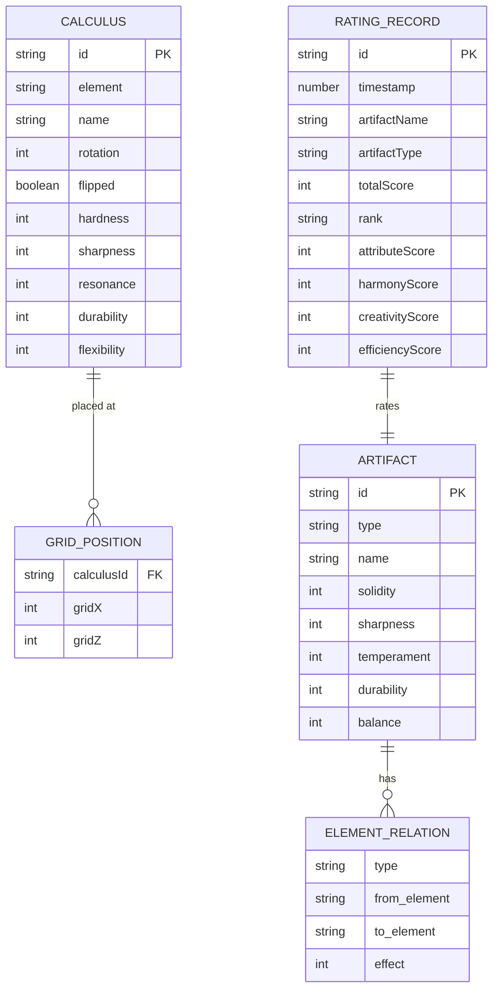

## 1. 架构设计



## 2. 技术选型说明

### 2.1 前端技术栈
- **框架**: React@18 + TypeScript@5
- **构建工具**: Vite@5
- **3D渲染**: three@0.160, @react-three/fiber@8, @react-three/drei@9
- **后处理**: @react-three/postprocessing@2
- **状态管理**: React Hooks (useState, useReducer, useContext)
- **拖拽**: 原生HTML5 Drag & Drop API + 自定义拖拽逻辑
- **样式**: CSS Modules + CSS Variables

### 2.2 后端技术栈
- **框架**: FastAPI@0.104
- **服务器**: Uvicorn@0.24
- **类型支持**: Pydantic@2
- **CORS**: fastapi.middleware.cors

### 2.3 开发工具
- **代码规范**: TypeScript 严格模式
- **热更新**: Vite HMR + Uvicorn --reload

## 3. 目录结构

```
auto287/
├── frontend/
│   ├── src/
│   │   ├── App.tsx                    # 主应用组件
│   │   ├── main.tsx                   # 入口文件
│   │   ├── types/
│   │   │   └── index.ts               # 类型定义
│   │   ├── components/
│   │   │   ├── Workshop.tsx           # 工坊3D场景
│   │   │   ├── CalculusStore.tsx      # 算筹仓库
│   │   │   ├── InfoPanel.tsx          # 信息面板
│   │   │   ├── Calculus3D.tsx         # 算筹3D组件
│   │   │   ├── Particles.tsx          # 粒子特效
│   │   │   └── Artifact3D.tsx         # 器物3D预览
│   │   ├── hooks/
│   │   │   ├── useDragDrop.ts         # 拖拽逻辑
│   │   │   ├── useFiveElements.ts     # 五行生克逻辑
│   │   │   └── useAudio.ts            # 音效管理
│   │   ├── utils/
│   │   │   ├── api.ts                 # API调用
│   │   │   └── constants.ts           # 常量配置
│   │   └── styles/
│   │       └── global.css             # 全局样式
│   ├── index.html
│   ├── package.json
│   ├── tsconfig.json
│   └── vite.config.ts
├── backend/
│   ├── main.py                        # FastAPI入口
│   ├── models.py                      # Pydantic模型
│   ├── services/
│   │   ├── calculus_logic.py          # 算筹组合逻辑
│   │   └── rating_service.py          # 评分服务
│   └── requirements.txt
└── .trae/documents/
    ├── PRD.md
    └── Technical-Architecture.md
```

## 4. 路由定义

| 路由 | 用途 |
|------|------|
| / | 主工坊页面（唯一页面，SPA单页应用） |

## 5. API 定义

### 5.1 类型定义 (TypeScript)

```typescript
// 五行类型
type ElementType = 'wood' | 'metal' | 'fire' | 'water' | 'earth';

// 算筹接口
interface Calculus {
  id: string;
  element: ElementType;
  name: string;
  rotation: number;
  flipped: boolean;
  position?: { x: number; y: number; z: number };
  attributes: {
    hardness: number;      // 硬度
    sharpness: number;     // 锋利度
    resonance: number;     // 音律
    durability: number;    // 耐久度
    flexibility: number;   // 柔韧性
  };
}

// 器物属性
interface ArtifactAttributes {
  solidity: number;       // 坚固度
  sharpness: number;      // 锋利度
  temperament: number;    // 音律
  durability: number;     // 耐久度
  balance: number;        // 平衡性
}

// 生克关系
interface ElementRelation {
  type: 'generates' | 'overcomes';  // 生 / 克
  from: ElementType;
  to: ElementType;
  effect: number;       // 影响值
}

// 组合计算请求
interface CombineRequest {
  calculi: Calculus[];
  gridPositions: Array<{ calculusId: string; gridX: number; gridZ: number }>;
}

// 组合计算响应
interface CombineResponse {
  artifactType: string;       // 器物类型：战车/农具/乐器等
  artifactName: string;       // 器物名称
  attributes: ArtifactAttributes;
  relations: ElementRelation[];
  bonusEffects: string[];
}

// 评分请求
interface RatingRequest {
  artifact: CombineResponse;
  calculiCount: number;
  buildTime: number;          // 建造时长（秒）
}

// 评分响应
interface RatingResponse {
  totalScore: number;         // 总分
  rank: 'S' | 'A' | 'B' | 'C' | 'D';
  breakdown: {
    attributeScore: number;
    harmonyScore: number;     // 五行和谐度
    creativityScore: number;
    efficiencyScore: number;
  };
  record: {
    id: string;
    timestamp: number;
    artifactName: string;
    artifactType: string;
    attributes: ArtifactAttributes;
    totalScore: number;
    rank: string;
  };
}
```

### 5.2 后端接口

#### POST /api/calculus-combine
计算算筹组合效果

**请求体**:
```json
{
  "calculi": [...],
  "gridPositions": [...]
}
```

**响应体**:
```json
{
  "artifactType": "战车",
  "artifactName": "四象战车",
  "attributes": {
    "solidity": 85,
    "sharpness": 72,
    "temperament": 45,
    "durability": 90,
    "balance": 78
  },
  "relations": [
    {"type": "generates", "from": "wood", "to": "fire", "effect": 15}
  ],
  "bonusEffects": ["木火通明", "金坚玉润"]
}
```

#### POST /api/rating
生成器物评分和记录

**请求体**:
```json
{
  "artifact": {...},
  "calculiCount": 5,
  "buildTime": 120
}
```

**响应体**:
```json
{
  "totalScore": 92,
  "rank": "A",
  "breakdown": {
    "attributeScore": 88,
    "harmonyScore": 95,
    "creativityScore": 90,
    "efficiencyScore": 85
  },
  "record": {...}
}
```

## 6. 服务器架构图



## 7. 数据模型

### 7.1 数据模型定义



### 7.2 五行生克常量

```python
# 五行相生关系
GENERATION = {
    'wood': 'fire',   # 木生火
    'fire': 'earth',  # 火生土
    'earth': 'metal', # 土生金
    'metal': 'water', # 金生水
    'water': 'wood',  # 水生木
}

# 五行相克关系
OVERCOMING = {
    'wood': 'earth',  # 木克土
    'earth': 'water', # 土克水
    'water': 'fire',  # 水克火
    'fire': 'metal',  # 火克金
    'metal': 'wood',  # 金克木
}

# 五行基础属性
ELEMENT_BASE_ATTRIBUTES = {
    'wood': {
        'hardness': 40, 'sharpness': 30, 'resonance': 70,
        'durability': 50, 'flexibility': 80
    },
    'fire': {
        'hardness': 30, 'sharpness': 90, 'resonance': 60,
        'durability': 20, 'flexibility': 40
    },
    'earth': {
        'hardness': 70, 'sharpness': 20, 'resonance': 40,
        'durability': 90, 'flexibility': 30
    },
    'metal': {
        'hardness': 90, 'sharpness': 85, 'resonance': 50,
        'durability': 75, 'flexibility': 20
    },
    'water': {
        'hardness': 20, 'sharpness': 50, 'resonance': 80,
        'durability': 40, 'flexibility': 90
    },
}
```

## 8. 性能优化策略

### 8.1 3D性能
- 使用 `InstancedMesh` 渲染多个算筹模型
- 场景几何体使用 `BufferGeometry`
- 后处理效果根据设备性能动态调整
- 实现视锥体剔除（Frustum Culling）
- 控制粒子数量：生克特效最多50个粒子

### 8.2 前端性能
- React.memo 优化组件重渲染
- useMemo/useCallback 缓存计算结果和回调
- 虚拟滚动优化算筹仓库列表
- 防抖/节流处理高频交互事件
- 资源预加载：算筹模型、音效文件

### 8.3 后端性能
- 计算逻辑使用纯函数，便于缓存
- 无状态设计，支持水平扩展
- Pydantic 模型自动验证输入
