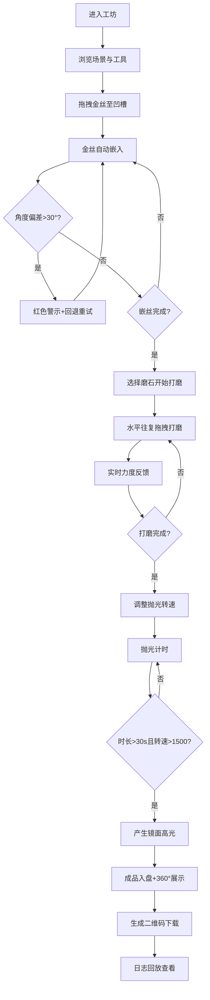

## 1. 产品概述

错金银交互坊是一款在浏览器中模拟古代青铜器错金银工艺制作全过程的交互演示应用，解决传统工艺学习中金属丝嵌入深度、角度和打磨力度对成品影响难以直观感受和反复试错的问题。

- **核心目标**：通过数字化交互，让用户沉浸式体验战国时期青铜错金银工艺的刻槽、嵌丝、打磨、抛光全流程
- **目标用户**：工艺美术学习者、文物爱好者、博物馆教育工作者
- **市场价值**：将非物质文化遗产技艺转化为可交互的数字化教育产品

## 2. 核心功能

### 2.1 用户角色
本产品为单用户学习型应用，无需角色区分。

### 2.2 功能模块
1. **青铜工坊主场景**：CSS绘制的战国时期青铜工坊剖面图，包含操作台、青铜豆、工具架
2. **金丝嵌入操作**：拖拽金丝沿凹槽路径自动嵌入，实时显示进度与角度检测
3. **打磨抛光模拟**：粗/细磨石选择，力度感应，火花粒子效果，抛光转速控制
4. **成品质量评估**：操作记录时间轴，历史回放，360°旋转展示，二维码下载

### 2.3 页面详情

| 页面名称 | 模块名称 | 功能描述 |
|---------|---------|----------|
| 主界面 | 三栏布局 | 左侧工具面板（220px）、中央操作区（自适应）、右侧日志区（280px） |
| 主界面 | 青铜工坊场景 | 灰土地面、青石操作台、云雷纹青铜豆、挂架工具（錾刀、鎯头、磨石） |
| 主界面 | 金丝嵌入交互 | 拖拽金丝卷到凹槽入口，自动沿路径嵌入，角度偏差>30°时红色警示并回退 |
| 主界面 | 打磨交互 | 选择粗细磨石，水平往复拖拽，力度影响表面效果，火花粒子反馈 |
| 主界面 | 抛光交互 | 鹿皮木轮，转速滑块200-2000rpm，时长>30s且转速>1500rpm产生镜面效果 |
| 主界面 | 日志与回放 | 竹简样式时间轴，0.5x/2x倍速回放，高亮显示操作节点 |
| 主界面 | 成品展示 | 360°旋转（8秒/圈），深色丝绒背景，二维码下载摘要 |

## 3. 核心流程

用户进入应用后，首先浏览青铜工坊场景，了解各工具用途。随后从工具架拖拽金丝卷开始嵌丝工序，嵌入过程中系统实时检测角度偏差，完成后进入打磨工序，用户选择磨石进行水平往复打磨，力度通过视觉与听觉反馈实时呈现。打磨完成后自动进入抛光工序，调整转速与时长，最终成品放入青铜盘并生成360°旋转展示。全程操作记录在日志区，支持时间轴回放与二维码下载。

## 4. 用户界面设计

### 4.1 设计风格
- **主色调**：战国红铜色#8b4513、青铜绿#5a7a3a、牛皮色#d2b48c、灰土地面#a08868
- **边框样式**：5px宽铜绿色双线，模拟青铜器回纹边框
- **按钮风格**：篆书印章风格，圆形红底白字，思源宋体字体，hover放大1.1倍+振铃动画
- **字体**：思源宋体（正文）、篆书（印章按钮）
- **整体风格**：古风厚重，战国青铜器美学，竹简与铜绿质感

### 4.2 页面设计概述

| 页面名称 | 模块名称 | UI元素 |
|---------|---------|--------|
| 主界面 | 工具面板 | 竖向排列工具图标，hover显示材质用途提示，金丝剩余长度指示器，力度/转速滑块 |
| 主界面 | 操作区 | 青铜工坊剖面图，可缩放视角，金丝嵌入路径动画，打磨火花粒子，抛光旋转木轮 |
| 主界面 | 日志面板 | 竹简样式背景#d4c4a8，墨色#1a1a1a宋体文字，时间轴滑块，回放控制按钮，速度切换 |
| 主界面 | 成品展示 | 深色丝绒背景#1a1a2a，360°旋转青铜豆，光照径向渐变高光，右下角二维码 |

### 4.3 响应式
- 桌面端优先设计，三栏固定比例布局
- 工具面板与日志面板固定宽度，中央操作区自适应
- 触控设备支持触摸拖拽与双指缩放
- 弹窗提示自适应屏幕宽度

### 4.4 交互动效设计
- **工具拖拽**：CSS transform + transition，拖拽时光标变为手形抓手
- **金丝嵌入**：沿SVG路径动画，嵌入深度用阴影层叠表现
- **打磨粒子**：Canvas粒子系统，数量≤200，60fps流畅运行
- **抛光旋转**：木轮旋转动画，镜面高光使用backdrop-filter与径向渐变
- **精度提示**：底部中央半透明弹窗#2a1a0a80，2秒自动消失
- **成品旋转**：autoplay 360°旋转，每圈8秒，背景切换丝绒布
