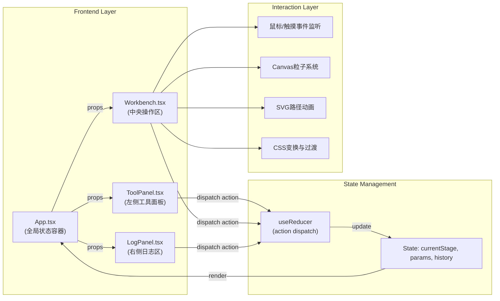

## 1. 架构设计

本应用为纯前端React单页应用，采用三栏式组件架构，通过useReducer进行全局状态管理，无需后端服务。



## 2. 技术描述

- **前端框架**：React@18 + TypeScript
- **构建工具**：Vite@5
- **状态管理**：React useReducer（内置，无需额外库）
- **样式方案**：CSS Modules / 内联样式 + CSS变量
- **粒子系统**：原生Canvas 2D API
- **路径动画**：SVG + CSS动画
- **二维码生成**：纯TypeScript实现（不引入外部库）
- **无额外运行时依赖**：严格遵循用户要求，仅使用React核心库

### 项目初始化
使用 `npm init vite-init@latest` 创建项目，模板选择 `react-ts`。

## 3. 目录结构

```
auto29/
├── package.json
├── index.html
├── vite.config.js
├── tsconfig.json
└── src/
    ├── App.tsx              # 主组件，三栏布局，全局状态
    ├── ToolPanel.tsx        # 左侧工具面板
    ├── Workbench.tsx        # 中央操作区
    ├── LogPanel.tsx         # 右侧日志面板
    ├── types/               # TypeScript类型定义
    │   └── index.ts
    ├── utils/               # 工具函数
    │   ├── qrcode.ts        # 二维码生成
    │   └── particles.ts     # 粒子系统
    └── hooks/               # 自定义Hooks
        └── useDrag.ts       # 拖拽逻辑
```

## 4. 核心数据结构

### 4.1 全局状态定义

```typescript
interface AppState {
  currentStage: 'IDLE' | 'EMBEDDING' | 'GRINDING' | 'POLISHING' | 'FINISHED';
  goldWire: {
    remainingLength: number;     // 剩余长度cm
    embeddedPercent: number;     // 嵌入百分比
    currentAngle: number;        // 当前嵌入角度
    pathProgress: number;        // 路径进度
  };
  grinding: {
    selectedStone: 'COARSE' | 'FINE' | null;
    force: number;               // 力度0.1-1.0
    surfaceQuality: number;      // 表面质量0-100
    passCount: number;           // 打磨次数
  };
  polishing: {
    rpm: number;                 // 转速200-2000
    duration: number;            // 累计时长秒
    isMirror: boolean;           // 是否镜面效果
  };
  history: HistoryEntry[];       // 操作历史
  replay: {
    isActive: boolean;
    speed: 0.5 | 1 | 2;
    position: number;            // 时间轴位置0-100
  };
  viewport: {
    zoom: number;                // 缩放比例
    offsetX: number;
    offsetY: number;
  };
  warnings: Warning[];           // 警示信息
}
```

### 4.2 Action 类型定义

```typescript
type Action =
  | { type: 'START_EMBEDDING' }
  | { type: 'UPDATE_EMBED_PROGRESS'; payload: { percent: number; angle: number; lengthUsed: number } }
  | { type: 'EMBED_WARNING'; payload: { message: string; revertTo: number } }
  | { type: 'FINISH_EMBEDDING' }
  | { type: 'SELECT_GRIND_STONE'; payload: 'COARSE' | 'FINE' }
  | { type: 'UPDATE_GRINDING'; payload: { force: number; qualityDelta: number } }
  | { type: 'FINISH_GRINDING' }
  | { type: 'SET_POLISH_RPM'; payload: number }
  | { type: 'UPDATE_POLISH_DURATION'; payload: number }
  | { type: 'FINISH_POLISHING' }
  | { type: 'ZOOM_VIEWPORT'; payload: number }
  | { type: 'PAN_VIEWPORT'; payload: { x: number; y: number } }
  | { type: 'START_REPLAY' }
  | { type: 'SET_REPLAY_SPEED'; payload: 0.5 | 1 | 2 }
  | { type: 'SET_REPLAY_POSITION'; payload: number }
  | { type: 'STOP_REPLAY' }
  | { type: 'ADD_HISTORY_ENTRY'; payload: HistoryEntry }
  | { type: 'DISMISS_WARNING'; payload: string };
```

### 4.3 历史记录条目

```typescript
interface HistoryEntry {
  id: string;
  timestamp: number;
  stage: 'EMBED' | 'GRIND' | 'POLISH';
  action: string;
  params: Record<string, any>;
  position: { x: number; y: number }[];  // 手势轨迹
}
```

## 5. 核心技术实现

### 5.1 金丝嵌入路径
- 使用SVG预定义云雷纹路径
- 通过 `stroke-dasharray` 与 `stroke-dashoffset` 实现金丝嵌入动画
- 路径采样点检测角度偏差，超过30°触发回退

### 5.2 打磨力度检测
- 监听 `mousedown`/`mouseup`/`mousemove` 事件
- 通过鼠标移动速度与按下时长计算模拟力度（0.1-1.0）
- 力度与打磨质量、火花粒子数量正相关

### 5.3 粒子系统
- Canvas 2D实现，最大200个粒子
- 火花粒子物理模拟（重力、速度衰减、生命周期）
- requestAnimationFrame 驱动，确保60fps

### 5.4 360°旋转展示
- CSS `transform: rotateY()` 动画
- 配合 `perspective` 实现立体效果
- 镜面高光使用 `radial-gradient` + `backdrop-filter`

### 5.5 二维码生成
- TypeScript实现QR Code编码算法（Version 1-10，纠错等级M）
- Canvas渲染，支持下载PNG格式

## 6. 性能优化

- **动画性能**：所有动画使用 `transform` 与 `opacity`，避免触发重排
- **粒子限制**：最大200个，超出后回收最早粒子
- **事件节流**：鼠标移动事件使用 `requestAnimationFrame` 节流
- **状态更新**：useReducer 批量更新，避免不必要重渲染
- **内存管理**：粒子对象池复用，Canvas 离屏渲染缓存

## 7. 构建与部署

- 开发命令：`npm run dev`（Vite开发服务器，端口5173）
- 构建命令：`npm run build`（输出到 `dist` 目录）
- 基础路径：`./`（相对路径，支持静态部署）
- 目标浏览器：Chrome/Edge/Firefox/Safari 最新2个版本
