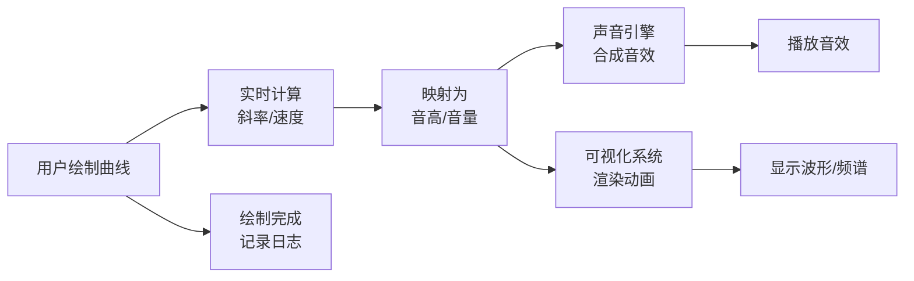

## 1. 产品概述

光音织痕是一款交互式声音可视化Web应用，让用户化身声音设计师，通过在画布上绘制曲线实时生成波形动画与合成音效。曲线斜率决定音调高低，绘制速度控制音量大小，多条曲线可叠加形成和声，创造独特的视听体验。

- 核心价值：将绘画与音乐创作结合，提供直观、富有表现力的声音创作工具
- 目标用户：音乐爱好者、视觉艺术家、创意设计师、教育工作者
- 市场定位：作为创意工具和交互艺术展示项目

## 2. 核心功能

### 2.1 功能模块

1. **主画布区**：动态Canvas画布，支持鼠标绘制曲线、点击粒子效果、坐标与音高预览
2. **控制面板**：波形选择、频谱显示开关、重置按钮、音量滑块
3. **声音引擎**：实时合成音效，支持多种波形、多轨和声、音量控制
4. **可视化系统**：波形动画、频谱分析、粒子效果、霓虹发光效果
5. **日志面板**：记录最近5次绘制操作的音高、时长、曲线颜色

### 2.3 页面详情

| 页面名称 | 模块名称 | 功能描述 |
|-----------|-------------|---------------------|
| 主页面 | 中央画布 | 鼠标拖动绘制曲线，实时生成波形动画和合成音效；悬停显示坐标和音高预览；点击触发粒子涟漪效果 |
| 主页面 | 控制面板 | 波形选择下拉框（正弦波、方波、锯齿波）；频谱显示开关；重置画布按钮；音量滑块 |
| 主页面 | 日志面板 | 显示最近5次绘制的音高、时长、曲线颜色，滚动更新 |

## 3. 核心流程

用户在画布上按住鼠标拖动绘制曲线 → 系统实时计算曲线斜率和绘制速度 → 根据斜率映射为音高、速度映射为音量 → 声音引擎生成合成音效并播放 → 可视化系统渲染波形动画和频谱 → 绘制完成后记录操作到日志面板。

## 4. 用户界面设计

### 4.1 设计风格

- **主题风格**：霓虹赛博朋克风
- **主色调**：霓虹紫 `#b300ff`，暗青 `#00e5ff`
- **背景色**：深黑 `#0a0a0f`，带微弱网格线
- **按钮样式**：渐变背景 + 发光边框，悬停微震动反馈
- **字体**：使用科技感无衬线字体，Orbitron作为标题字体，JetBrains Mono作为等宽字体
- **发光效果**：所有交互元素带有霓虹发光边框，canvas绘制曲线带有辉光效果
- **动效**：粒子爆炸、涟漪扩散、微震动反馈

### 4.2 页面设计概述

| 页面名称 | 模块名称 | UI Elements |
|-----------|-------------|-------------|
| 主页面 | 中央画布 | 全屏Canvas，深黑背景带网格，绘制曲线带霓虹发光，波形动画，频谱柱状图，坐标提示 |
| 主页面 | 控制面板 | 左下角悬浮面板，半透明玻璃拟态，霓虹边框，包含下拉框、开关、按钮、滑块 |
| 主页面 | 日志面板 | 右下角悬浮面板，半透明玻璃拟态，霓虹边框，列表展示最近操作 |

### 4.3 响应式设计

- 桌面端优先设计，Canvas占主要视口面积
- 控制面板和日志面板固定在角落，不随滚动移动
- 支持触摸设备绘制操作

## 5. 非功能需求

- **性能**：帧率稳定60fps，粒子数量控制在200以内
- **交互**：鼠标响应延迟<16ms，音效实时播放无延迟
- **浏览器兼容**：支持Chrome、Firefox、Safari最新版本
- **可访问性**：键盘操作支持，音量控制可调节
