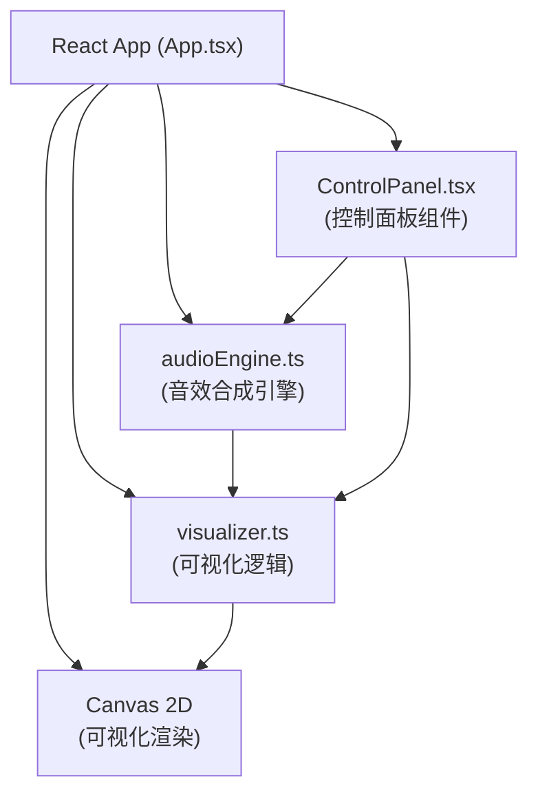

## 1. 架构设计



## 2. 技术描述

- **前端框架**：React 18 + TypeScript 5
- **构建工具**：Vite 5
- **渲染技术**：Canvas 2D API
- **音频技术**：Web Audio API (OscillatorNode, GainNode, AnalyserNode)
- **状态管理**：React useState/useRef
- **样式方案**：CSS Modules + CSS Variables

## 3. 文件结构

```
项目根目录/
├── package.json
├── tsconfig.json
├── vite.config.js
├── index.html
└── src/
    ├── App.tsx           # 主应用组件
    ├── visualizer.ts     # 可视化逻辑（波形、频谱、粒子）
    ├── audioEngine.ts    # 音效合成引擎
    ├── ControlPanel.tsx  # 控制面板组件
    └── index.css         # 全局样式
```

## 4. 核心模块设计

### 4.1 audioEngine.ts - 音效合成引擎

| 接口/类 | 说明 |
|---------|------|
| `AudioEngine` | 主类，管理AudioContext和所有音频节点 |
| `startDrawing()` | 开始绘制时创建新的振荡器 |
| `updateSound(frequency, volume)` | 实时更新音高和音量 |
| `stopDrawing()` | 停止绘制，释放振荡器 |
| `setWaveform(type)` | 设置波形类型（sine/square/sawtooth） |
| `setMasterVolume(volume)` | 设置主音量 |
| `getFrequencyData()` | 获取频谱分析数据 |

### 4.2 visualizer.ts - 可视化系统

| 接口/类 | 说明 |
|---------|------|
| `Visualizer` | 主类，管理Canvas渲染 |
| `resize(width, height)` | 调整画布尺寸 |
| `startCurve(x, y, color)` | 开始绘制新曲线 |
| `addPoint(x, y, slope, speed)` | 添加曲线点，返回音高和音量 |
| `endCurve()` | 结束当前曲线 |
| `addParticles(x, y, count)` | 添加粒子效果 |
| `updateHover(x, y, frequency)` | 更新悬停提示 |
| `render()` | 主渲染循环（60fps） |
| `clear()` | 清空画布 |
| `setShowSpectrum(show)` | 设置是否显示频谱 |
| `setSpectrumData(data)` | 设置频谱数据 |

### 4.3 类型定义

```typescript
// 曲线点
interface CurvePoint {
  x: number;
  y: number;
  slope: number;
  speed: number;
  timestamp: number;
}

// 曲线
interface Curve {
  id: string;
  points: CurvePoint[];
  color: string;
  oscillatorId: string;
  startTime: number;
  endTime?: number;
}

// 粒子
interface Particle {
  x: number;
  y: number;
  vx: number;
  vy: number;
  life: number;
  maxLife: number;
  color: string;
  size: number;
}

// 日志条目
interface LogEntry {
  id: string;
  pitch: number;
  pitchName: string;
  duration: number;
  color: string;
  timestamp: number;
}

// 波形类型
type WaveformType = 'sine' | 'square' | 'sawtooth';
```

## 5. 关键算法

### 5.1 斜率转音高算法
```
频率范围: 110Hz (A2) ~ 880Hz (A5)
斜率范围: -∞ ~ +∞
映射公式: frequency = 110 * 2^(clamp(slope * 0.1, -1, 1) * 1.5)
使用指数映射使音高变化符合听觉感知
```

### 5.2 绘制速度转音量算法
```
速度计算: distance / timeDelta (像素/毫秒)
音量范围: 0.1 ~ 0.8
映射公式: volume = clamp(speed * 0.02, 0.1, 0.8)
```

### 5.3 性能优化
- 使用requestAnimationFrame进行渲染
- 粒子池复用，限制最大数量200
- 曲线点隔帧采样，避免数据过多
- 使用离屏Canvas预渲染网格背景
- CSS transforms硬件加速

## 6. 配置文件说明

### package.json
- react, react-dom: UI框架
- typescript: 类型系统
- vite: 构建工具
- @types/react, @types/react-dom: 类型定义
- scripts: dev (vite), build (tsc && vite build)

### tsconfig.json
- strict: true (严格模式)
- target: ES2020
- module: ESNext
- jsx: react-jsx
- moduleResolution: bundler

### vite.config.js
- 标准Vite React配置
- 端口: 5173
