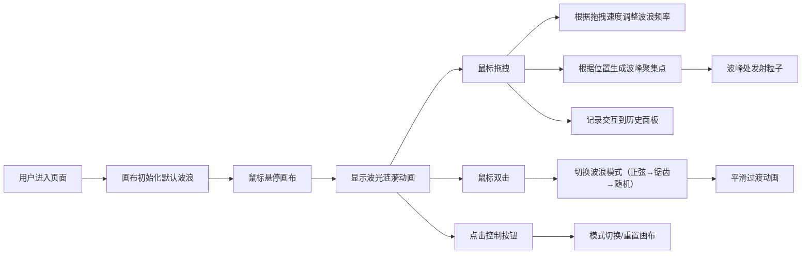

## 1. 产品概述

"墨迹潮汐"是一款交互式动态波浪可视化应用，用户化身为海洋画家，通过鼠标在画布上的交互创作独特的波浪艺术作品。应用将传统水墨美学与现代科技感完美融合，为用户提供沉浸式的创作体验。

- 核心价值：通过直观的鼠标交互，让用户轻松创作出富有艺术感的动态波浪效果
- 目标用户：艺术爱好者、设计师、普通用户
- 市场定位：创意工具类Web应用，兼具艺术性和交互趣味性

## 2. 核心功能

### 2.1 功能模块
1. **主画布区域**：波浪实时绘制、粒子系统渲染、交互反馈效果
2. **控制面板**：模式切换按钮、重置按钮、实时数据显示（频率/幅度/模式）
3. **历史记录面板**：最近5次交互记录（时间戳+模式）

### 2.2 页面详情
| 页面名称 | 模块名称 | 功能描述 |
|----------|----------|----------|
| 主页面 | 波浪画布 | 支持正弦波、锯齿波、随机波三种模式，鼠标拖拽控制频率，点击决定波峰聚集点，双击切换模式 |
| 主页面 | 粒子系统 | 波峰处微光粒子飞散，粒子大小和透明度随鼠标速度动态变化 |
| 主页面 | 控制面板 | 左下角显示实时数据，提供模式切换和重置功能 |
| 主页面 | 历史记录 | 右下角显示最近5次交互记录，包含时间戳和模式名称 |

## 3. 核心流程

## 4. 用户界面设计

### 4.1 设计风格
- **设计理念**：水墨与科技融合，东方美学遇上现代技术
- **主色调**：渐变灰白背景 #e0e0e0 → #f5f5f5
- **波浪色**：半透明墨蓝 #1a237e、墨绿 #004d40，多层叠加营造水墨晕染效果
- **按钮风格**：简约圆角设计，12px圆角，柔和阴影（0 4px 12px rgba(0,0,0,0.08)），悬停微缩放（1.02倍）
- **字体**：标题使用"Noto Serif SC"体现水墨韵味，数据显示使用"JetBrains Mono"体现科技感
- **动画**：涟漪扩散、波光粼粼、平滑过渡、微缩放动效

### 4.2 页面设计概述
| 页面名称 | 模块名称 | UI元素 |
|----------|----------|--------|
| 主页面 | 画布区域 | 自适应窗口大小，占中央主要区域，多层半透明波浪，动态粒子系统，鼠标涟漪效果 |
| 主页面 | 控制面板 | 左下角定位，半透明白色背景（rgba(255,255,255,0.85)），模糊效果，16px圆角，包含模式名称、频率数值、幅度数值、模式切换按钮、重置按钮 |
| 主页面 | 历史记录 | 右下角定位，半透明白色背景，模糊效果，16px圆角，显示最近5条记录，每条包含时间和模式图标 |

### 4.3 响应式设计
- 桌面端：画布自适应窗口，控制面板和历史面板固定在左下角和右下角
- 平板端：保持相同布局，适当调整控件大小
- 移动端：控制面板和历史面板改为底部堆叠布局，优化触摸交互

### 4.4 视觉细节
- **波浪效果**：3-4层不同透明度和速度的波浪叠加，营造水墨晕染的层次感
- **粒子效果**：波峰位置随机发射圆形粒子，带有径向渐变发光效果，向上飘散后渐隐
- **涟漪效果**：鼠标悬停位置产生扩散圆环，透明度由内向外递减
- **过渡动画**：模式切换时波浪参数在1.5秒内平滑插值过渡
- **按钮动效**：点击时缩放至0.95倍再回弹，带有微妙的阴影变化

## 5. 性能指标
- 帧率稳定在60fps
- 粒子数量控制在200以内
- 波浪计算采用requestAnimationFrame优化
- 离屏Canvas预渲染波浪波形
