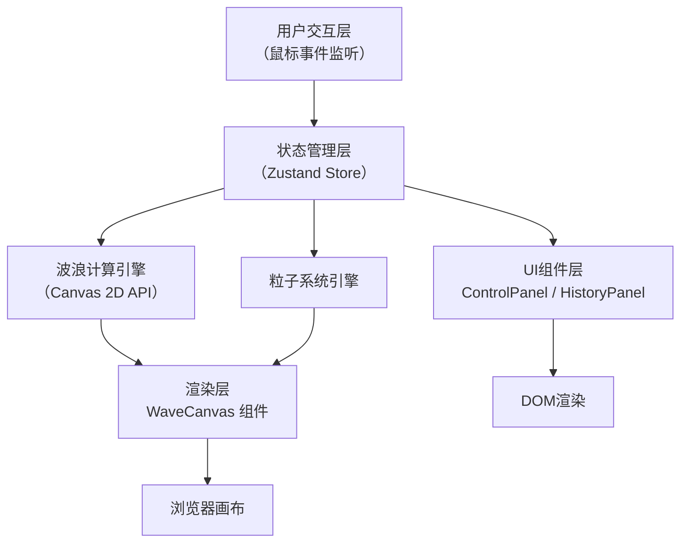

## 1. 架构设计



## 2. 技术描述

- **前端框架**：React@18 + TypeScript@5 + Vite@5
- **状态管理**：Zustand（轻量级，适合实时交互场景）
- **渲染技术**：Canvas 2D API（高性能波浪和粒子渲染）
- **样式方案**：原生CSS + CSS变量（性能最优，避免Tailwind运行时开销）
- **图标库**：lucide-react（按需引入，轻量级）
- **构建工具**：Vite（热更新快，构建性能优）

## 3. 目录结构

```
src/
├── components/
│   ├── WaveCanvas.tsx      # 波浪画布主组件（波浪+粒子渲染）
│   ├── ControlPanel.tsx    # 左下角控制面板
│   └── HistoryPanel.tsx    # 右下角历史记录面板
├── hooks/
│   ├── useWaveEngine.ts    # 波浪计算逻辑Hook
│   ├── useParticleSystem.ts # 粒子系统Hook
│   └── useRippleEffect.ts  # 涟漪效果Hook
├── store/
│   └── useWaveStore.ts     # Zustand全局状态管理
├── types/
│   └── index.ts            # TypeScript类型定义
├── utils/
│   ├── waveMath.ts         # 波浪数学计算函数
│   └── animation.ts        # 动画缓动函数
├── App.tsx                 # 主应用组件
├── main.tsx                # React入口
└── index.css               # 全局样式
```

## 4. 核心数据模型

### 4.1 类型定义

```typescript
// 波浪模式
type WaveMode = 'sine' | 'sawtooth' | 'random';

// 波浪状态
interface WaveState {
  mode: WaveMode;
  frequency: number;
  amplitude: number;
  phase: number;
  speed: number;
}

// 粒子对象
interface Particle {
  id: number;
  x: number;
  y: number;
  vx: number;
  vy: number;
  size: number;
  opacity: number;
  life: number;
  maxLife: number;
}

// 交互记录
interface InteractionRecord {
  id: number;
  timestamp: Date;
  mode: WaveMode;
  type: 'drag' | 'click' | 'doubleClick' | 'button';
}

// 涟漪效果
interface Ripple {
  id: number;
  x: number;
  y: number;
  radius: number;
  maxRadius: number;
  opacity: number;
}

// 全局状态
interface WaveStore {
  wave: WaveState;
  targetWave: WaveState;
  particles: Particle[];
  ripples: Ripple[];
  history: InteractionRecord[];
  mousePos: { x: number; y: number };
  mouseSpeed: number;
  isDragging: boolean;
  peakPoints: { x: number; intensity: number }[];
  setMode: (mode: WaveMode) => void;
  setFrequency: (freq: number) => void;
  setAmplitude: (amp: number) => void;
  addParticle: (particle: Omit<Particle, 'id'>) => void;
  addRipple: (ripple: Omit<Ripple, 'id'>) => void;
  addHistory: (record: Omit<InteractionRecord, 'id' | 'timestamp'>) => void;
  setMousePos: (x: number, y: number, speed: number) => void;
  setDragging: (dragging: boolean) => void;
  addPeakPoint: (x: number, intensity: number) => void;
  reset: () => void;
  update: (deltaTime: number) => void;
}
```

## 5. 核心算法

### 5.1 波浪生成算法

```typescript
// 正弦波
function sineWave(x: number, phase: number, freq: number, amp: number): number {
  return Math.sin(x * freq + phase) * amp;
}

// 锯齿波
function sawtoothWave(x: number, phase: number, freq: number, amp: number): number {
  const t = (x * freq + phase) / (Math.PI * 2);
  return (2 * (t - Math.floor(t + 0.5))) * amp;
}

// 随机波（基于柏林噪声简化版）
function randomWave(x: number, phase: number, freq: number, amp: number, seed: number): number {
  const noise = Math.sin(x * freq * 0.5 + seed) * 0.5 + 
                Math.sin(x * freq + phase) * 0.3 +
                Math.sin(x * freq * 2 + phase * 1.5) * 0.2;
  return noise * amp;
}

// 多层波浪叠加
function combinedWave(
  x: number, 
  waves: WaveState[], 
  peakPoints: { x: number; intensity: number }[]
): number {
  let y = 0;
  for (const wave of waves) {
    let waveValue;
    switch (wave.mode) {
      case 'sine':
        waveValue = sineWave(x, wave.phase, wave.frequency, wave.amplitude);
        break;
      case 'sawtooth':
        waveValue = sawtoothWave(x, wave.phase, wave.frequency, wave.amplitude);
        break;
      case 'random':
        waveValue = randomWave(x, wave.phase, wave.frequency, wave.amplitude, 12345);
        break;
    }
    y += waveValue;
  }
  
  // 波峰聚集点影响
  for (const peak of peakPoints) {
    const distance = Math.abs(x - peak.x);
    const influence = Math.max(0, 1 - distance / 150) * peak.intensity;
    y += influence * 30;
  }
  
  return y;
}
```

### 5.2 平滑过渡动画

```typescript
function lerp(start: number, end: number, t: number): number {
  return start + (end - start) * t;
}

function easeInOutCubic(t: number): number {
  return t < 0.5 ? 4 * t * t * t : 1 - Math.pow(-2 * t + 2, 3) / 2;
}
```

## 6. 性能优化策略

1. **分层渲染**：使用多层Canvas，波浪层、粒子层、UI层分离
2. **对象池**：粒子和涟漪对象复用，避免频繁GC
3. **离屏Canvas**：预渲染波浪基础形状
4. **requestAnimationFrame**：统一动画循环，计算deltaTime
5. **节流处理**：鼠标事件使用requestAnimationFrame节流
6. **粒子上限**：严格控制粒子数量在200以内，超出则淘汰最旧的
7. **will-change**：对DOM动画元素使用will-change优化

## 7. 配置文件

### 7.1 package.json
- react, react-dom, typescript, vite, @vitejs/plugin-react
- @types/react, @types/react-dom, zustand, lucide-react
- scripts: dev, build, preview

### 7.2 tsconfig.json
- strict: true
- module: ESNext
- target: ES2020
- jsx: react-jsx

### 7.3 vite.config.js
- 使用@vitejs/plugin-react
- 配置端口3000
- 构建输出到dist目录
