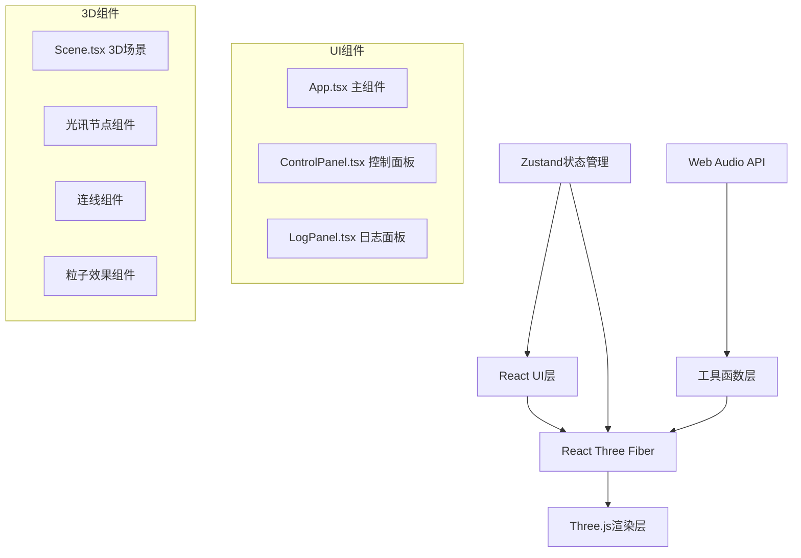

## 1. 架构设计



## 2. 技术描述

- **前端框架**：React 18 + TypeScript
- **构建工具**：Vite
- **3D渲染**：Three.js + @react-three/fiber + @react-three/drei
- **状态管理**：Zustand
- **样式方案**：Tailwind CSS 3
- **音频处理**：Web Audio API（电子合成音生成）
- **后处理效果**：@react-three/postprocessing（Bloom泛光）

## 3. 目录结构

```
src/
├── components/
│   ├── Scene.tsx          # 3D场景主组件
│   ├── ControlPanel.tsx   # 控制面板
│   ├── LogPanel.tsx       # 通信日志面板
│   ├── StarNode.tsx       # 光讯节点组件
│   ├── ConnectionLine.tsx # 连线组件
│   └── PulseEffect.tsx    # 脉冲效果组件
├── hooks/
│   ├── useAudio.ts        # 音频合成Hook
│   └── useNodeStore.ts    # 节点状态管理
├── utils/
│   └── nodeUtils.ts       # 节点与连线工具函数
├── types/
│   └── index.ts           # 类型定义
├── App.tsx                # 主应用组件
├── main.tsx               # 入口文件
└── index.css              # 全局样式
```

## 4. 数据模型

### 4.1 类型定义

```typescript
interface StarNode {
  id: string;
  position: [number, number, number];
  color: string;
  rotationSpeed: number;
  createdAt: number;
}

interface Connection {
  id: string;
  from: string;
  to: string;
  signalStrength: number;
  createdAt: number;
}

interface LogEntry {
  id: string;
  nodeId: string;
  signalStrength: number;
  distance: number;
  timestamp: number;
  type: 'create' | 'connect' | 'pulse';
}

interface AppState {
  nodes: StarNode[];
  connections: Connection[];
  logs: LogEntry[];
  signalStrength: number;
  mode: 'normal' | 'spectrum';
  selectedNode: string | null;
  connectingFrom: string | null;
}
```

## 5. 核心技术点

### 5.1 3D渲染优化
- 使用InstancedMesh渲染大量星点背景
- 节点使用ShaderMaterial实现渐变发光效果
- 连线使用CustomMaterial实现流动光带和呼吸动画
- 粒子效果使用Points实现高效渲染

### 5.2 性能优化
- 启用Frustum Culling
- 使用React.memo优化组件重渲染
- requestAnimationFrame统一动画循环
- 合理设置像素比，平衡画质与性能

### 5.3 交互设计
- Raycaster实现3D对象拾取
- 拖拽创建连线逻辑
- 信号强度实时影响连线视觉效果
- 相机视角重置功能

### 5.4 音频合成
- 使用OscillatorNode生成电子合成音
- 随机频率和波形，每次点击产生独特音效
- GainNode控制音量包络
