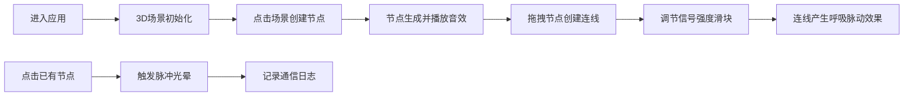

## 1. 产品概述

光语星图是一款沉浸式3D交互可视化应用，让用户扮演星际通信师的角色，在三维空间中通过点击和拖拽创建并连接光讯节点，构建属于自己的星际通信网络。

- 核心价值：通过可视化的3D交互体验，让用户感受星际通信的浪漫与科技感，每个节点都是一颗会呼吸、会发光的星球。
- 目标用户：对3D可视化、交互设计、科幻主题感兴趣的用户。

## 2. 核心功能

### 2.1 功能模块

1. **3D场景模块**：全屏3D星空场景，支持鼠标拖拽旋转视角、滚轮缩放
2. **节点系统**：点击创建光讯节点，节点缓缓旋转并发射细密光束流
3. **连线系统**：拖拽连接节点，连线随信号强度产生呼吸式明暗脉动
4. **交互反馈**：点击节点触发爆裂脉冲光晕，播放随机电子合成音
5. **控制面板**：节点生成按钮、信号强度滑块、重置视角按钮、模式切换开关
6. **通信日志**：显示最近6次交互记录，包含节点ID、信号强度、相对距离

### 2.2 页面详情

| 页面名称 | 模块名称 | 功能描述 |
|-----------|-------------|---------------------|
| 主页面 | 3D场景 | Three.js渲染的深空场景，支持视角操控 |
| 主页面 | 控制面板 | 左下角半透明面板，包含操作控件 |
| 主页面 | 通信日志 | 右下角面板，显示交互记录 |

## 3. 核心流程

## 4. 用户界面设计

### 4.1 设计风格

- **银河脉冲风**：深空黑背景为基调，电光蓝(#00d4ff)和霓虹紫(#a855f7)为主色调
- **视觉元素**：
  - 节点：渐变发光球体，带有光晕效果
  - 连线：流动光带，随信号强度呼吸脉动
  - 脉冲：爆裂式颗粒扩散效果
- **字体**：采用现代科技感无衬线字体
- **控制面板**：半透明毛玻璃效果，带霓虹边框
- **动画**：所有元素带有平滑的过渡和呼吸效果

### 4.2 页面设计概述

| 页面名称 | 模块名称 | UI Elements |
|-----------|-------------|-------------|
| 主页面 | 3D场景 | 深空背景、星点点缀、发光节点、光束连线 |
| 主页面 | 控制面板 | 半透明背景、霓虹按钮、发光滑块、毛玻璃效果 |
| 主页面 | 通信日志 | 渐变边框、滚动列表、时间戳样式 |

### 4.3 3D场景指导

- **环境**：深空黑背景，远处散落闪烁星点，营造宇宙氛围
- **光照**：环境光+点光源组合，节点自身发光材质，产生辉光效果
- **相机**：透视相机，初始视角略俯，支持OrbitControls操控
- **交互**：点击创建节点、拖拽连线、滚轮缩放、右键平移
- **动画**：节点自转、光束流动、连线呼吸脉动、脉冲爆裂扩散
- **后处理**：Bloom泛光效果，增强发光质感

### 4.4 响应式

- 桌面端优先设计，全屏3D场景
- 控制面板和日志面板采用固定定位，自适应屏幕尺寸
- 移动端适配触摸交互

## 5. 性能要求

- 稳定60fps帧率
- 支持至少50个节点同时渲染
- 内存占用控制在合理范围
